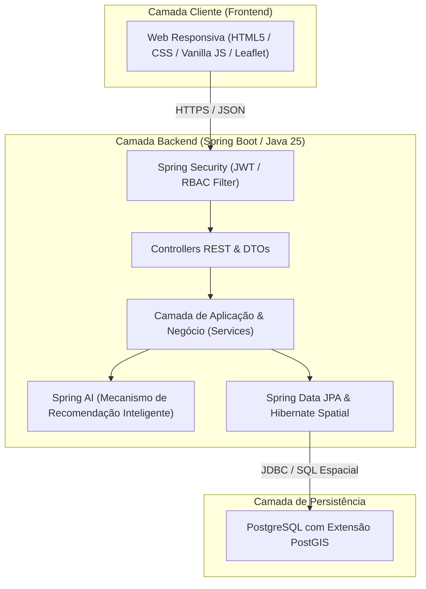
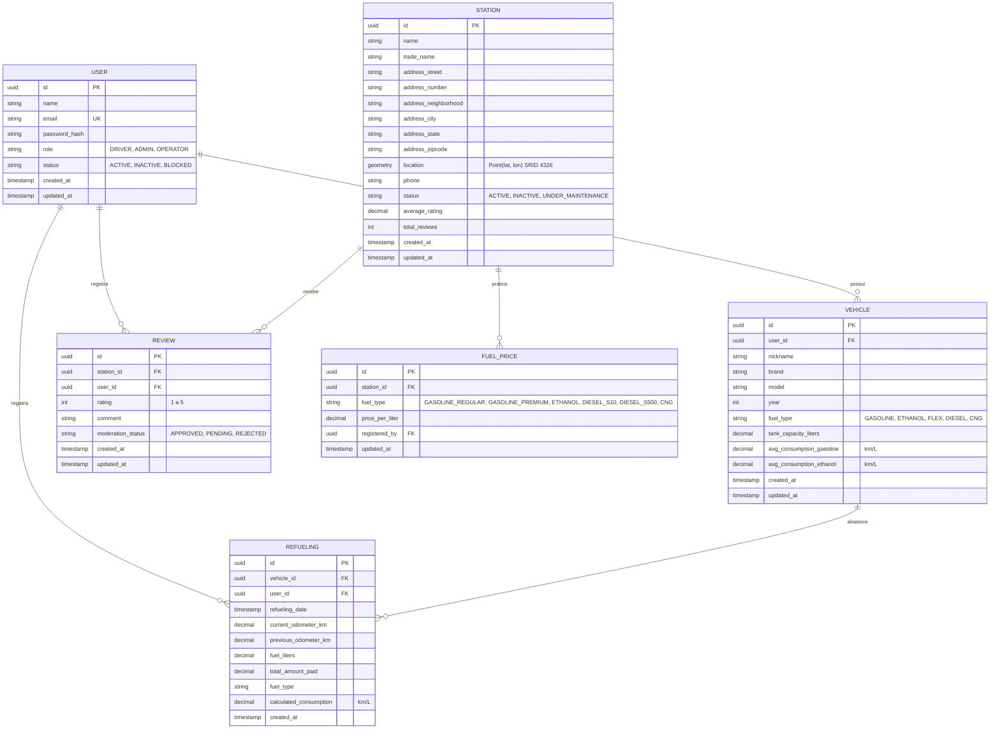
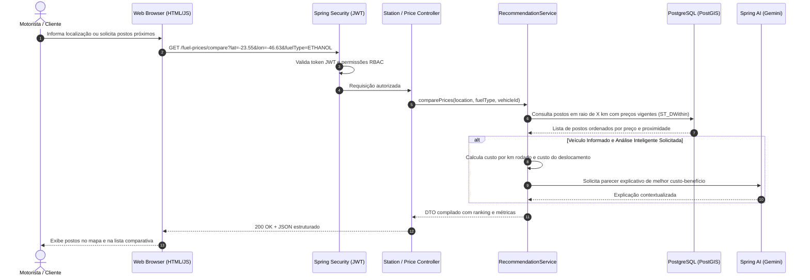

# Decisões de Alto Nível de Arquitetura (ADRs) — FuelFinder

Este documento registra as decisões arquiteturais essenciais (Architecture Decision Records — ADRs), o modelo conceitual do sistema e os diagramas das camadas da plataforma **FuelFinder**.

---

## 1. Visão Geral da Arquitetura

O **FuelFinder** adota o modelo de **Monolito Modular em Camadas**. Esta abordagem oferece alta coesão e independência lógica entre os módulos de negócio, permitindo desenvolvimento ágil no MVP sem o custo e a complexidade operacional distribuída de microsserviços.

---

## 2. Registros de Decisão de Arquitetura (ADRs)

### ADR-001: Adoção de Monolito Modular para o MVP
- **Status**: Aprovado
- **Contexto**: A plataforma precisa ser entregue de forma ágil, testável e de fácil manutenção, integrando autenticação, gestão de postos, preços, veículos e avaliações.
- **Decisão**: Construir a aplicação como um Monolito Modular utilizando Spring Boot, onde cada domínio (`user`, `vehicle`, `station`, `price`, `review`, `recommendation`) é isolado em seus próprios pacotes com contratos explícitos.
- **Consequências**:
  - *Positivas*: Deploy simplificado (único artefato executável JAR/Docker), transações atômicas nativas ACID, ausência de latência de rede entre serviços.
  - *Negativas*: Caso um módulo demande escala extrema no futuro, será necessário desacoplá-lo para um microsserviço independente.

---

### ADR-002: Runtime Java 25 e Spring Boot 3.4+ com Virtual Threads
- **Status**: Aprovado
- **Contexto**: O sistema atenderá a consultas frequentes de localização e comparações com I/O de banco de dados e APIs externas de mapas.
- **Decisão**: Utilizar o Java 25 e Spring Boot 3.4+, habilitando Virtual Threads (Project Loom) no Tomcat embutido (`spring.threads.virtual.enabled=true`).
- **Consequências**:
  - *Positivas*: Alta taxa de throughput com I/O bloqueante tradicional sem necessidade de reatividade complexa (WebFlux/Reactor); código síncrono limpo e legível.
  - *Negativas*: Requer JDK 25 e suporte atualizado nas bibliotecas de infraestrutura.

---

### ADR-003: Persistência Relacional com PostgreSQL e Extensão PostGIS
- **Status**: Aprovado
- **Contexto**: O sistema exige integridade referencial forte (usuários, veículos, postos, preços) e consultas geoespaciais eficientes (encontrar postos dentro de um raio de distância a partir da latitude/longitude do motorista).
- **Decisão**: Utilizar o PostgreSQL como banco de dados principal, integrado à extensão PostGIS e mapeamento com Hibernate Spatial (`geometry(Point, 4326)`).
- **Consequências**:
  - *Positivas*: Consultas geoespaciais nativas de altíssimo desempenho (`ST_DWithin`, `ST_DistanceSphere`), consistência ACID e suporte a índices espaciais GIST.
  - *Negativas*: Requer provisionamento de imagem PostgreSQL com extensão PostGIS ativa.

---

### ADR-004: Autenticação Stateless com JWT e Controle de Acesso Baseado em Papéis (RBAC)
- **Status**: Aprovado
- **Contexto**: A plataforma requer diferenciação de privilégios entre usuários comuns (Motoristas) e Administradores da plataforma.
- **Decisão**: Utilizar Spring Security 6 com autenticação baseada em tokens JWT (JSON Web Tokens) assinados com algoritmo HMAC-SHA256 ou RSA. As permissões serão validadas via papéis:
  - `ROLE_DRIVER`: Motorista (consulta, comparação, cadastro de veículos, avaliações).
  - `ROLE_ADMIN`: Administrador (gestão de postos, preços, usuários e moderação).
  - `ROLE_STATION_OPERATOR`: Operador de Posto (opcional para evolução futura).
- **Consequências**:
  - *Positivas*: Backend completamente stateless, facilitando escalabilidade horizontal; autorização declarativa nos métodos e rotas.
  - *Negativas*: Invalidação de tokens antes do tempo de expiração exige estratégia de blacklist (Redis) ou tokens de curta duração com refresh token.

---

### ADR-005: Utilização do Spring AI para Recomendações e Análise de Valor
- **Status**: Aprovado
- **Contexto**: Para além da fórmula matemática básica de paridade, os motoristas se beneficiam de recomendações contextuais explicadas em linguagem natural, considerando condições do veículo, distância e qualidade percebida (avaliações).
- **Decisão**: Integrar o Spring AI para orquestrar prompts estruturados de recomendação e análise qualitativa de avaliações de postos.
- **Consequências**:
  - *Positivas*: Geração de insights personalizados e explicações claras sobre o porquê de abastecer em determinado posto; diferenciação competitiva do produto.
  - *Negativas*: Dependência de chaves de API de provedor LLM (ex.: Gemini) e latência moderada nas chamadas de geração de texto (mitigada com cache).

---

### ADR-006: Frontend Web Responsivo com HTML5, Tailwind CSS e Leaflet
- **Status**: Aprovado
- **Contexto**: O usuário precisa acessar a plataforma tanto pelo celular (durante o trajeto) quanto pelo desktop de maneira leve e rápida.
- **Decisão**: Construir a interface web como uma aplicação web responsiva leve (HTML5 Semântico, CSS moderno / Tailwind CSS, JavaScript modular e Leaflet.js para renderização de mapas com OpenStreetMap).
- **Consequências**:
  - *Positivas*: Carregamento quase instantâneo, compatibilidade total com navegadores móveis, sem a sobrecarga de frameworks frontend pesados no MVP.
  - *Negativas*: Gerenciamento manual de estados de componentes de UI.

---

## 3. Modelo de Entidades e Relacionamentos (ERD)

---

## 4. Fluxo de Comunicação e Ciclo de Vida da Requisição

