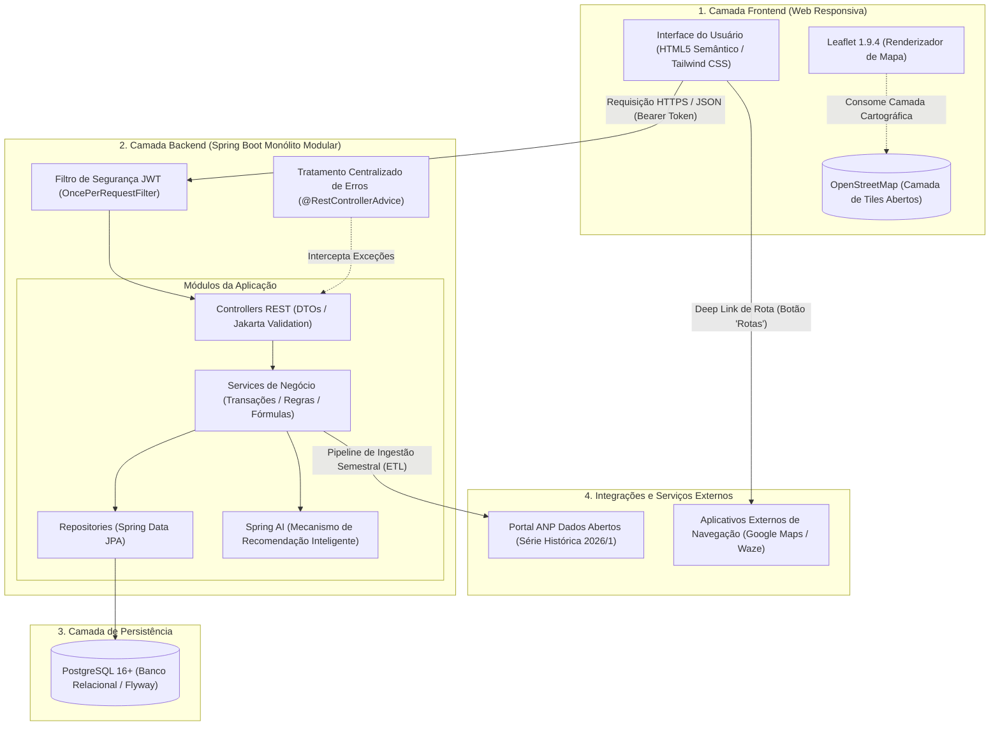
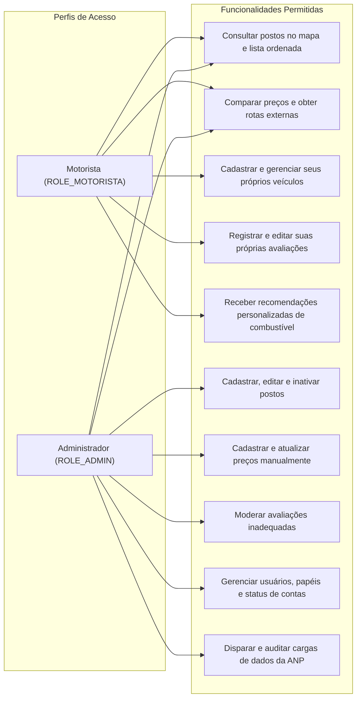
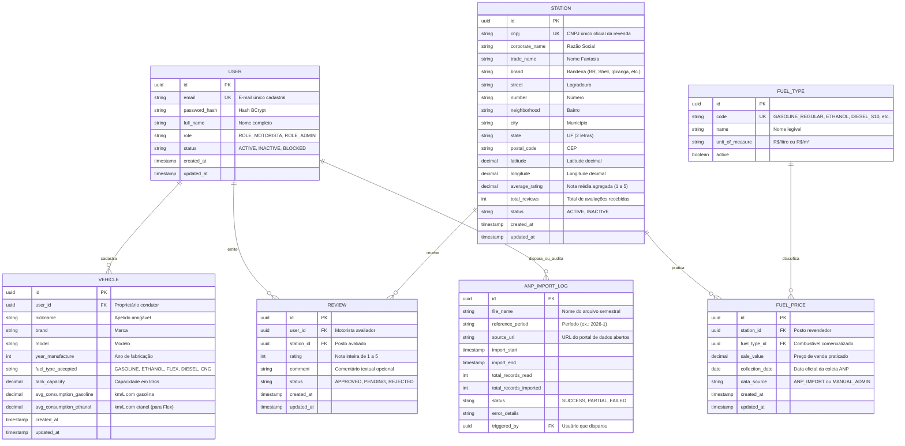
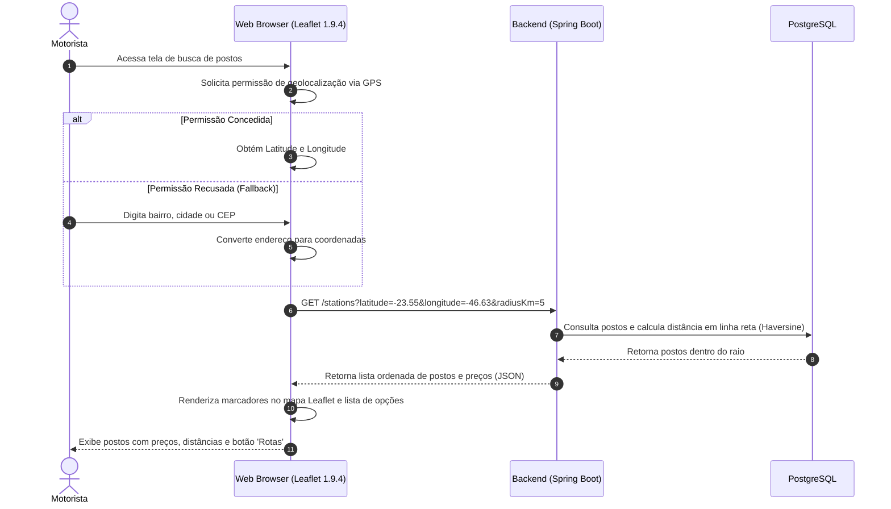
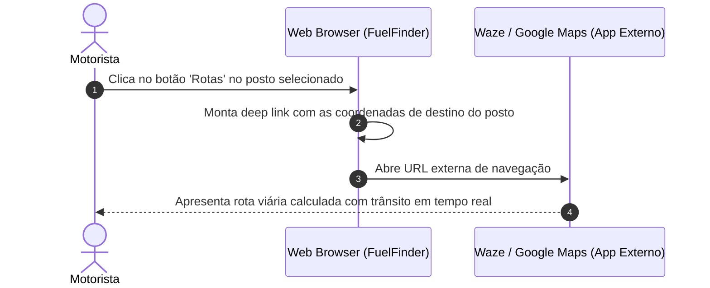
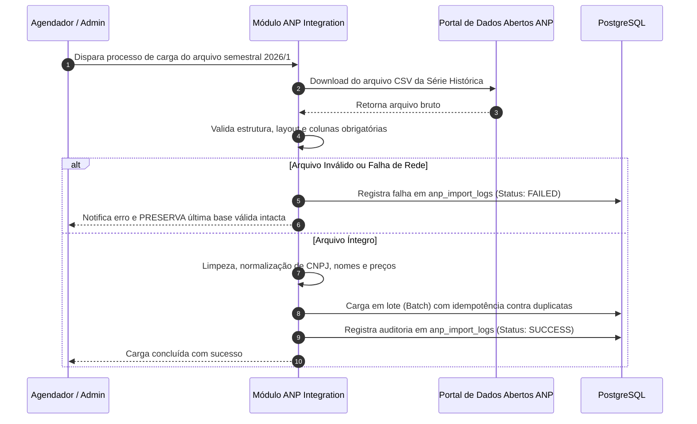

# Arquitetura do Sistema — FuelFinder

Este documento estabelece formalmente a arquitetura de software, modelo de dados, catálogo de endpoints REST, integrações externas e fluxos operacionais da plataforma **FuelFinder**.

Ele foi estruturado especificamente como a **especificação arquitetural executável e base de implementação para a próxima aula**.

---

## 1. Visão Geral da Arquitetura

O FuelFinder adota a arquitetura de **Monolito Modular em Camadas**, expondo uma **API REST stateless** consumida por uma interface **Web Responsiva** com visualização cartográfica interativa.

```text
[ Cliente Web Responsivo ] (HTML5 / Tailwind CSS / Vanilla JS / Leaflet 1.9.4)
              │
              │ HTTPS / JSON (Bearer JWT)
              ▼
[ Backend Monólito Modular ] (Spring Boot 3.4 / Java 21 LTS)
  ├── Security Filter (JWT & RBAC)
  ├── Controllers REST & DTOs (Records)
  ├── Services de Domínio & Recomendações (Spring AI)
  └── Repositories (Spring Data JPA)
              │
              │ JDBC / SQL
              ▼
[ Banco de Dados Relacional ] (PostgreSQL 16+)
```

### 1.1 Justificativa Arquitetural
* **Entrega Ágil no MVP:** O monólito modular permite desenvolver e testar rapidamente todas as funcionalidades em uma única base de código, com deploy simples e transações ACID nativas no PostgreSQL, sem o overhead operacional e latência de microsserviços.
* **Fronteiras Claras de Domínio:** Cada domínio de negócio (`auth`, `user`, `vehicle`, `station`, `fuel`, `price`, `review`, `recommendation`, `anp`) é isolado em seu próprio módulo, com interfaces públicas explícitas (`Service`), facilitando a futura extração para microsserviços caso a volumetria justifique.
* **Desacoplamento Total:** O backend é estritamente stateless e orientador das regras de negócio. O frontend é uma aplicação web leve e responsiva, focada na experiência do motorista e renderização de mapas via Leaflet 1.9.4.

---

## 2. Diagrama Geral da Arquitetura em Camadas

O diagrama abaixo ilustra a segregação entre as camadas de Frontend, Backend, Banco de Dados e Serviços Externos:



---

## 3. Tipos de Usuários e Suas Permissões (RBAC)

O controle de acesso é baseado em papéis (Role-Based Access Control):



* **Motorista (`ROLE_MOTORISTA`):** Perfil atribuído no autocadastro. Pode consultar postos, comparar preços, registrar veículos com consumos médios informados, emitir avaliações e receber recomendações personalizadas.
* **Administrador (`ROLE_ADMIN`):** Gestão governamental da plataforma. Pode gerenciar postos, retificar preços, moderar avaliações, ativar/bloquear contas e acompanhar os processos de carga da ANP.

---

## 4. Entidades Principais e Relacionamentos (ERD)

O diagrama a seguir define as entidades, chaves primárias, chaves estrangeiras, restrições e relacionamentos:



---

## 5. Endpoints da API REST (Catálogo Completo com Contratos)

> [!IMPORTANT]
> **Correção Normativa de `PATH` para `PATCH`:**
> A especificação original grafou erroneamente o método como `PATH`. Esta arquitetura adota formalmente o método HTTP **`PATCH`** para atualizações parciais, em total conformidade com a RFC 5789.

### 5.1 Autenticação e Sessão (`/auth`)

| Método | Rota | Objetivo | Perfil Autorizado | Status Esperado |
| :---: | :--- | :--- | :--- | :--- |
| `POST` | `/auth/register` | Cadastra novo usuário motorista | Público | `201 Created` |
| `POST` | `/auth/login` | Autentica com e-mail/senha e emite token JWT | Público | `200 OK` |
| `POST` | `/auth/logout` | Encerra sessão ativa no cliente | Autenticado | `204 No Content` |
| `POST` | `/auth/refresh` | Renova token de acesso | Autenticado | `200 OK` |
| `GET` | `/auth/me` | Retorna dados e permissões do usuário autenticado | Autenticado | `200 OK` |
| `PATCH`| `/users/me` | Atualiza dados cadastrais do próprio usuário | Autenticado | `200 OK` |

#### Exemplo: `POST /auth/login`
**Request Payload:**
```json
{
  "email": "motorista@email.com",
  "password": "SenhaForte@2026"
}
```
**Response Payload (200 OK):**
```json
{
  "accessToken": "eyJhbGciOiJIUzI1NiIsInR5cCI6IkpXVCJ9...",
  "tokenType": "Bearer",
  "expiresIn": 86400,
  "user": {
    "id": "3fa85f64-5717-4562-b3fc-2c963f66afa6",
    "fullName": "Carlos Silva",
    "email": "motorista@email.com",
    "role": "ROLE_MOTORISTA"
  }
}
```

---

### 5.2 Veículos (`/vehicles`)

| Método | Rota | Objetivo | Perfil Autorizado | Status Esperado |
| :---: | :--- | :--- | :--- | :--- |
| `POST` | `/vehicles` | Cadastra veículo com consumo informado | `ROLE_MOTORISTA` | `201 Created` |
| `GET` | `/vehicles` | Lista veículos cadastrados pelo motorista | `ROLE_MOTORISTA` | `200 OK` |
| `GET` | `/vehicles/{id}` | Consulta detalhes de um veículo do motorista | `ROLE_MOTORISTA` | `200 OK` |
| `PATCH`| `/vehicles/{id}` | Atualiza dados cadastrais ou consumo do veículo | `ROLE_MOTORISTA` | `200 OK` |
| `DELETE`| `/vehicles/{id}` | Remove um veículo cadastrado | `ROLE_MOTORISTA` | `204 No Content` |

#### Exemplo: `POST /vehicles`
**Request Payload:**
```json
{
  "nickname": "Meu Onix",
  "brand": "Chevrolet",
  "model": "Onix 1.0 Flex",
  "yearManufacture": 2023,
  "fuelTypeAccepted": "FLEX",
  "tankCapacity": 54.0,
  "averageConsumptionGasoline": 13.5,
  "averageConsumptionEthanol": 9.2
}
```

---

### 5.3 Postos de Combustível (`/stations`)

| Método | Rota | Objetivo | Perfil Autorizado | Status Esperado |
| :---: | :--- | :--- | :--- | :--- |
| `GET` | `/stations` | Busca postos por geolocalização ou texto | Público / Autenticado | `200 OK` |
| `GET` | `/stations/{id}` | Consulta detalhes do posto e preços vigentes | Público / Autenticado | `200 OK` |
| `POST` | `/stations` | Cadastra novo posto revendedor | `ROLE_ADMIN` | `201 Created` |
| `PATCH`| `/stations/{id}` | Atualiza informações cadastrais do posto | `ROLE_ADMIN` | `200 OK` |
| `DELETE`| `/stations/{id}` | Inativa logicamente um posto | `ROLE_ADMIN` | `204 No Content` |

#### Exemplo: `GET /stations?latitude=-23.5505&longitude=-46.6333&radiusKm=5`
**Response Payload (200 OK):**
```json
[
  {
    "id": "c1f7b8a2-1234-4b5c-8901-abcdef123456",
    "corporateName": "AUTO POSTO CENTRAL LTDA",
    "tradeName": "Posto Central",
    "brand": "IPIRANGA",
    "address": "Av. Paulista, 1000 - Bela Vista, São Paulo - SP",
    "latitude": -23.5614,
    "longitude": -46.6558,
    "distanceKm": 2.45,
    "averageRating": 4.6,
    "totalReviews": 38,
    "prices": [
      {
        "fuelType": "GASOLINE_REGULAR",
        "saleValue": 5.79,
        "collectionDate": "2026-03-15",
        "dataSource": "ANP_IMPORT"
      },
      {
        "fuelType": "ETHANOL",
        "saleValue": 3.89,
        "collectionDate": "2026-03-15",
        "dataSource": "ANP_IMPORT"
      }
    ]
  }
]
```

---

### 5.4 Preços e Comparação (`/fuel-prices`)

| Método | Rota | Objetivo | Perfil Autorizado | Status Esperado |
| :---: | :--- | :--- | :--- | :--- |
| `GET` | `/stations/{id}/fuel-prices` | Lista preços cadastrados do posto | Público / Autenticado | `200 OK` |
| `POST` | `/stations/{id}/fuel-prices` | Registra novo preço de combustível | `ROLE_ADMIN` | `201 Created` |
| `PATCH`| `/stations/{id}/fuel-prices/{priceId}` | Atualiza preço existente | `ROLE_ADMIN` | `200 OK` |
| `GET` | `/fuel-prices/compare` | Compara postos ordenados por preço/distância | Público / Autenticado | `200 OK` |

---

### 5.5 Avaliações (`/reviews`)

| Método | Rota | Objetivo | Perfil Autorizado | Status Esperado |
| :---: | :--- | :--- | :--- | :--- |
| `GET` | `/stations/{id}/reviews` | Lista avaliações aprovadas do posto | Público / Autenticado | `200 OK` |
| `POST` | `/stations/{id}/reviews` | Registra avaliação com nota (1 a 5) | `ROLE_MOTORISTA` | `201 Created` |
| `PATCH`| `/reviews/{id}` | Edita a própria avaliação | `ROLE_MOTORISTA` | `200 OK` |
| `DELETE`| `/reviews/{id}` | Remove avaliação (autor ou moderação) | `ROLE_MOTORISTA` / `ROLE_ADMIN` | `204 No Content` |

---

### 5.6 Recomendações Inteligentes (`/recommendations`)

| Método | Rota | Objetivo | Perfil Autorizado | Status Esperado |
| :---: | :--- | :--- | :--- | :--- |
| `GET` | `/recommendations/fuel` | Retorna recomendação de melhor custo-benefício | `ROLE_MOTORISTA` | `200 OK` |

#### Exemplo: `GET /recommendations/fuel?vehicleId=...&latitude=-23.5505&longitude=-46.6333&radiusKm=5`
**Response Payload (200 OK):**
```json
{
  "vehicle": {
    "nickname": "Meu Onix",
    "fuelTypeAccepted": "FLEX"
  },
  "recommendedFuel": "ETHANOL",
  "explanation": "Com base no consumo informado (9.2 km/L no etanol vs 13.5 km/L na gasolina), o etanol tem custo de R$ 0,42/km contra R$ 0,43/km da gasolina no Posto Central, garantindo a maior economia.",
  "parityPercentage": 67.18,
  "topOptions": [
    {
      "stationId": "c1f7b8a2-1234-4b5c-8901-abcdef123456",
      "stationName": "Posto Central",
      "brand": "IPIRANGA",
      "fuelType": "ETHANOL",
      "price": 3.89,
      "distanceKm": 2.45,
      "costPerKm": 0.4228,
      "estimatedFullTankCost": 210.06,
      "estimatedRoundTripCost": 2.07
    }
  ]
}
```

---

## 6. Fluxos Principais do Sistema

### 6.1 Fluxo: Consulta Geolocalizada de Postos com Leaflet


### 6.2 Fluxo: Redirecionamento de Rotas para Waze / Google Maps


### 6.3 Fluxo: Ingestão de Dados Públicos da ANP (ETL com Resiliência)


---

## 7. Registros de Decisão de Arquitetura (ADRs)

| ADR | Título | Decisão | Consequência |
| :--- | :--- | :--- | :--- |
| **ADR-001** | Monólito Modular | Adotado monólito modular com Spring Boot 3.4. | Simplicidade operacional no MVP, facilidade de deploy e integridade transacional. |
| **ADR-002** | Java 21 LTS e Records | Homologado Java 21 LTS como runtime oficial. | Suporte nativo a DTOs com Java Records, alta performance com Virtual Threads. |
| **ADR-003** | PostgreSQL 16 + Flyway | SGBD relacional com migrações declarativas. | Consistência ACID, cálculos trigonométricos de distância e rastreabilidade com Flyway. |
| **ADR-004** | Leaflet 1.9.4 + OpenStreetMap | Mapa gratuito com tiles abertos. | Custo zero de licença no MVP, visualização leve e compatível com navegadores móveis. |
| **ADR-005** | Distância em Linha Reta + Rotas Externas | Distância por Haversine e deep link para Waze/Google Maps. | Sem custo com APIs de roteamento; o condutor usa seu navegador GPS habitual. |
| **ADR-006** | Ingestão ANP com Resiliência | Pipeline ETL do arquivo semestral 2026/1 com fallback. | Alta disponibilidade; preservação da base anterior em caso de erro na fonte governamental. |
| **ADR-007** | Consumo Informado pelo Motorista | Consumo médio cadastrado diretamente pelo condutor. | Não depende de manuais ou tabelas externas no MVP; suporta paridade flex precisa. |
