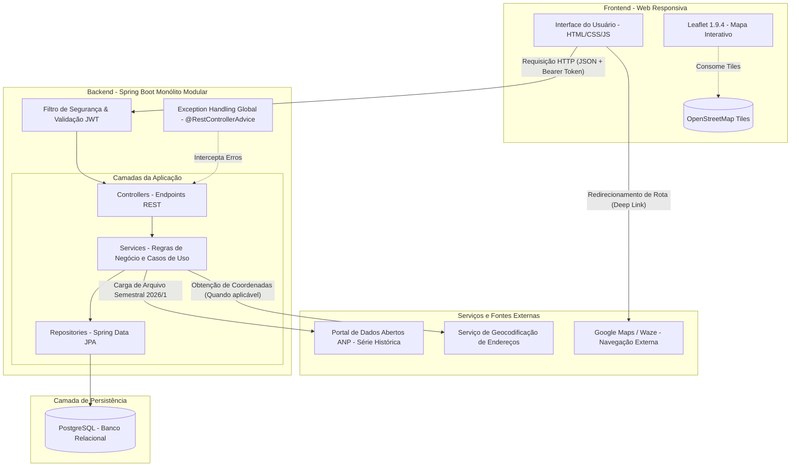
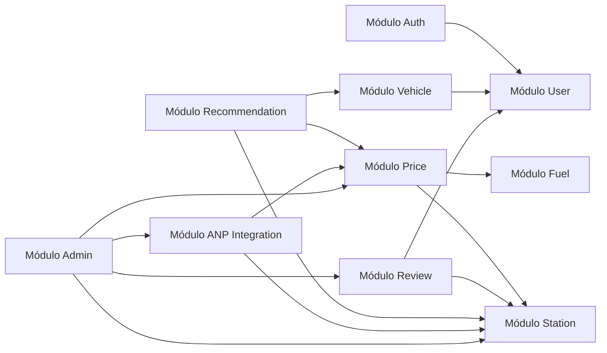
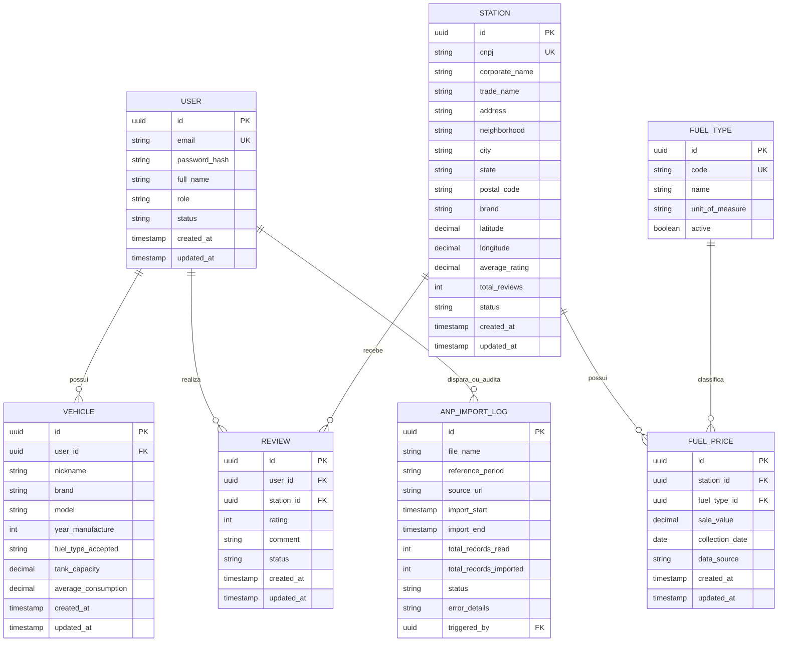
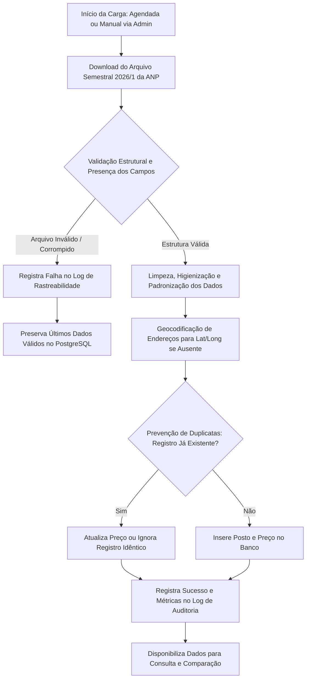
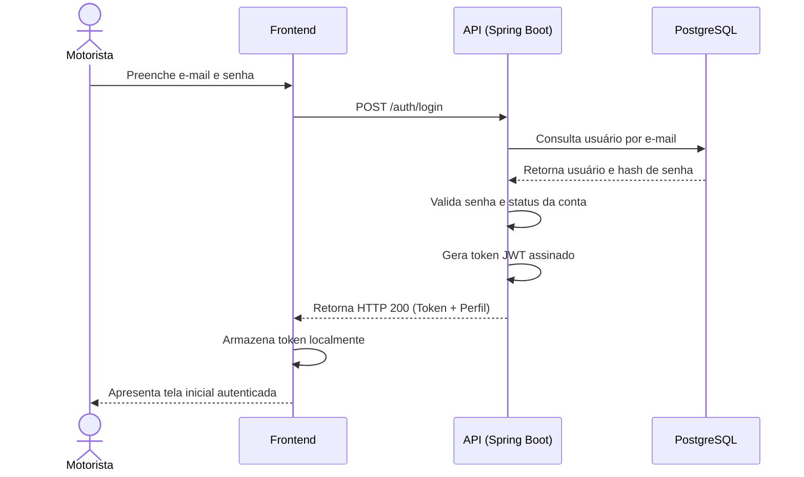
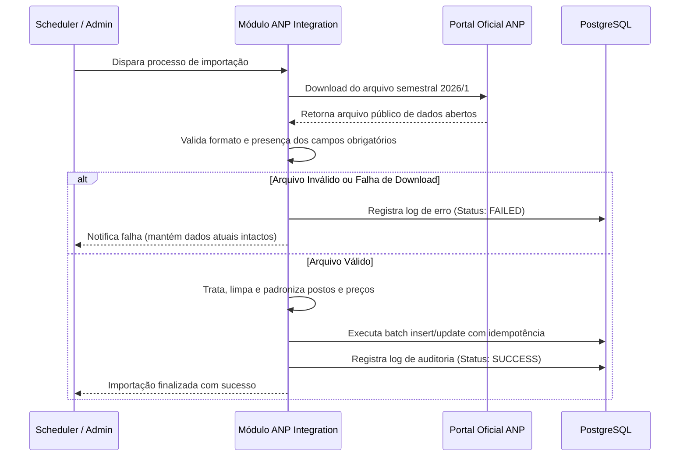
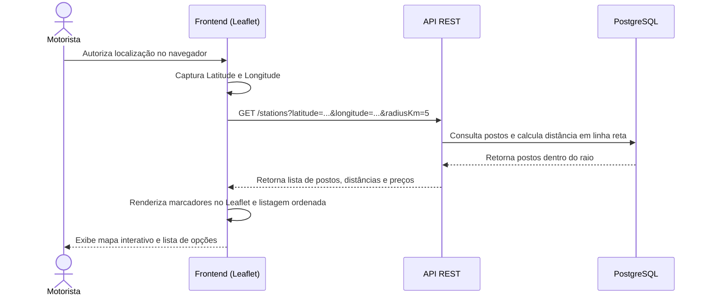
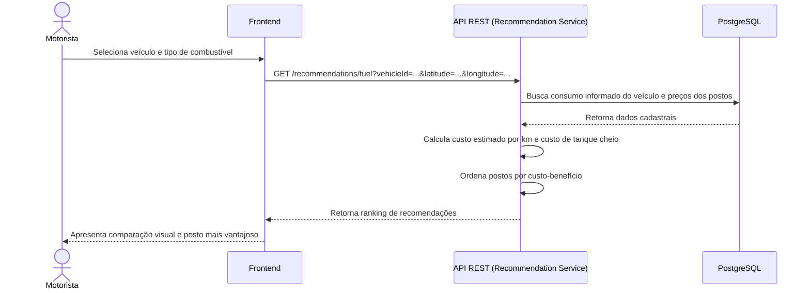
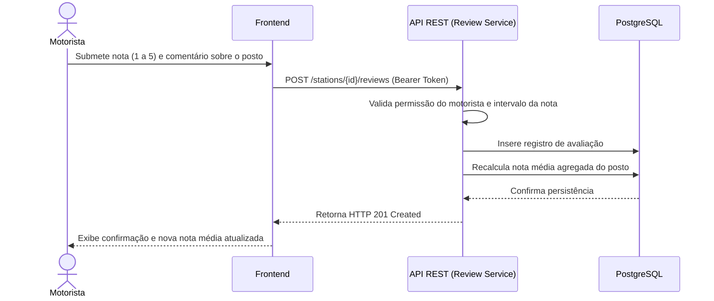
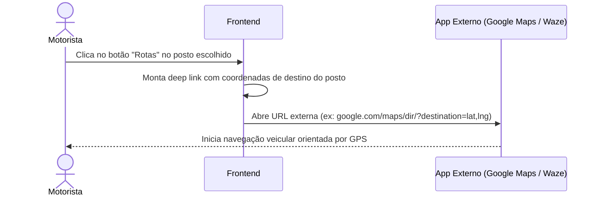

# Arquitetura do Sistema — FuelFinder

Este documento descreve detalhadamente a arquitetura planejada para a plataforma **FuelFinder**. 
Como o projeto está em **fase de concepção e planejamento**, este material constitui a referência estrutural e técnica formal para a futura implementação, consolidando decisões, padrões de comunicação, diagrama de dados, endpoints e fluxos operacionais.

---

## 1. Visão Geral da Arquitetura

O FuelFinder é concebido inicialmente como um **Monólito Modular** que expõe uma **API REST** para clientes web responsivos.

```text
Frontend (Web Responsiva / Leaflet)
             ↓  (HTTP/REST + JWT via HTTPS)
Backend (Spring Boot - Monólito Modular)
             ↓  (JDBC / JPA)
Banco de Dados Relacional (PostgreSQL)
```

### 1.1 Justificativa Arquitetural

* **Simplicidade Operacional no MVP:** A opção pelo monólito modular viabiliza entrega ágil com uma base de código unificada, baixo custo de infraestrutura e sem a sobrecarga de governança e latência de rede típica de microsserviços (como orquestração distribuída, transações distribuídas via saga e múltiplos pipelines de CI/CD).
* **Fronteiras Claras de Domínio:** O código é segregado logicamente em módulos independentes com alto acoplamento interno e baixo acoplamento externo, garantindo manutenibilidade e permitindo que qualquer módulo seja extraído para um serviço autônomo no futuro, caso a volumetria justifique.
* **Desacoplamento Cliente-Servidor:** O backend atua exclusivamente como fornecedor de dados via API REST stateless em formato JSON, enquanto o frontend gerencia sua interface responsiva, renderização de mapas e gerenciamento de estado da aplicação.

---

## 2. Diagrama Geral da Arquitetura

O diagrama abaixo representa a arquitetura física e lógica planejada do sistema, incluindo os fluxos de requisição e componentes transversais:



---

## 3. Camadas da Aplicação e Responsabilidades

O backend adota a separação arquitetural em camadas do ecossistema Spring:

```text
[ Requisição HTTP ]
        ↓
Security (JWT Filter & RBAC)
        ↓
Controller (Exposição REST & Validação de Payload)
        ↓
Service (Casos de Uso, Regras de Negócio & Cálculos)
        ↓
Repository (Persistência & Queries Spring Data JPA)
        ↓
Database (PostgreSQL)
```

### 3.1 Responsabilidade de Cada Camada

| Camada | Responsabilidade Técnica | O que NÃO deve conter |
| :--- | :--- | :--- |
| **Controller** | Mapeamento de rotas HTTP, extração de parâmetros, deserialização de JSON, disparo de Bean Validation (`@Valid`) e retorno de DTOs com status HTTP semântico. | Cálculos de negócio, regras de domínio, chamadas diretas a repositórios, manipulação de entidades JPA. |
| **Service** | Implementação dos casos de uso, validação de regras e invariantes de negócio, cálculos matemáticos (consumo, autonomia, custo por km), orquestração de transações (`@Transactional`) e disparo de exceções tipadas. | Objetos de requisição/resposta HTTP (`HttpServletRequest`), geração de status HTTP. |
| **Repository** | Abstração de persistência via interfaces Spring Data JPA, execução de queries relacionais (JPQL/Nativas) otimizadas para filtros e paginação. | Regras de validação de negócio ou transformações de apresentação. |
| **Entity** | Classes de mapeamento objeto-relacional representando o modelo de dados persistido no PostgreSQL. Mantêm integridade de tipos, restrições e auditoria temporal. | Lógicas de apresentação externa ou referências a DTOs. |
| **DTO** | Objetos de transferência de dados que definem os contratos formais de entrada (Request) e saída (Response) da API REST, isolando a estrutura do banco de dados. | Métodos com regras de negócio complexas ou estado persistido. |
| **Security** | Interceptação transversal de requisições, decodificação e validação de tokens JWT, injeção do usuário autenticado no contexto (`SecurityContext`) e garantia de controle de acesso (RBAC: Motorista e Administrador). | Lógicas de regras de negócio desvinculadas de segurança. |
| **Exception Handling** | Componente transversal (`@RestControllerAdvice`) que captura exceções de negócio e de sistema, transformando-as em respostas HTTP estruturadas e previsíveis. | Execução de regras de negócio ou mutação de estado de entidades. |

---

## 4. Domínios e Módulos do Sistema

A aplicação é dividida modularmente nos seguintes domínios de negócio:



### 4.1 Detalhamento dos Módulos

#### 1. Módulo de Autenticação (`auth`)
* **Responsabilidade:** Registro de usuários, autenticação por e-mail e senha, emissão e renovação de tokens de acesso JWT e encerramento de sessão.
* **Entidades Envolvidas:** `User` e `TokenSession` (se adotado controle de sessão ativa).
* **Principais Regras:** Senhas com hash criptográfico seguro; token stateless emitido no login.
* **Endpoints:** `/auth/register`, `/auth/login`, `/auth/logout`, `/auth/refresh`, `/auth/me`.
* **Dependências:** Módulo `user`.

#### 2. Módulo de Usuários (`user`)
* **Responsabilidade:** Manutenção cadastral de usuários, controle de perfis de acesso (RBAC) e alteração de status da conta.
* **Entidades Envolvidas:** `User`, `Role`.
* **Principais Regras:** E-mail único no sistema; bloqueio e inativação de contas por administradores.
* **Endpoints:** `/users/me`, `/users`, `/users/{id}`, `/users/{id}/role`, `/users/{id}/status`.
* **Dependências:** Nenhuma direta.

#### 3. Módulo de Veículos (`vehicle`)
* **Responsabilidade:** Gestão dos veículos pertencentes ao motorista e armazenamento do consumo médio informado.
* **Entidades Envolvidas:** `Vehicle`.
* **Principais Regras:** Usuário informa consumo com base em sua experiência; não consulta manuais no MVP. Capacidade de tanque e consumo devem ser valores positivos.
* **Endpoints:** `/vehicles`, `/vehicles/{id}` (CRUD completo).
* **Dependências:** Módulo `user`.

#### 4. Módulo de Postos (`station`)
* **Responsabilidade:** Gestão do cadastro de postos revendedores, localização geográfica (latitude/longitude), endereço completo e busca por proximidade.
* **Entidades Envolvidas:** `Station`.
* **Principais Regras:** Suporte à consulta geolocalizada por raio e busca manual por texto; cálculo de distância em linha reta no MVP.
* **Endpoints:** `/stations`, `/stations/{id}` (Consulta pública/autenticada e CRUD administrativo).
* **Dependências:** Nenhuma direta.

#### 5. Módulo de Combustíveis (`fuel`)
* **Responsabilidade:** Manutenção do catálogo de produtos combustíveis comercializados (Gasolina Comum, Gasolina Aditivada, Etanol, Diesel S10, GNV, etc.).
* **Entidades Envolvidas:** `FuelType`.
* **Principais Regras:** Padronização das nomenclaturas oficiais da ANP.
* **Endpoints:** Gerenciados administrativamente.
* **Dependências:** Nenhuma direta.

#### 6. Módulo de Preços (`price`)
* **Responsabilidade:** Armazenamento e consulta dos preços de venda praticados pelos postos, preservando a data da coleta e histórico.
* **Entidades Envolvidas:** `FuelPrice`.
* **Principais Regras:** Valores possuem caráter histórico/informativo baseado na coleta da ANP; exibição obrigatória da data de referência. Preços também podem ser cadastrados/atualizados pela administração.
* **Endpoints:** `/stations/{id}/fuel-prices`, `/stations/{id}/fuel-prices/{priceId}`, `/fuel-prices/compare`.
* **Dependências:** Módulos `station` e `fuel`.

#### 7. Módulo de Avaliações (`review`)
* **Responsabilidade:** Registro de avaliações com nota e comentário de motoristas para os postos, cálculo da média agregada e moderação.
* **Entidades Envolvidas:** `Review`.
* **Principais Regras:** Nota em escala definida (ex.: 1 a 5); cálculo automático da média do posto; moderação e exclusão por administradores.
* **Endpoints:** `/stations/{id}/reviews`, `/reviews/{id}`.
* **Dependências:** Módulos `user` e `station`.

#### 8. Módulo de Recomendações (`recommendation`)
* **Responsabilidade:** Algoritmos de ordenação e sugestão de melhor custo-benefício, considerando preço, distância em linha reta, compatibilidade e consumo do veículo.
* **Entidades Envolvidas:** Consome dados de `Vehicle`, `Station` e `FuelPrice`.
* **Principais Regras:** Centralizado no backend para assegurar consistência de regras de negócio.
* **Endpoints:** `/recommendations/fuel`.
* **Dependências:** Módulos `vehicle`, `station` e `price`.

#### 9. Módulo de Integração com a ANP (`anp`)
* **Responsabilidade:** Download, validação estrutural, limpeza, transformação e carga dos arquivos da Série Histórica da ANP (1º Semestre de 2026), com rastreabilidade e política de fallback.
* **Entidades Envolvidas:** `AnpImportLog`.
* **Principais Regras:** Idempotência para evitar registros duplicados do mesmo arquivo; preservação dos últimos dados válidos em caso de falha.
* **Endpoints:** Executado via rotina batch/agendada e/ou disparador administrativo.
* **Dependências:** Módulos `station`, `fuel` e `price`.

#### 10. Módulo de Administração (`admin`)
* **Responsabilidade:** Painel central de gestão de entidades, moderação de conteúdos, acompanhamento de cargas de dados e parametrizações da plataforma.
* **Dependências:** Atua de forma transversal consumindo os serviços administrativos dos demais módulos.

---

## 5. Entidades e Relacionamentos

### 5.1 Diagrama de Entidade-Relacionamento (ERD)



> [!NOTE]
> **Nota sobre Entidade de Abastecimento (`Fueling`):**
> O módulo e a entidade de registro de abastecimento para cálculo de consumo real com hodômetro constam na especificação como funcionalidade **Pós-MVP / Em Avaliação**. Não foram incluídos como entidade obrigatória do MVP para preservar rigor com a especificação, sendo detalhados na seção de divergências e evoluções futuras.

### 5.2 Descrição das Entidades

1. **`User`:** Representa os usuários cadastrados. Armazena credenciais criptografadas, dados cadastrais, perfil de acesso (`ROLE_MOTORISTA` ou `ROLE_ADMIN`) e status da conta (`ACTIVE`, `INACTIVE`, `BLOCKED`).
2. **`Vehicle`:** Veículos cadastrados por motoristas. Contém marca, modelo, ano, capacidade do tanque em litros e consumo médio (km/L) informado diretamente pelo condutor com base na sua experiência prática.
3. **`Station`:** Postos revendedores de combustível. Contém dados cadastrais oficiais (CNPJ, Razão Social, Nome Fantasia, Bandeira), endereço completo e coordenadas geográficas (latitude e longitude) para exibição em mapa.
4. **`FuelType`:** Tipos de combustíveis reconhecidos pelo sistema (Gasolina Comum, Gasolina Aditivada, Etanol, Diesel S10, GNV, etc.).
5. **`FuelPrice`:** Preços de venda de combustível praticados em determinado posto, com data de coleta oficial pela ANP (ou inserção manual) e valor numérico por unidade de medida.
6. **`Review`:** Avaliação de um posto realizada por um motorista autenticado, contendo pontuação numérica (1 a 5), comentário opcional e status para moderação.
7. **`AnpImportLog`:** Registro de auditoria e rastreabilidade dos processos de importação dos dados abertos da ANP, contendo período de referência, data/hora, quantidade de registros e status da operação.

---

## 6. Endpoints da API REST

Abaixo estão detalhados os endpoints da API REST do FuelFinder organizados por domínio funcional.

### 6.1 Autenticação e Sessão (`/auth`)

| Método | Rota | Objetivo | Perfil Autorizado | Parâmetros / Body | Resposta Esperada | Regras de Negócio |
| :---: | :--- | :--- | :--- | :--- | :--- | :--- |
| `POST` | `/auth/register` | Realiza o cadastro de um novo usuário motorista. | Público | Body: `fullName`, `email`, `password` | `201 Created` + Dados básicos do usuário | E-mail deve ser único; senha armazenada com hash seguro. |
| `POST` | `/auth/login` | Autentica o usuário e gera o token JWT. | Público | Body: `email`, `password` | `200 OK` + `accessToken`, `refreshToken`, dados do perfil | Credenciais validadas; conta não pode estar inativa ou bloqueada. |
| `POST` | `/auth/logout` | Encerra a sessão ativa invalidando o token. | Autenticado | Header: `Authorization: Bearer <token>` | `204 No Content` | Invalidação do token ou refresh token no cliente/servidor. |
| `POST` | `/auth/refresh` | Renova o token de acesso expirado. | Público / Autenticado | Body: `refreshToken` | `200 OK` + novo `accessToken` | Refresh token válido e não revogado. |
| `GET` | `/auth/me` | Retorna os dados do usuário autenticado na sessão. | Autenticado | Header: `Authorization` | `200 OK` + Perfil, e-mail e dados do usuário | Identifica usuário a partir do token JWT. |
| `PATCH` | `/users/me` | Atualiza dados cadastrais do próprio usuário. | Autenticado | Body: `fullName`, `password` (opcional) | `200 OK` + Dados atualizados | *(Nota de inconsistência: especificação grafou como `PATH`)*. |

### 6.2 Gestão de Usuários e RBAC (`/users`)

| Método | Rota | Objetivo | Perfil Autorizado | Parâmetros / Body | Resposta Esperada | Regras de Negócio |
| :---: | :--- | :--- | :--- | :--- | :--- | :--- |
| `GET` | `/users` | Lista usuários cadastrados com paginação. | Administrador | Query: `page`, `size`, `status` | `200 OK` + Lista paginada de usuários | Acesso restrito a administradores. |
| `GET` | `/users/{id}` | Consulta detalhes de um usuário específico. | Administrador | Path: `id` | `200 OK` + Dados detalhados | Usuário deve existir no sistema. |
| `PATCH` | `/users/{id}/role` | Altera o perfil de acesso de um usuário. | Administrador | Path: `id`, Body: `role` (`MOTORISTA`, `ADMIN`) | `200 OK` + Usuário com novo perfil | Apenas administradores podem promover ou alterar perfis. |
| `PATCH` | `/users/{id}/status` | Ativa, inativa ou bloqueia uma conta. | Administrador | Path: `id`, Body: `status` (`ACTIVE`, `INACTIVE`, `BLOCKED`) | `200 OK` + Usuário com status atualizado | Bloqueia novas autenticações imediatamente. |

### 6.3 Gestão de Veículos (`/vehicles`)

| Método | Rota | Objetivo | Perfil Autorizado | Parâmetros / Body | Resposta Esperada | Regras de Negócio |
| :---: | :--- | :--- | :--- | :--- | :--- | :--- |
| `POST` | `/vehicles` | Cadastra veículo para o motorista autenticado. | Motorista | Body: `nickname`, `brand`, `model`, `year`, `fuelTypeAccepted`, `tankCapacity`, `averageConsumption` | `201 Created` + Veículo criado | Consumo informado pelo usuário; capacidade e consumo > 0. |
| `GET` | `/vehicles` | Lista veículos do motorista autenticado. | Motorista | Header: `Authorization` | `200 OK` + Lista de veículos | Retorna exclusivamente os veículos do usuário autenticado. |
| `GET` | `/vehicles/{id}` | Retorna detalhes de um veículo do usuário. | Motorista | Path: `id` | `200 OK` + Detalhes do veículo | Motorista só pode visualizar seus próprios veículos. |
| `PATCH` | `/vehicles/{id}` | Atualiza dados cadastrais do veículo. | Motorista | Path: `id`, Body com campos a atualizar | `200 OK` + Veículo atualizado | *(Nota de inconsistência: especificação grafou como `PATH`)*. |
| `DELETE` | `/vehicles/{id}` | Remove um veículo cadastrado pelo usuário. | Motorista | Path: `id` | `204 No Content` | Motorista só pode remover seus próprios veículos. |

### 6.4 Consulta e Gestão de Postos (`/stations`)

| Método | Rota | Objetivo | Perfil Autorizado | Parâmetros / Body | Resposta Esperada | Regras de Negócio |
| :---: | :--- | :--- | :--- | :--- | :--- | :--- |
| `GET` | `/stations` | Lista postos próximos com filtros e paginação. | Público / Autenticado | Query: `latitude`, `longitude`, `radiusKm`, `fuelType`, `minRating`, `sort`, `page`, `size` | `200 OK` + Lista de postos e distâncias estimadas | Calcula distância em linha reta; busca por coordenadas ou texto. |
| `GET` | `/stations/{id}` | Detalhes completos de um posto específico. | Público / Autenticado | Path: `id` | `200 OK` + Posto, preços vigentes e nota média | Exibe data da coleta dos preços e dados de contato. |
| `POST` | `/stations` | Cadastra manualmente um novo posto revendedor. | Administrador | Body: `cnpj`, `tradeName`, `corporateName`, `address`, `latitude`, `longitude`, `brand` | `201 Created` + Posto cadastrado | CNPJ único; coordenadas válidas. |
| `PATCH` | `/stations/{id}` | Atualiza informações cadastrais de um posto. | Administrador | Path: `id`, Body com campos a atualizar | `200 OK` + Posto atualizado | *(Nota de inconsistência: especificação grafou como `PATH`)*. |
| `DELETE` | `/stations/{id}` | Remove ou inativa logicamente um posto. | Administrador | Path: `id` | `204 No Content` | Inativação preserva histórico de preços e avaliações. |

### 6.5 Preços de Combustíveis e Comparação (`/fuel-prices`)

| Método | Rota | Objetivo | Perfil Autorizado | Parâmetros / Body | Resposta Esperada | Regras de Negócio |
| :---: | :--- | :--- | :--- | :--- | :--- | :--- |
| `GET` | `/stations/{id}/fuel-prices` | Lista preços cadastrados para um posto. | Público / Autenticado | Path: `id` | `200 OK` + Preços por combustível com data de coleta | Exibe claramente o caráter histórico e data de coleta ANP. |
| `POST` | `/stations/{id}/fuel-prices` | Registra novo preço de combustível para o posto. | Administrador / Operador Autorizado | Path: `id`, Body: `fuelTypeId`, `saleValue`, `collectionDate` | `201 Created` + Preço registrado | Valor de venda estritamente positivo; registra data de referência. |
| `PATCH` | `/stations/{id}/fuel-prices/{priceId}` | Atualiza ou retifica um preço registrado. | Administrador / Operador Autorizado | Path: `id`, `priceId`, Body: `saleValue` | `200 OK` + Preço atualizado | *(Nota de inconsistência: especificação grafou como `PATH`)*. |
| `GET` | `/fuel-prices/compare` | Retorna comparação de preços conforme localização e filtros. | Público / Autenticado | Query: `latitude`, `longitude`, `fuelType`, `vehicleId`, `radiusKm`, `sort` | `200 OK` + Postos ordenados, preços, distância e custo/km | Custo/km e custo total estimados caso veículo seja informado. |

### 6.6 Avaliações de Postos (`/reviews`)

| Método | Rota | Objetivo | Perfil Autorizado | Parâmetros / Body | Resposta Esperada | Regras de Negócio |
| :---: | :--- | :--- | :--- | :--- | :--- | :--- |
| `GET` | `/stations/{id}/reviews` | Lista avaliações registradas para um posto. | Público / Autenticado | Path: `id`, Query: `page`, `size` | `200 OK` + Lista paginada de avaliações | Retorna apenas avaliações com status ativo/aprovado. |
| `POST` | `/stations/{id}/reviews` | Registra uma avaliação e nota para o posto. | Motorista | Path: `id`, Body: `rating` (1 a 5), `comment` | `201 Created` + Avaliação criada | Usuário autenticado; nota entre 1 e 5; recalcula nota média do posto. |
| `PATCH` | `/reviews/{id}` | Atualiza uma avaliação criada pelo próprio usuário. | Motorista | Path: `id`, Body: `rating`, `comment` | `200 OK` + Avaliação atualizada | Motorista só pode editar sua própria avaliação. *(Nota: `PATH` no original)*. |
| `DELETE` | `/reviews/{id}` | Remove uma avaliação. | Autor da avaliação ou Administrador | Path: `id` | `204 No Content` | Motorista remove sua avaliação ou Administrador modera conteúdo. |

### 6.7 Recomendações e Custo-Benefício (`/recommendations`)

| Método | Rota | Objetivo | Perfil Autorizado | Parâmetros / Body | Resposta Esperada | Regras de Negócio |
| :---: | :--- | :--- | :--- | :--- | :--- | :--- |
| `GET` | `/recommendations/fuel` | Retorna recomendação de melhor combustível e postos vantajosos. | Motorista | Query: `vehicleId`, `latitude`, `longitude`, `radiusKm` | `200 OK` + Ranking de recomendações com estimativa de gasto e custo/km | Processado no backend. Cruza consumo cadastrado, preço e distância em linha reta. |

### 6.8 Operações de Ingestão de Dados ANP *(Sugestão de Endpoint Administrativo)*

```text
SUGESTÃO — NÃO DEFINIDO NA ESPECIFICAÇÃO
```
A especificação estabelece o requisito mandatório de integração com a ANP para carga dos arquivos semestrais, mas não detalhou a rota REST de disparo manual da importação. Planeja-se o seguinte endpoint administrativo para execução sob demanda:

| Método | Rota | Objetivo | Perfil Autorizado | Parâmetros / Body | Resposta Esperada | Regras de Negócio |
| :---: | :--- | :--- | :--- | :--- | :--- | :--- |
| `POST` | `/admin/anp/import` | Dispara manualmente o processo de download e ingestão do arquivo ANP. | Administrador | Body opcional: `fileUrl`, `referencePeriod` | `202 Accepted` + ID do log de importação | Execução assíncrona; prevenção de duplicidade; fallback se houver falha. |
| `GET` | `/admin/anp/logs` | Consulta o histórico de execuções de importação da ANP. | Administrador | Query: `page`, `size` | `200 OK` + Lista de registros de auditoria | Exibe data, status, registros lidos e falhas. |

---

## 7. Integração com a Base de Dados da ANP

O sistema possui como núcleo de dados públicos a integração com a **Série Histórica de Preços de Combustíveis e de GLP** da ANP.

* **Fonte Oficial:** `https://www.gov.br/anp/pt-br/centrais-de-conteudo/dados-abertos/serie-historica-de-precos-de-combustiveis`
* **Base Inicial do MVP:** Arquivo semestral mais recente disponibilizado — especificamente o arquivo do **1º semestre de 2026** (enquanto permanecer como o período mais atual publicado).

### 7.1 Pipeline de Carga (ETL)

O processo de ingestão segue o fluxo estruturado:



### 7.2 Regras do Processo de Carga

1. **Rastreabilidade Obrigatória:** Cada importação registra no `anp_import_logs` a URL de origem, período de referência (ex.: "2026-1"), timestamp de início e fim, volume de linhas lidas/inseridas e status (`SUCCESS`, `PARTIAL`, `FAILED`).
2. **Resiliência e Fallback:** Se o download falhar, o formato estiver corrompido ou o arquivo contiver erros impeditivos, o sistema aborta a carga, registra o erro e **preserva integralmente a base de dados anterior** para manter a plataforma operacional.
3. **Idempotência:** Reimportações do mesmo arquivo não geram postos ou preços duplicados para o mesmo período e data de coleta.
4. **Campos Importados:** Região, Estado/UF, Município, Revenda (Razão Social e Nome Fantasia), CNPJ, Endereço completo, Bairro, CEP, Produto, Data da Coleta, Valor de Venda, Unidade de Medida e Bandeira.
5. **Caráter Histórico e Informativo:** Os preços não representam valores em tempo real. A `Data da Coleta` informada pela ANP é armazenada e obrigatoriamente exibida ao usuário.

---

## 8. Geolocalização, Mapas e Navegação Externa

* **Captura de Localização:** O frontend utiliza a API Geolocation do navegador com consentimento prévio do usuário.
* **Busca Manual Alternativa:** Se o acesso for negado ou indisponível no dispositivo, o usuário pesquisa digitando endereço, bairro, cidade ou CEP.
* **Componente de Visualização:** Biblioteca **Leaflet 1.9.4** renderizando camadas de tiles gratuitas do **OpenStreetMap**.
* **Cálculo de Distância:** Calculada no backend/banco em **linha reta** baseando-se na diferença das coordenadas geográficas (fórmula de Haversine ou esférica euclidiana), sem sobrecarga de roteamento viário interno.
* **Redirecionamento de Rotas (Navegação Externa):** A interface possui botão "Rotas" que abre o aplicativo nativo de preferência do condutor (**Google Maps** ou **Waze**) já com as coordenadas do posto de destino configuradas.

---

## 9. Fluxos Principais do Sistema

### 9.1 Fluxo: Cadastro e Autenticação de Usuário



### 9.2 Fluxo: Ingestão de Dados da ANP



### 9.3 Fluxo: Consulta e Localização de Postos Próximos



### 9.4 Fluxo: Comparação de Preços e Recomendações



### 9.5 Fluxo: Avaliação de Posto



### 9.6 Fluxo: Redirecionamento de Rotas para Aplicativo Externo



---

## 10. Registros de Decisões Arquiteturais (ADRs)

### ADR-001 — Monólito Modular no MVP
* **Status:** Aceito.
* **Contexto:** A plataforma está na fase inicial de concepção e precisa viabilizar a entrega do MVP com simplicidade operacional, baixo custo de infraestrutura e rapidez de desenvolvimento, sem a complexidade de microsserviços.
* **Decisão:** Adotar a arquitetura de monólito modular baseado em Spring Boot, separando domínios em pacotes lógicos e módulos internos.
* **Consequências:** Facilidade de deploy e testes; transações locais no PostgreSQL; baixo custo de manutenção; possibilidade de futura extração de módulos para serviços independentes caso surja necessidade de escala.

### ADR-002 — Backend em Spring Boot e Exposição de API REST
* **Status:** Aceito.
* **Contexto:** Necessidade de construir um backend robusto, com tipagem estática forte, ecossistema maduro para persistência, segurança e tratamento de erros.
* **Decisão:** Utilizar o framework Spring Boot expondo exclusivamente endpoints em padrão RESTful com payloads em JSON.
* **Consequências:** Alto desacoplamento entre frontend e backend; suporte a múltiplos clientes consumidores (web e futuras aplicações móveis); facilidade de testes unitários e de integração.

### ADR-003 — Banco de Dados Relacional PostgreSQL
* **Status:** Aceito.
* **Contexto:** As entidades do FuelFinder apresentam forte relacionamento relacional (postos, preços históricos, combustíveis, veículos, avaliações) e necessitam de integridade referencial, transações ACID e consultas estruturadas.
* **Decisão:** Adotar o PostgreSQL como banco de dados relacional principal.
* **Consequências:** Consistência de dados garantida; suporte nativo a operações de batch insert para grandes cargas da ANP; caminho preparado para futura evolução com a extensão PostGIS.

### ADR-004 — Autenticação Stateless via JWT e RBAC
* **Status:** Aceito.
* **Contexto:** O sistema atende múltiplos perfis de usuários e deve operar de modo desacoplado com o cliente web responsivo, sem retenção de estado de sessão em memória no servidor.
* **Decisão:** Adotar autenticação stateless utilizando tokens JWT assinados pelo backend, com controle de acesso baseado em papéis (RBAC: Motorista e Administrador).
* **Consequências:** Escalabilidade horizontal facilitada; ausência de sincronização de sessões distribuídas; responsabilidade do cliente frontend em armazenar e enviar o token nas requisições autenticadas.

### ADR-005 — Visualização de Mapas com Leaflet 1.9.4 e OpenStreetMap
* **Status:** Aceito.
* **Contexto:** A aplicação necessita exibir mapa interativo responsivo contendo marcadores da posição do condutor e dos postos, sem incorrer em custos com provedores de mapas proprietários no MVP.
* **Decisão:** Adotar a biblioteca Leaflet 1.9.4 com tiles cartográficos abertos do OpenStreetMap.
* **Consequências:** Custo zero de licenciamento de mapas no MVP; solução leve e compatível com navegadores móveis e desktop; ausência de cotas pagas por requisição de mapa.

### ADR-006 — Distância em Linha Reta e Navegação Externa via Google Maps / Waze
* **Status:** Aceito.
* **Contexto:** Implementar cálculos de rota viária com trânsito em tempo real dentro do sistema geraria custos com provedores proprietários e elevada complexidade de desenvolvimento.
* **Decisão:** O FuelFinder calcula a proximidade do posto em linha reta pela diferença de coordenadas no MVP e delega a navegação viária por rota aos aplicativos especializados (Google Maps e Waze) por meio de links estruturados.
* **Consequências:** Redução drástica da complexidade técnica e custo operacional; o condutor utiliza o aplicativo de navegação com o qual já está habituado.

### ADR-007 — Ingestão de Dados Públicos da ANP com Rastreabilidade e Fallback Resiliente
* **Status:** Aceito.
* **Contexto:** A base primária de postos e preços decorre de dados abertos semestrais da ANP (1º Semestre de 2026). Falhas na fonte oficial ou indisponibilidades no download não podem indisponibilizar a plataforma.
* **Decisão:** Implementar pipeline de ingestão com download, validação estrutural, limpeza e carga idempotente, mantendo tabela de auditoria (`anp_import_logs`) e preservando os últimos dados válidos caso nova importação falhe.
* **Consequências:** Garantia de disponibilidade contínua dos dados aos usuários; integridade contra arquivos com formato quebrado; explicitação do caráter histórico da informação.

---

## 11. Decisões Arquiteturais em Aberto

```text
DECISÃO EM ABERTO
- Adoção imediata do PostGIS no PostgreSQL para consultas geoespaciais versus cálculo inicial de distância por fórmula matemática (Haversine) na aplicação ou SQL nativo.
- Mecanismo de execução da importação da ANP: rotina agendada interna (Spring @Scheduled) versus trigger manual por painel administrativo versus job externo/cron.
- Estratégia de invalidação de tokens JWT no logout (Token Blacklist no Redis/banco versus expiração curta do token combinada com controle de refreshToken).
- Definição do provedor ou serviço de geocodificação textual para busca manual por endereço/CEP (ex.: Nominatim OpenStreetMap, ViaCEP para CEPs brasileiros).
- Estrutura de empacotamento para implantação (Docker compose unificado, container Spring Boot isolado servindo frontend estático versus instâncias separadas com Nginx).
```

---

## 12. Inconsistências Identificadas na Especificação

Em cumprimento à diretriz fundamental de **não corrigir silenciosamente inconsistências da especificação**, destacam-se os seguintes pontos de divergência observados nos documentos originais do projeto:

1. **Grafia de Método HTTP nas Tabelas de Endpoints (`PATH` vs `PATCH`):**
   * A especificação utilizou a palavra inexistente `PATH` nas tabelas de rotas para `/users/me`, `/vehicles/{id}`, `/stations/{id}`, `/stations/{id}/fuel-prices/{priceId}` e `/reviews/{id}`.
   * *Tratamento arquitetural:* A arquitetura planeja o uso do método `PATCH` para atualizações parciais em conformidade com a RFC 5789, registrando a divergência original.
2. **Histórico de Abastecimentos e Cálculo de Consumo Real (MVP vs Pós-MVP):**
   * Na seção *"Evoluções previstas (pós-MVP)"*, o "Histórico de abastecimentos" é categorizado expressamente como pós-MVP.
   * Contudo, na seção *"Fluxos principais"*, o item 5 ("Registro de abastecimento e cálculo de consumo") descreve o fluxo detalhado e a fórmula de consumo real com quilometragem do hodômetro. Além disso, nenhuma rota de abastecimento consta na tabela oficial de endpoints da API REST.
   * *Tratamento arquitetural:* O cadastro de veículos do MVP utiliza estritamente o **consumo médio informado pelo usuário**. O módulo de histórico de abastecimentos e cálculo real é classificado como evolução Pós-MVP até deliberação do comitê de projeto.
3. **Perfis de Usuário: Motorista, Administrador, Operador de Posto e Usuário Final:**
   * A especificação oscila na nomenclatura entre "Motorista" e "Usuário final".
   * O perfil "Operador de posto" é citado na tabela de endpoints como "opcional no MVP", enquanto em outra seção é descrito como evolução Pós-MVP ("Cadastro de promoções pelos postos").
   * *Tratamento arquitetural:* O MVP implementa rigorosamente os papéis `ROLE_MOTORISTA` e `ROLE_ADMIN`. O perfil de operador de posto é marcado como `PÓS-MVP / EM AVALIAÇÃO`.
4. **Preços Históricos da ANP vs Atualização Manual Administrativa:**
   * A especificação enfatiza que a base da ANP é histórica e não reflete preços em tempo real. Por outro lado, disponibiliza rotas administrativas para inserção e atualização manual de preços (`POST /stations/{id}/fuel-prices`).
   * *Tratamento arquitetural:* O sistema suporta fontes mistas de preço, registrando a origem (`ANP_IMPORT` ou `MANUAL_ADMIN`) e exibindo a data de referência/coleta de cada registro para garantir transparência ao condutor.
