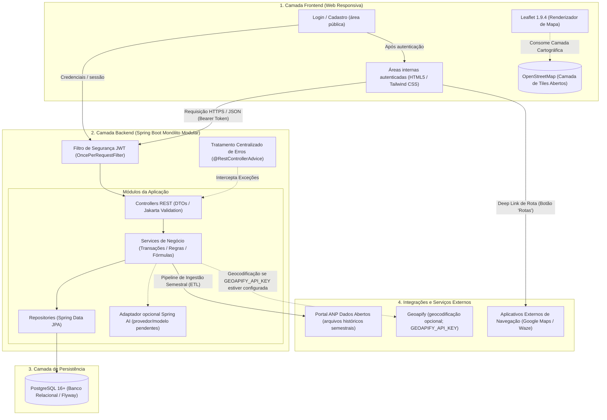
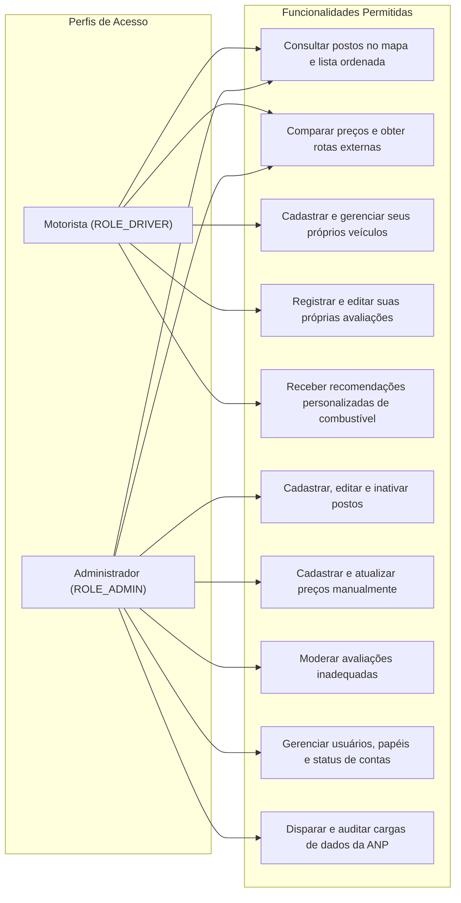
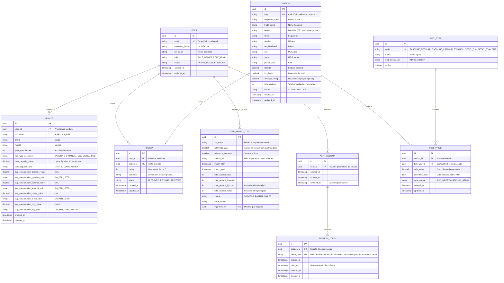
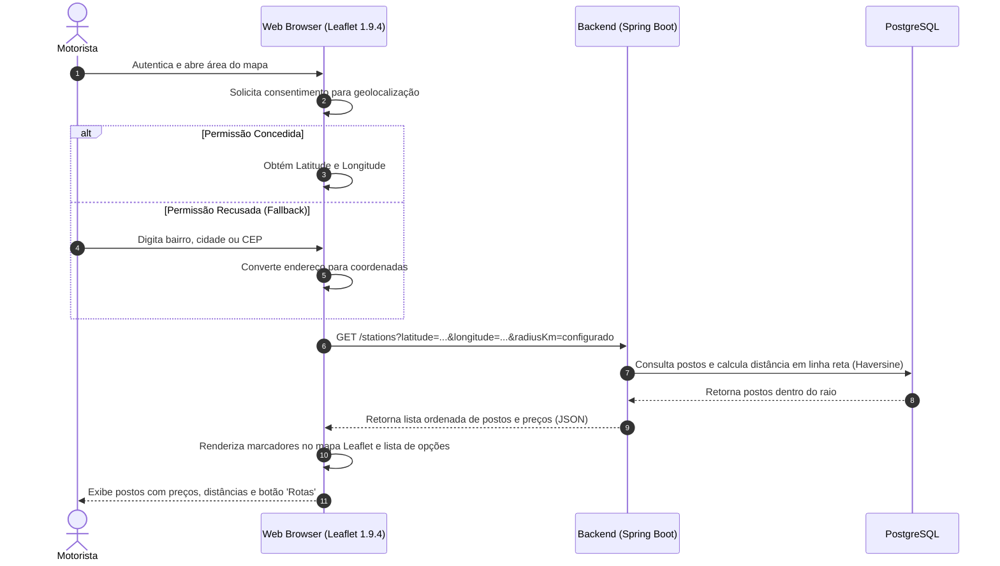
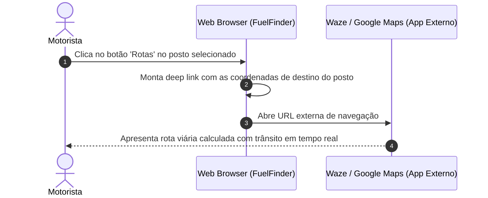
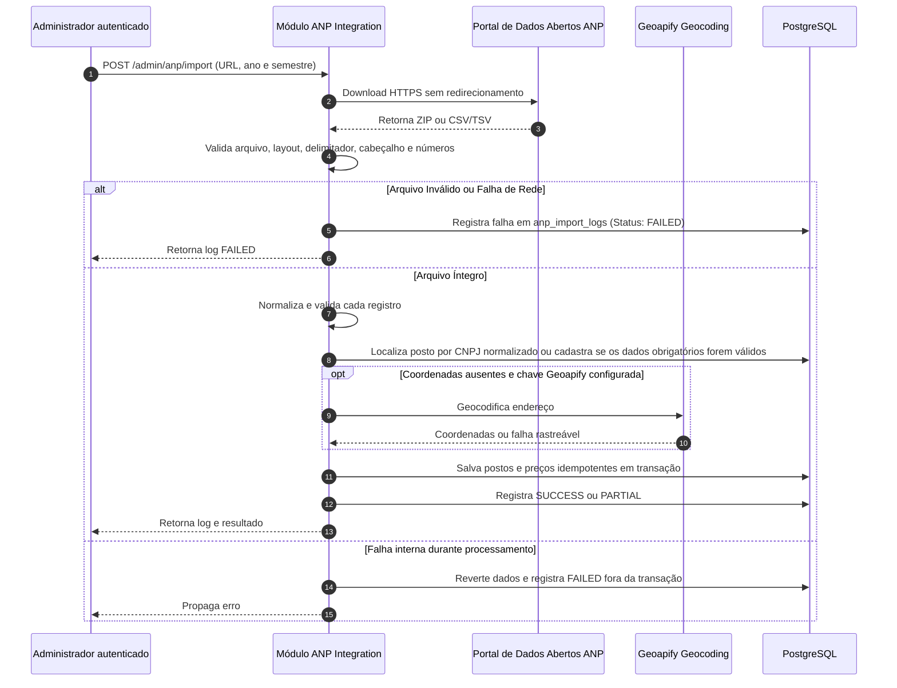

# Arquitetura do Sistema — FuelFinder

Este documento estabelece formalmente a arquitetura de software, modelo de dados, catálogo de endpoints REST, integrações externas e fluxos operacionais da plataforma **FuelFinder**.

Ele foi estruturado especificamente como a **especificação arquitetural executável e base de implementação para a próxima aula**.

---

## 1. Visão Geral da Arquitetura

O FuelFinder adota a arquitetura de **Monolito Modular em Camadas**, expondo uma **API REST** consumida por uma interface **Web Responsiva** com visualização cartográfica interativa. A autenticação usa access tokens JWT e sessões mantidas no servidor para suportar rotação e revogação de refresh tokens e invalidação imediata de sessões. No comportamento-alvo da interface, a tela inicial é o login; mapa e funcionalidades internas exigem autenticação. A situação atual da implementação e o trabalho planejado para alinhar o acesso estão registrados em `Plano/09-frontend-integracao.md`.

```text
[ Cliente Web Responsivo ] (HTML5 / Tailwind CSS / Vanilla JS / Leaflet 1.9.4)
              │
              │ HTTPS / JSON (Bearer JWT)
              ▼
[ Backend Monólito Modular ] (Spring Boot 3.4 / Java 21 LTS)
  ├── Security Filter (JWT & RBAC)
  ├── Controllers REST & DTOs (Records)
  ├── Services de Domínio & Recomendações (cálculo determinístico; IA opcional)
  └── Repositories (Spring Data JPA)
              │
              │ JDBC / SQL
              ▼
[ Banco de Dados Relacional ] (PostgreSQL 16+)
```

### 1.1 Justificativa Arquitetural
* **Entrega Ágil no MVP:** O monólito modular permite desenvolver e testar rapidamente todas as funcionalidades em uma única base de código, com deploy simples e transações ACID nativas no PostgreSQL, sem o overhead operacional e latência de microsserviços.
* **Fronteiras Claras de Domínio:** Cada domínio de negócio (`auth`, `user`, `vehicle`, `station`, `fuel`, `price`, `review`, `recommendation`, `anp`) é isolado em seu próprio módulo, com interfaces públicas explícitas (`Service`), facilitando a futura extração para microsserviços caso a volumetria justifique.
* **Desacoplamento:** O backend concentra as regras de negócio. A API é stateless para os recursos de domínio; a autenticação mantém estado de sessão no servidor para permitir rotação e revogação imediata de tokens. O frontend é uma aplicação web leve e responsiva, focada na experiência do motorista e renderização de mapas via Leaflet 1.9.4.

### 1.2 Áreas Públicas e Autenticadas

- **Público:** tela de login, cadastro e endpoints mínimos para registro, login e renovação de sessão. Assets estritamente necessários para essas telas também podem ser entregues sem sessão.
- **Autenticado (`ROLE_DRIVER` ou `ROLE_ADMIN`):** mapa, busca e detalhes de postos, preços, avaliações, veículos, recomendações e as demais telas internas. Endpoints de dados correspondentes também exigem autenticação; operações administrativas continuam exigindo `ROLE_ADMIN`.
- **Acesso direto sem sessão:** redirecionar para o login e preservar somente o caminho interno solicitado, quando seguro. Após autenticação bem-sucedida, retornar à área originalmente solicitada; se a sessão expirar, a conta não tiver o papel necessário ou o destino não for válido, mostrar mensagem adequada e encaminhar para uma área autorizada. Destinos externos não são aceitos como retorno.
- **Estado atual:** a interface implementada anteriormente entrega páginas estáticas publicamente; a proteção visual por cliente não substitui autorização no backend. A restrição de páginas internas e das APIs de leitura é uma alteração futura planejada, não uma descrição do comportamento já entregue.

---

## 2. Diagrama Geral da Arquitetura em Camadas

O diagrama abaixo ilustra a segregação entre as camadas de Frontend, Backend, Banco de Dados e Serviços Externos:


```mermaid
flowchart TB
    subgraph FRONTEND["1. Camada Frontend (Web Responsiva)"]
        LOGIN["Login / Cadastro (área pública)"]
        UI["Áreas internas autenticadas (HTML5 / Tailwind CSS)"]
        LEAFLET["Leaflet 1.9.4 (Renderizador de Mapa)"]
        OSM_TILES[("OpenStreetMap (Camada de Tiles Abertos)")]
        LEAFLET -. Consome Camada Cartográfica .-> OSM_TILES
    end

    subgraph BACKEND["2. Camada Backend (Spring Boot Monólito Modular)"]
        AUTH_FILTER["Filtro de Segurança JWT (OncePerRequestFilter)"]
        EX_HANDLER["Tratamento Centralizado de Erros (@RestControllerAdvice)"]
        
        subgraph MODULES["Módulos da Aplicação"]
            CTRL["Controllers REST (DTOs / Jakarta Validation)"]
            SRV["Services de Negócio (Transações / Regras / Fórmulas)"]
            REPO["Repositories (Spring Data JPA)"]
            AI["Adaptador opcional Spring AI (provedor/modelo pendentes)"]
        end

        AUTH_FILTER --> CTRL
        CTRL --> SRV
        SRV --> REPO
        SRV -.-> AI
        EX_HANDLER -. Intercepta Exceções .-> CTRL
    end

    subgraph DATABASE["3. Camada de Persistência"]
        POSTGRES[("PostgreSQL 16+ (Banco Relacional / Flyway)")]
        REPO --> POSTGRES
    end

    subgraph EXTERNAL["4. Integrações e Serviços Externos"]
        ANP_PORTAL["Portal ANP Dados Abertos (arquivos históricos semestrais)"]
        GEOAPIFY["Geoapify (geocodificação opcional; GEOAPIFY_API_KEY)"]
        EXT_NAV["Aplicativos Externos de Navegação (Google Maps / Waze)"]
    end

    UI -- "Requisição HTTPS / JSON (Bearer Token)" --> AUTH_FILTER
    LOGIN -->|"Credenciais / sessão"| AUTH_FILTER
    LOGIN -->|"Após autenticação"| UI
    SRV -- "Pipeline de Ingestão Semestral (ETL)" --> ANP_PORTAL
    SRV -. "Geocodificação se GEOAPIFY_API_KEY estiver configurada" .-> GEOAPIFY
    UI -- "Deep Link de Rota (Botão 'Rotas')" --> EXT_NAV
```

---

## 3. Tipos de Usuários e Suas Permissões (RBAC)

O controle de acesso é baseado em papéis (Role-Based Access Control):


```mermaid
flowchart LR
    subgraph PERFIS[Perfis de Acesso]
        DRIVER["Motorista (ROLE_DRIVER)"]
        ADMIN["Administrador (ROLE_ADMIN)"]
    end

    subgraph FUNCS[Funcionalidades Permitidas]
        F1[Consultar postos no mapa e lista ordenada]
        F2[Comparar preços e obter rotas externas]
        F3[Cadastrar e gerenciar seus próprios veículos]
        F4[Registrar e editar suas próprias avaliações]
        F5[Receber recomendações personalizadas de combustível]
        F6[Cadastrar, editar e inativar postos]
        F7[Cadastrar e atualizar preços manualmente]
        F8[Moderar avaliações inadequadas]
        F9[Gerenciar usuários, papéis e status de contas]
        F10[Disparar e auditar cargas de dados da ANP]
    end

    DRIVER --> F1
    DRIVER --> F2
    DRIVER --> F3
    DRIVER --> F4
    DRIVER --> F5

    ADMIN --> F1
    ADMIN --> F2
    ADMIN --> F6
    ADMIN --> F7
    ADMIN --> F8
    ADMIN --> F9
    ADMIN --> F10
```

* **Motorista (`ROLE_DRIVER`):** Perfil atribuído no autocadastro. Pode consultar postos, comparar preços, registrar veículos com consumos médios informados, emitir avaliações e receber recomendações personalizadas.
* **Administrador (`ROLE_ADMIN`):** Gestão governamental da plataforma. Pode gerenciar postos, retificar preços, moderar avaliações, ativar/bloquear contas e acompanhar os processos de carga da ANP.

---

## 4. Entidades Principais e Relacionamentos (ERD)

O diagrama a seguir define as entidades, chaves primárias, chaves estrangeiras, restrições e relacionamentos. Os campos separados de ano/semestre e os contadores de ignorados/falhos em `ANP_IMPORT_LOG` representam o modelo-alvo planejado; ainda exigem migração, contrato e implementação.


```mermaid
erDiagram
    USER ||--o{ VEHICLE : "cadastra"
    USER ||--o{ REVIEW : "emite"
    USER ||--o{ ANP_IMPORT_LOG : "dispara_ou_audita"
    USER ||--o{ AUTH_SESSION : "mantem"
    AUTH_SESSION ||--o{ REFRESH_TOKEN : "rotaciona"
    STATION ||--o{ REVIEW : "recebe"
    STATION ||--o{ FUEL_PRICE : "pratica"
    FUEL_TYPE ||--o{ FUEL_PRICE : "classifica"

    USER {
        uuid id PK
        string email UK "E-mail único cadastral"
        string password_hash "Hash BCrypt"
        string full_name "Nome completo"
        string role "ROLE_DRIVER, ROLE_ADMIN"
        string status "ACTIVE, INACTIVE, BLOCKED"
        timestamp created_at
        timestamp updated_at
    }

    VEHICLE {
        uuid id PK
        uuid user_id FK "Proprietário condutor"
        string nickname "Apelido amigável"
        string brand "Marca"
        string model "Modelo"
        int year_manufacture "Ano de fabricação"
        string fuel_type_accepted "GASOLINE, ETHANOL, FLEX, DIESEL, CNG"
        decimal tank_capacity_value "L para líquidos; m³ para CNG"
        string tank_capacity_unit "LITER ou CUBIC_METER"
        decimal avg_consumption_gasoline_value "km/L"
        string avg_consumption_gasoline_unit "KM_PER_LITER"
        decimal avg_consumption_ethanol_value "km/L"
        string avg_consumption_ethanol_unit "KM_PER_LITER"
        decimal avg_consumption_diesel_value "km/L"
        string avg_consumption_diesel_unit "KM_PER_LITER"
        decimal avg_consumption_cng_value "km/m³"
        string avg_consumption_cng_unit "KM_PER_CUBIC_METER"
        timestamp created_at
        timestamp updated_at
    }

    STATION {
        uuid id PK
        string cnpj UK "CNPJ único oficial da revenda"
        string corporate_name "Razão Social"
        string trade_name "Nome Fantasia"
        string brand "Bandeira (BR, Shell, Ipiranga, etc.)"
        string street "Logradouro"
        string number "Número"
        string neighborhood "Bairro"
        string city "Município"
        string state "UF (2 letras)"
        string postal_code "CEP"
        decimal latitude "Latitude decimal"
        decimal longitude "Longitude decimal"
        decimal average_rating "Nota média agregada (1 a 5)"
        int total_reviews "Total de avaliações recebidas"
        string status "ACTIVE, INACTIVE"
        timestamp created_at
        timestamp updated_at
    }

    FUEL_TYPE {
        uuid id PK
        string code UK "GASOLINE_REGULAR, GASOLINE_PREMIUM, ETHANOL, DIESEL_S10, DIESEL_S500, CNG"
        string name "Nome legível"
        string unit_of_measure "R$/litro ou R$/m³"
        boolean active
    }

    FUEL_PRICE {
        uuid id PK
        uuid station_id FK "Posto revendedor"
        uuid fuel_type_id FK "Combustível comercializado"
        decimal sale_value "Preço de venda praticado"
        date collection_date "Data oficial da coleta ANP"
        string data_source "ANP_IMPORT ou MANUAL_ADMIN"
        timestamp created_at
        timestamp updated_at
    }

    REVIEW {
        uuid id PK
        uuid user_id FK "Motorista avaliador"
        uuid station_id FK "Posto avaliado"
        int rating "Nota inteira de 1 a 5"
        string comment "Comentário textual opcional"
        string status "APPROVED, PENDING, REJECTED"
        timestamp created_at
        timestamp updated_at
    }

    ANP_IMPORT_LOG {
        uuid id PK
        string file_name "Nome do arquivo semestral"
        smallint reference_year "Ano de referência com quatro dígitos"
        smallint reference_semester "Semestre: 1 ou 2"
        string source_url "URL do portal de dados abertos"
        timestamp import_start
        timestamp import_end
        int total_records_read
        int total_records_imported
        int total_records_ignored "Contador-alvo planejado"
        int total_records_failed "Contador-alvo planejado"
        string status "SUCCESS, PARTIAL, FAILED"
        string error_details
        uuid triggered_by FK "Usuário que disparou"
    }

    AUTH_SESSION {
        uuid id PK
        uuid user_id FK "Usuário proprietário da sessão"
        timestamp created_at
        timestamp expires_at
        timestamp revoked_at "Nulo enquanto ativa"
    }

    REFRESH_TOKEN {
        uuid id PK
        uuid session_id FK "Sessão de autenticação"
        string token_hash UK "Hash do refresh token; inclui tokens já utilizados para detectar reutilização"
        timestamp expires_at
        timestamp used_at "Nulo enquanto não utilizado"
        timestamp revoked_at
        timestamp created_at
    }
```

---

## 5. Endpoints da API REST (Catálogo Completo com Contratos)

> [!IMPORTANT]
> **Correção Normativa de `PATH` para `PATCH`:**
> A especificação original grafou erroneamente o método como `PATH`. Esta arquitetura adota formalmente o método HTTP **`PATCH`** para atualizações parciais, em total conformidade com a RFC 5789.

### 5.1 Autenticação e Sessão (`/auth`)

| Método | Rota | Objetivo | Perfil Autorizado | Status Esperado |
| :---: | :--- | :--- | :--- | :--- |
| `POST` | `/auth/register` | Cadastra novo usuário motorista | Público | `201 Created` |
| `POST` | `/auth/login` | Autentica com e-mail/senha e emite access JWT e refresh token | Público | `200 OK` |
| `POST` | `/auth/logout` | Revoga a sessão autenticada atual | Autenticado | `204 No Content` |
| `POST` | `/auth/sessions/revoke-all` | Revoga todas as sessões do usuário autenticado | Autenticado | `204 No Content` |
| `POST` | `/auth/refresh` | Rotaciona o refresh token e emite novos tokens | Público; exige refresh token válido | `200 OK` |
| `GET` | `/auth/me` | Retorna dados e permissões do usuário autenticado | Autenticado | `200 OK` |
| `PATCH`| `/users/me` | Atualiza dados cadastrais do próprio usuário | Autenticado | `200 OK` |

Os access tokens JWT têm curta duração configurável, incluem o identificador da sessão (`sid`) e são retornados no JSON. O frontend os mantém somente em memória. O refresh token é de uso único, armazenado no servidor somente como hash e transmitido exclusivamente por cookie `HttpOnly`, `SameSite` e `Secure` em produção; nunca é incluído no JSON. Cada requisição protegida valida a sessão no servidor e o status `ACTIVE` da conta; logout, revogação global ou bloqueio tornam inválidos imediatamente os access tokens já emitidos. Requisições autenticadas por cookie validam a origem permitida e aplicam proteção CSRF.

#### Exemplo: `POST /auth/login`
**Request Payload:**
```json
{
  "email": "motorista@email.com",
  "password": "SenhaForte@2026"
}
```
**Response Payload (200 OK):**
```json
{
  "accessToken": "eyJhbGciOiJIUzI1NiIsInR5cCI6IkpXVCJ9...",
  "tokenType": "Bearer",
  "expiresIn": "<duração configurada do access token em segundos>",
  "user": {
    "id": "3fa85f64-5717-4562-b3fc-2c963f66afa6",
    "fullName": "Carlos Silva",
    "email": "motorista@email.com",
    "role": "ROLE_DRIVER"
  }
}
```

#### Exemplo: `POST /auth/refresh`
O navegador envia automaticamente o cookie `refreshToken`; o cliente não o lê nem o envia no body. A resposta contém o novo `accessToken` e `expiresIn` no JSON e define o refresh token rotacionado por `Set-Cookie` com `HttpOnly`, `SameSite` e `Secure` em produção.

`POST /auth/logout` recebe a sessão autenticada pelo access token, revoga a sessão e expira o cookie com os mesmos atributos e escopo. Refresh e logout validam a origem permitida e aplicam proteção CSRF. `POST /auth/sessions/revoke-all` também exige autenticação e revoga todas as sessões ativas pertencentes ao usuário autenticado.

---

### 5.2 Veículos (`/vehicles`)

| Método | Rota | Objetivo | Perfil Autorizado | Status Esperado |
| :---: | :--- | :--- | :--- | :--- |
| `POST` | `/vehicles` | Cadastra veículo com consumo informado | `ROLE_DRIVER` | `201 Created` |
| `GET` | `/vehicles` | Lista veículos cadastrados pelo motorista | `ROLE_DRIVER` | `200 OK` |
| `GET` | `/vehicles/{id}` | Consulta detalhes de um veículo do motorista | `ROLE_DRIVER` | `200 OK` |
| `PATCH`| `/vehicles/{id}` | Atualiza dados cadastrais ou consumo do veículo | `ROLE_DRIVER` | `200 OK` |
| `DELETE`| `/vehicles/{id}` | Remove um veículo cadastrado | `ROLE_DRIVER` | `204 No Content` |

#### Exemplo: `POST /vehicles`
**Request Payload:**
```json
{
  "nickname": "Meu Onix",
  "brand": "Chevrolet",
  "model": "Onix 1.0 Flex",
  "yearManufacture": 2023,
  "fuelTypeAccepted": "FLEX",
  "tankCapacity": {"value": 54.0, "unit": "LITER"},
  "averageConsumptionGasoline": {"value": 13.5, "unit": "KM_PER_LITER"},
  "averageConsumptionEthanol": {"value": 9.2, "unit": "KM_PER_LITER"}
}
```

---

### 5.3 Postos de Combustível (`/stations`)

| Método | Rota | Objetivo | Perfil Autorizado | Status Esperado |
| :---: | :--- | :--- | :--- | :--- |
| `GET` | `/stations` | Busca postos por geolocalização ou texto | `ROLE_DRIVER` / `ROLE_ADMIN` | `200 OK` |
| `GET` | `/stations/{id}` | Consulta detalhes do posto e preços vigentes | `ROLE_DRIVER` / `ROLE_ADMIN` | `200 OK` |
| `POST` | `/stations` | Cadastra novo posto revendedor | `ROLE_ADMIN` | `201 Created` |
| `PATCH`| `/stations/{id}` | Atualiza informações cadastrais do posto | `ROLE_ADMIN` | `200 OK` |
| `DELETE`| `/stations/{id}` | Inativa logicamente um posto | `ROLE_ADMIN` | `204 No Content` |

#### Exemplo: `GET /stations?latitude=-23.5505&longitude=-46.6333&radiusKm=5`
Para busca textual (endereço, bairro, município ou CEP), o cliente envia `GET /stations?query={texto}&radiusKm={raioKm}`. Chamadas reais de geocodificação usam Geoapify no backend e exigem `GEOAPIFY_API_KEY`, lida exclusivamente do ambiente. A variável é necessária somente para testar essas chamadas; sem ela, a aplicação inicia normalmente e os fluxos que não dependem do serviço continuam disponíveis. A chave nunca deve ser exposta ao cliente nem armazenada no código/Git. Os limites do plano gratuito podem mudar.

**Response Payload (200 OK):**
```json
[
  {
    "id": "c1f7b8a2-1234-4b5c-8901-abcdef123456",
    "corporateName": "AUTO POSTO CENTRAL LTDA",
    "tradeName": "Posto Central",
    "brand": "IPIRANGA",
    "address": "Av. Paulista, 1000 - Bela Vista, São Paulo - SP",
    "latitude": -23.5614,
    "longitude": -46.6558,
    "distanceKm": 2.45,
    "averageRating": 4.6,
    "totalReviews": 38,
    "status": "ACTIVE"
  }
]
```
Preços são consultados separadamente por `GET /stations/{id}/fuel-prices`;
essa resposta inclui `fuelTypeCode`, `unitOfMeasure` e `collectionDate`.

---

### 5.4 Preços e Comparação (`/fuel-prices`)

| Método | Rota | Objetivo | Perfil Autorizado | Status Esperado |
| :---: | :--- | :--- | :--- | :--- |
| `GET` | `/stations/{id}/fuel-prices` | Lista preços cadastrados do posto | `ROLE_DRIVER` / `ROLE_ADMIN` | `200 OK` |
| `POST` | `/stations/{id}/fuel-prices` | Registra novo preço de combustível | `ROLE_ADMIN` | `201 Created` |
| `PATCH`| `/stations/{id}/fuel-prices/{priceId}` | Atualiza preço existente | `ROLE_ADMIN` | `200 OK` |
| `GET` | `/fuel-prices/compare` | Compara postos ordenados por preço/distância | `ROLE_DRIVER` / `ROLE_ADMIN` | `200 OK` |

---

### 5.5 Avaliações (`/reviews`)

| Método | Rota | Objetivo | Perfil Autorizado | Status Esperado |
| :---: | :--- | :--- | :--- | :--- |
| `GET` | `/stations/{id}/reviews` | Lista avaliações aprovadas do posto | `ROLE_DRIVER` / `ROLE_ADMIN` | `200 OK` |
| `POST` | `/stations/{id}/reviews` | Registra avaliação com nota (1 a 5) | `ROLE_DRIVER` | `201 Created` |
| `PATCH`| `/reviews/{id}` | Edita a própria avaliação | `ROLE_DRIVER` | `200 OK` |
| `PATCH`| `/reviews/{id}/moderation` | Modera status da avaliação | `ROLE_ADMIN` | `200 OK` |
| `DELETE`| `/reviews/{id}` | Remove avaliação (autor ou moderação) | `ROLE_DRIVER` / `ROLE_ADMIN` | `204 No Content` |

---

### 5.6 Recomendações Inteligentes (`/recommendations`)

| Método | Rota | Objetivo | Perfil Autorizado | Status Esperado |
| :---: | :--- | :--- | :--- | :--- |
| `GET` | `/recommendations/fuel` | Retorna recomendação determinística de melhor custo-benefício com explicação por template; eventual IA é futura e opcional | `ROLE_DRIVER` | `200 OK` |

#### Exemplo: `GET /recommendations/fuel?vehicleId=...&latitude=-23.5505&longitude=-46.6333&radiusKm=5`
**Response Payload (200 OK):**
```json
{
  "vehicle": {
    "nickname": "Meu Onix",
    "fuelTypeAccepted": "FLEX"
  },
  "recommendedFuel": "ETHANOL",
  "explanation": "Para o veículo Meu Onix, etanol tem custo de R$ 0.4228/km no posto Posto Central. Paridade etanol/gasolina: 67.18%.",
  "parityPercentage": 67.18,
  "topOptions": [
    {
      "stationId": "c1f7b8a2-1234-4b5c-8901-abcdef123456",
      "stationName": "Posto Central",
      "brand": "IPIRANGA",
      "fuelType": "ETHANOL",
      "price": 3.89,
      "unitOfMeasure": "R$/litro",
      "distanceKm": 2.45,
      "costPerKm": 0.4228,
      "estimatedFullTankCost": 210.06,
      "estimatedRoundTripCost": 2.07
    }
  ]
}
```

`topOptions` contém os postos próximos com preço vigente para o código exato
retornado em `recommendedFuel`, ordenados pelo custo de abastecimento completo
mais o custo estimado do trajeto de ida e volta. Para CNG, preço e capacidade
são expressos em R$/m³ e m³; para combustíveis líquidos, em R$/litro e litros.
Veículos `GASOLINE` podem receber `GASOLINE_REGULAR` ou
`GASOLINE_PREMIUM`, e veículos `DIESEL`, `DIESEL_S10` ou `DIESEL_S500`.

---

## 6. Fluxos Principais do Sistema

### 6.1 Fluxo: Consulta Geolocalizada de Postos com Leaflet

```mermaid
sequenceDiagram
    autonumber
    actor Condutor as Motorista
    participant Browser as Web Browser (Leaflet 1.9.4)
    participant API as Backend (Spring Boot)
    participant DB as PostgreSQL

    Condutor->>Browser: Autentica e abre área do mapa
    Browser->>Browser: Solicita consentimento para geolocalização
    alt Permissão Concedida
        Browser->>Browser: Obtém Latitude e Longitude
    else Permissão Recusada (Fallback)
        Condutor->>Browser: Digita bairro, cidade ou CEP
        Browser->>Browser: Converte endereço para coordenadas
    end
    Browser->>API: GET /stations?latitude=...&longitude=...&radiusKm=configurado
    API->>DB: Consulta postos e calcula distância em linha reta (Haversine)
    DB-->>API: Retorna postos dentro do raio
    API-->>Browser: Retorna lista ordenada de postos e preços (JSON)
    Browser->>Browser: Renderiza marcadores no mapa Leaflet e lista de opções
    Browser-->>Condutor: Exibe postos com preços, distâncias e botão 'Rotas'
```

**Comportamento-alvo da localização:** somente após autenticação e entrada na área do mapa, solicitar permissão explícita do navegador. Com a permissão concedida, centralizar o mapa e iniciar automaticamente a consulta de postos próximos. Enquanto localização e resultados carregam, exibir estados de carregamento. Em caso de recusa, indisponibilidade ou erro, explicar o ocorrido e permitir pesquisa/seleção manual sem bloquear as demais funções autenticadas. O raio deve ser configurável; mantém-se o padrão de 5 km já registrado na Fase 4, sem definir novas opções de raio nesta revisão.

### 6.2 Fluxo: Redirecionamento de Rotas para Waze / Google Maps

```mermaid
sequenceDiagram
    autonumber
    actor Condutor as Motorista
    participant Browser as Web Browser (FuelFinder)
    participant App as Waze / Google Maps (App Externo)

    Condutor->>Browser: Clica no botão 'Rotas' no posto selecionado
    Browser->>Browser: Monta deep link com as coordenadas de destino do posto
    Browser->>App: Abre URL externa de navegação
    App-->>Condutor: Apresenta rota viária calculada com trânsito em tempo real
```

### 6.3 Fluxo: Ingestão de Dados Públicos da ANP (ETL com Resiliência)

O fluxo abaixo é o comportamento-alvo planejado para a evolução da integração;
ZIP, ano/semestre separados e cadastro controlado de postos ainda não foram
implementados.


```mermaid
sequenceDiagram
    autonumber
    participant Admin as Administrador autenticado
    participant ANP_Module as Módulo ANP Integration
    participant Portal_ANP as Portal de Dados Abertos ANP
    participant Geoapify as Geoapify Geocoding
    participant DB as PostgreSQL

    Admin->>ANP_Module: POST /admin/anp/import (URL, ano e semestre)
    ANP_Module->>Portal_ANP: Download HTTPS sem redirecionamento
    Portal_ANP-->>ANP_Module: Retorna ZIP ou CSV/TSV
    ANP_Module->>ANP_Module: Valida arquivo, layout, delimitador, cabeçalho e números
    alt Arquivo Inválido ou Falha de Rede
        ANP_Module->>DB: Registra falha em anp_import_logs (Status: FAILED)
        ANP_Module-->>Admin: Retorna log FAILED
    else Arquivo Íntegro
        ANP_Module->>ANP_Module: Normaliza e valida cada registro
        ANP_Module->>DB: Localiza posto por CNPJ normalizado ou cadastra se os dados obrigatórios forem válidos
        opt Coordenadas ausentes e chave Geoapify configurada
            ANP_Module->>Geoapify: Geocodifica endereço
            Geoapify-->>ANP_Module: Coordenadas ou falha rastreável
        end
        ANP_Module->>DB: Salva postos e preços idempotentes em transação
        ANP_Module->>DB: Registra SUCCESS ou PARTIAL
        ANP_Module-->>Admin: Retorna log e resultado
    else Falha interna durante processamento
        ANP_Module->>DB: Reverte dados e registra FAILED fora da transação
        ANP_Module-->>Admin: Propaga erro
    end
```

---

## 7. Registros de Decisão de Arquitetura (ADRs)

| ADR | Título | Decisão | Consequência |
| :--- | :--- | :--- | :--- |
| **ADR-001** | Monólito Modular | Adotado monólito modular com Spring Boot 3.4. | Simplicidade operacional no MVP, facilidade de deploy e integridade transacional. |
| **ADR-002** | Java 21 LTS e Records | Homologado Java 21 LTS como runtime oficial. | Suporte nativo a DTOs com Java Records, alta performance com Virtual Threads. |
| **ADR-003** | PostgreSQL 16 + Flyway | SGBD relacional com migrações declarativas. | Consistência ACID, cálculos trigonométricos de distância e rastreabilidade com Flyway. |
| **ADR-004** | Leaflet 1.9.4 + OpenStreetMap | Mapa gratuito com tiles abertos. | Custo zero de licença no MVP, visualização leve e compatível com navegadores móveis. |
| **ADR-005** | Distância em Linha Reta + Rotas Externas | Distância por Haversine e deep link para Waze/Google Maps. | Sem custo com APIs de roteamento; o condutor usa seu navegador GPS habitual. |
| **ADR-006** | Ingestão ANP com Resiliência | Pipeline ETL para arquivos históricos semestrais (CSV/TSV ou ZIP com CSV), com ano e semestre separados. | Alta disponibilidade; preservação da base anterior em caso de erro na fonte governamental. |
| **ADR-007** | Consumo Informado pelo Motorista | Consumo médio cadastrado diretamente pelo condutor. | Não depende de manuais ou tabelas externas no MVP; suporta paridade flex precisa. |
| **ADR-008** | Integração de IA Opcional | Provedor e modelo Spring AI aguardam aprovação; integração isolada por adaptador configurável. | Inicialização e fluxos essenciais funcionam sem provedor, modelo ou credenciais de IA. |
