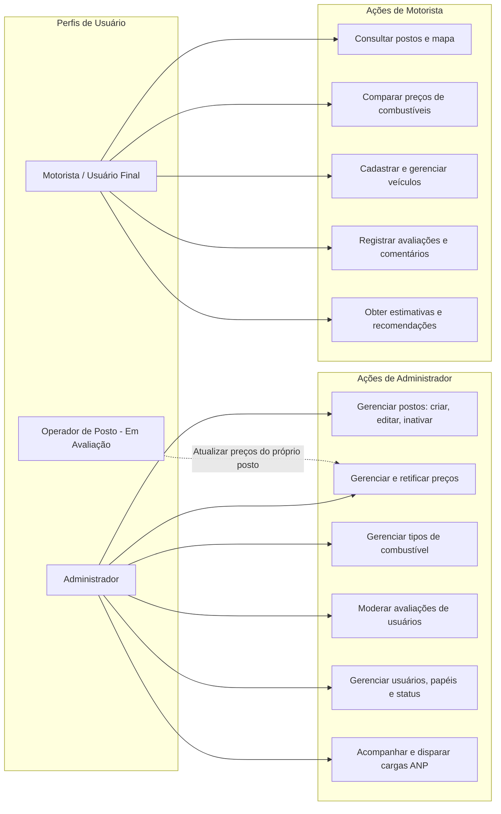
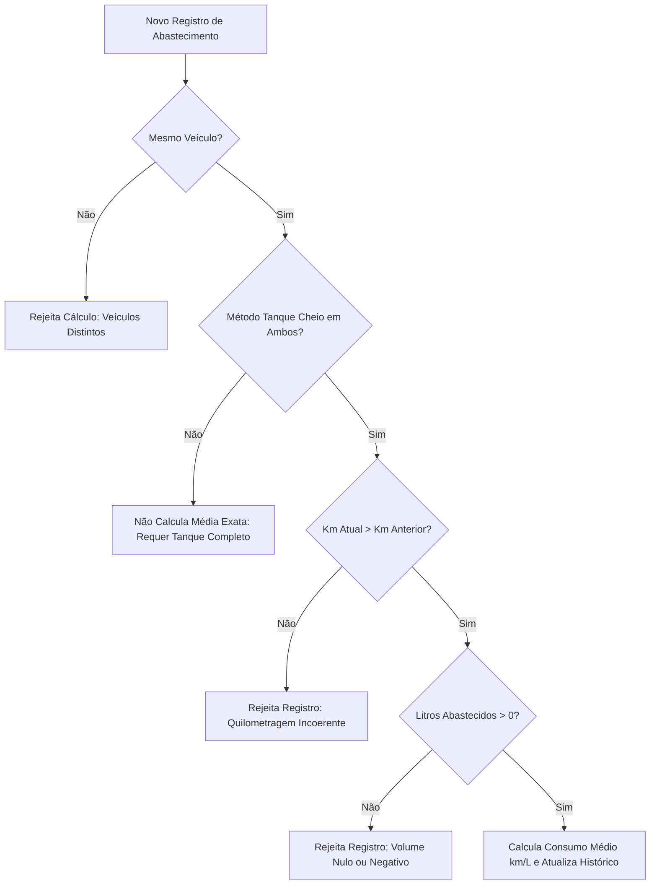
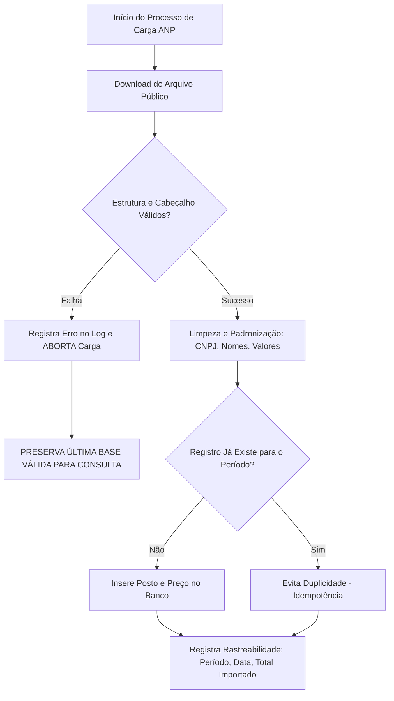

# Regras de Negócio — FuelFinder

Este documento formaliza as regras de negócio, invariantes operacionais, fórmulas de cálculo e políticas de controle da plataforma **FuelFinder**.

As regras aqui estabelecidas orientam a lógica de validação nos serviços de domínio, entidades de dados e controladores da aplicação.

---

## 1. Usuários, Autenticação e RBAC

### 1.1 Autocadastro de Motoristas
* `REGRA DEFINIDA`: O sistema permite o autocadastro de novos usuários com o perfil de **Motorista**.
* `REGRA DEFINIDA`: O e-mail informado deve ser estritamente único em toda a base de dados.
* `REGRA DEFINIDA`: As senhas devem ser armazenadas com hash criptográfico seguro (ex.: BCrypt). Não é permitido o armazenamento de senhas em texto puro.
* `REGRA / COMPORTAMENTO A DEFINIR`: Requisitos mínimos de complexidade de senha (ex.: tamanho mínimo, caracteres especiais, números).

### 1.2 Autenticação e Sessão
* `REGRA DEFINIDA`: A autenticação é realizada com e-mail e senha cadastrados.
* `REGRA DEFINIDA`: Após a autenticação bem-sucedida, o backend emite um token JWT stateless para controle de sessão.
* `REGRA DEFINIDA`: Contas com status `INACTIVE` ou `BLOCKED` não podem autenticar nem renovar tokens.
* `REGRA DEFINIDA`: O encerramento de sessão (`logout`) deve invalidar o acesso ativo no dispositivo.

### 1.3 Perfis e Matriz de Permissões (RBAC)

O controle de acesso é baseado no modelo RBAC (*Role-Based Access Control*):



#### Perfil: Motorista (`ROLE_MOTORISTA`)
* `REGRA DEFINIDA`: Pode consultar postos de combustível, mapa interativo e lista ordenada.
* `REGRA DEFINIDA`: Pode comparar preços de combustíveis e filtrar resultados.
* `REGRA DEFINIDA`: Pode cadastrar, listar, atualizar e remover seus próprios veículos.
* `REGRA DEFINIDA`: Pode emitir uma avaliação numérica (1 a 5) e comentário para postos.
* `REGRA DEFINIDA`: Pode solicitar recomendações de abastecimento para seus veículos.
* `REGRA DEFINIDA`: **NÃO** pode alterar cadastros de postos, gerenciar tipos de combustíveis, alterar preços oficiais ou moderar avaliações alheias.

#### Perfil: Administrador (`ROLE_ADMIN`)
* `REGRA DEFINIDA`: Possui controle total de gestão e governança da plataforma.
* `REGRA DEFINIDA`: Pode cadastrar, editar dados cadastrais (endereço, coordenadas, contato) e inativar postos.
* `REGRA DEFINIDA`: Pode cadastrar e atualizar preços de venda de combustíveis.
* `REGRA DEFINIDA`: Pode gerenciar tipos de combustíveis aceitos na plataforma.
* `REGRA DEFINIDA`: Pode moderar e remover avaliações inadequadas de usuários.
* `REGRA DEFINIDA`: Pode alterar papéis (`role`) e status (`ACTIVE`, `INACTIVE`, `BLOCKED`) de contas de usuários.

#### Perfil: Operador de Posto (`ROLE_OPERADOR`)
* `PÓS-MVP / EM AVALIAÇÃO`: A especificação cita este perfil como "opcional no MVP" e em outra seção como evolução futura para representantes de postos gerenciarem dados e promoções com aprovação administrativa.
* `REGRA / COMPORTAMENTO A DEFINIR`: Se implementado, terá permissão restrita exclusivamente para atualizar preços e dados do posto ao qual estiver explicitamente vinculado.

---

## 2. Veículos e Consumo Médio

### 2.1 Cadastro de Veículos
* `REGRA DEFINIDA`: Um usuário autenticado pode possuir um ou múltiplos veículos cadastrados.
* `REGRA DEFINIDA`: O cadastro compreende: identificação/apelido, marca, modelo, ano de fabricação, combustíveis aceitos (ex.: Flex, Gasolina, Diesel, GNV), capacidade aproximada do tanque em litros e consumo médio em km/L.
* `REGRA DEFINIDA`: A capacidade do tanque deve ser um valor numérico estritamente positivo (`tank_capacity > 0`).
* `REGRA DEFINIDA`: O consumo médio cadastrado deve ser um valor numérico estritamente positivo (`average_consumption > 0`).

### 2.2 Fonte do Consumo Médio no MVP
* `REGRA DEFINIDA`: O consumo médio inicial é **obrigatoriamente informado pelo próprio usuário condutor** com base na sua experiência prática de uso.
* `REGRA DEFINIDA`: O sistema **NÃO** consulta tabelas externas, manuais de montadoras ou bases do Inmetro no escopo do MVP.

---

## 3. Abastecimentos e Cálculo de Consumo Real

### 3.1 Status da Funcionalidade: Divergência na Especificação
* `PÓS-MVP / EM AVALIAÇÃO`: Na seção de evoluções previstas da especificação, o módulo de "Histórico de abastecimentos" é classificado formalmente como pós-MVP.
* Por outro lado, na seção de fluxos principais, o fluxo e a fórmula de consumo real são explicitados.
* Para fins de preservação das regras conceituais, a fórmula e suas condições permanecem documentadas a seguir para futura ativação.

### 3.2 Fórmula do Consumo Médio Real
Quando o módulo de abastecimento for ativado, o cálculo de consumo real entre dois abastecimentos consecutivos com método de tanque cheio será regido por:

$$\text{Consumo Médio (km/L)} = \frac{\text{Quilometragem Atual} - \text{Quilometragem Anterior}}{\text{Litros Abastecidos}}$$

```text
Consumo médio (km/L) = (quilometragem atual - quilometragem anterior) / litros abastecidos
```

### 3.3 Condições de Validade Matemática e Operacional



1. **Regra do Tanque Cheio:** O cálculo exato exige que o abastecimento anterior e o atual tenham completado o reservatório até o desarme automático da bomba.
2. **Hodômetro Crescente:** A quilometragem atual deve ser estritamente superior à quilometragem anterior (`km_atual > km_anterior`).
3. **Volume Estritamente Positivo:** A quantidade de litros deve ser maior que zero (`litros > 0`).
4. **Unicidade de Veículo:** Os dois abastecimentos comparados devem pertencer rigorosamente ao mesmo automóvel.

---

## 4. Integração com a Base de Dados da ANP

### 4.1 Origem e Caráter dos Dados
* `REGRA DEFINIDA`: A fonte oficial de dados é a Série Histórica de Preços de Combustíveis e GLP da ANP (`https://www.gov.br/anp/pt-br/centrais-de-conteudo/dados-abertos/serie-historica-de-precos-de-combustiveis`).
* `REGRA DEFINIDA`: No MVP, o sistema utiliza o arquivo semestral mais recente disponibilizado, iniciando pelo arquivo referente ao **1º semestre de 2026** (enquanto permanecer como o mais atual).
* `REGRA DEFINIDA`: **Caráter Informativo e Histórico:** Os dados da ANP possuem defasagem inerente à periodicidade das pesquisas de preços. Portanto, **NÃO representam preços em tempo real**.
* `REGRA DEFINIDA`: A **Data da Coleta** informada pela ANP deve ser obrigatoriamente persistida e exibida de forma visível ao motorista junto a cada preço consultado.

### 4.2 Regras do Processo de Ingestão (ETL)



1. **Validação Estrutural:** O sistema deve verificar o formato e a presença dos campos obrigatórios: Região, Estado/UF, Município, Revenda, CNPJ, Endereço, Bairro, CEP, Produto, Data da Coleta, Valor de Venda, Unidade de Medida e Bandeira.
2. **Prevenção de Duplicatas (Idempotência):** Reexecuções de carga para o mesmo arquivo semestral ou período não podem gerar registros duplicados no banco de dados.
3. **Rastreabilidade Obrigatória:** Toda carga deve registrar em log auditável: URL/origem do arquivo, período de referência, data/hora da execução, quantidade de linhas lidas/inseridas e status final (`SUCCESS`, `PARTIAL`, `FAILED`).
4. **Política de Fallback e Resiliência:** Caso ocorra qualquer erro de download, inconsistência estrutural ou falha de processamento durante a importação, o sistema deve manter intactos e disponíveis para consulta os últimos dados válidos previamente carregados.
5. **Geocodificação de Coordenadas:** Caso o arquivo da ANP não forneça latitude e longitude, o sistema poderá acionar rotina de geocodificação baseada em endereço, bairro, CEP e município para permitir a localização em mapa.

---

## 5. Postos de Combustível e Localização

### 5.1 Cadastro e Identificação do Posto
* `REGRA DEFINIDA`: O posto deve possuir CNPJ válido e único no sistema.
* `REGRA DEFINIDA`: Cada posto mantém endereço textual completo (logradouro, bairro, município, UF e CEP) e coordenadas geográficas (latitude e longitude decimais).
* `REGRA DEFINIDA`: Postos podem receber status `ACTIVE` ou `INACTIVE`. Postos inativos não aparecem nas buscas de motoristas.

### 5.2 Geolocalização e Consulta de Proximidade
* `REGRA DEFINIDA`: O sistema solicita autorização do usuário no navegador para obter as coordenadas via API Geolocation.
* `REGRA DEFINIDA`: **Busca Manual Obrigatória:** Se a permissão for recusada ou indisponível, o sistema deve permitir que o motorista pesquise manualmente informando endereço, bairro, cidade ou CEP.
* `REGRA DEFINIDA`: **Visualização Dupla Obrigatória:** Os resultados devem ser apresentados simultaneamente em:
  1. Mapa interativo com marcadores (Leaflet 1.9.4 + OpenStreetMap).
  2. Lista ordenada com nome, bandeira, endereço, distância calculada e preços.
* `REGRA DEFINIDA`: **Distância em Linha Reta:** No MVP, a distância entre a posição de referência e o posto é calculada em **linha reta** baseando-se na diferença matemática das coordenadas geográficas (fórmula trigonométrica de Haversine ou euclidiana esférica):

$$d = 2 R \cdot \arcsin\left(\sqrt{\sin^2\left(\frac{\Delta \phi}{2}\right) + \cos(\phi_1)\cos(\phi_2)\sin^2\left(\frac{\Delta \lambda}{2}\right)}\right)$$

* `REGRA DEFINIDA`: O sistema **NÃO** calcula rotas viárias nem estimativas de trânsito em sua infraestrutura interna no MVP.

### 5.3 Navegação e Rotas Externas
* `REGRA DEFINIDA`: A aplicação deve disponibilizar o botão **"Rotas"** nos detalhes de cada posto.
* `REGRA DEFINIDA`: Ao acionar o botão, o sistema redireciona a navegação para os aplicativos externos **Google Maps** ou **Waze**, repassando as coordenadas de destino do posto via deep link / URL parametrizada.

---

## 6. Preços de Combustíveis e Comparação

### 6.1 Cadastro de Preços
* `REGRA DEFINIDA`: Cada registro de preço está vinculado a um posto e a um tipo de combustível (Gasolina Comum, Gasolina Aditivada, Etanol, Diesel S10, GNV, etc.).
* `REGRA DEFINIDA`: O valor de venda deve ser um número monetário estritamente positivo (`sale_value > 0`).
* `REGRA DEFINIDA`: Preços cadastrados registram a data de coleta/atualização e a fonte (`ANP_IMPORT` ou `MANUAL_ADMIN`).

### 6.2 Critérios de Filtro e Ordenação
A consulta de preços e postos deve suportar os seguintes critérios combinados:
* Tipo de combustível selecionado;
* Menor preço nominal;
* Menor distância geográfica em linha reta;
* Melhor nota de avaliação média do posto;
* Faixa de preço (valor mínimo e máximo);
* Raio de busca geográfico (ex.: 5 km, 10 km, 20 km).

---

## 7. Recomendações e Estimativas de Custo-Benefício

O módulo de recomendações cruza os dados do veículo cadastrado com os postos e preços da região pesquisada.

### 7.1 Fórmulas das Estimativas Personalizadas

1. **Custo Estimado para Abastecimento Completo (Tanque Cheio):**

$$\text{Custo Tanque Cheio (R\$)} = \text{Capacidade do Tanque (L)} \times \text{Preço por Litro (R\$/L)}$$

2. **Custo Estimado por Quilômetro Rodado:**

$$\text{Custo por km (R\$/km)} = \frac{\text{Preço por Litro (R\$/L)}}{\text{Consumo Médio do Veículo (km/L)}}$$

3. **Autonomia Estimada com Tanque Cheio:**

$$\text{Autonomia (km)} = \text{Capacidade do Tanque (L)} \times \text{Consumo Médio (km/L)}$$

4. **Comparação de Custo-Benefício entre Combustíveis Compatíveis:**
   * Para veículos bicombustíveis (Flex - Gasolina e Etanol), o sistema calcula o custo por quilômetro rodado de cada opção compatível e indica qual combustível apresenta o menor gasto financeiro por distância percorrida na região pesquisada.

* `REGRA DEFINIDA`: O processamento e as fórmulas das recomendações devem residir centralizados no **backend** para garantir auditabilidade e integridade das regras.
* `REGRA DEFINIDA`: Todas as estimativas apresentadas ao usuário possuem caráter meramente informativo e de apoio à decisão, dependendo da acurácia dos dados informados pelo motorista.

---

## 8. Avaliações de Postos (Reviews)

### 8.1 Registro de Avaliação
* `REGRA DEFINIDA`: Apenas usuários autenticados (com perfil de Motorista) podem avaliar postos.
* `REGRA DEFINIDA`: A avaliação consiste em uma nota numérica inteira em escala de **1 a 5** e um comentário textual opcional.
* `REGRA DEFINIDA`: A avaliação registra data/hora de criação, identificador do condutor avaliador e identificador do posto avaliado.
* `REGRA / COMPORTAMENTO A DEFINIR`: Política de unicidade — se o motorista pode registrar apenas uma avaliação ativa por posto (com suporte a edição) ou se pode registrar múltiplas avaliações ao longo do tempo.

### 8.2 Nota Média do Posto
* `REGRA DEFINIDA`: A nota média de cada posto é a média aritmética das notas das avaliações ativas e aprovadas:

$$\text{Nota Média} = \frac{\sum_{i=1}^{N} \text{Nota}_i}{N}$$

* `REGRA DEFINIDA`: O sistema deve manter atualizados a nota média agregada e o número total de avaliações recebidas pelo estabelecimento.

### 8.3 Moderação Administrativa
* `REGRA DEFINIDA`: Usuários com perfil `ROLE_ADMIN` podem inspecionar, ocultar ou excluir avaliações cujo texto contenha termos impróprios, ofensivos ou inconsistentes.

---

## 9. Funcionalidades Pós-MVP / Em Avaliação

As seguintes funcionalidades não integram o escopo obrigatório do MVP inicial:

1. **Atualização Colaborativa de Preços:** Envio ou confirmação de preços por motoristas, com mecanismos de aprovação e reputação.
2. **Leitura de Preços por Fotografia (OCR):** Envio de fotos de totens de postos pelo aplicativo, validação de metadados de localização/horário e atualização automática de divergências de preço.
3. **Módulo de Histórico de Abastecimentos e Hodômetro:** Registro de abastecimentos consecutivos para cálculo automático do consumo real.
4. **Notificações e Alertas:** Alertas no dispositivo para quedas de preços em postos favoritos ou valores abaixo de limites configurados.
5. **Favoritos e Rotas Frequentes:** Marcação de postos preferidos e comparação de valores ao longo de trajetos habituais (ex.: casa-trabalho).
6. **Portal de Representantes / Operadores de Posto:** Perfil restrito para gerenciamento de informações e publicação de promoções de postos.
7. **Painéis Analíticos e Relatórios:** Dashboards com indicadores estatísticos sobre preços médios regionais e comportamento de consumo.

---

## 10. Decisões de Negócio em Aberto

```text
DECISÃO EM ABERTO
1. Política de Validade dos Preços ANP:
   - Critério para rotular preços como "desatualizados" na interface caso passem mais de X meses sem nova carga oficial.
   - Status: NÃO DEFINIDO NA ESPECIFICAÇÃO.

2. Escopo do Perfil "Operador de Posto":
   - Definição formal se o operador de posto terá acesso no MVP para atualização manual ou se o cadastro manual será atribuição exclusiva de administradores.
   - Status: DECISÃO EM ABERTO.

3. Limite e Periodicidade de Avaliações:
   - Restrição de intervalo mínimo para que um mesmo motorista reavalie o mesmo posto de combustível.
   - Status: NÃO DEFINIDO NA ESPECIFICAÇÃO.

4. Raio de Busca Padrão e Limite Máximo:
   - Definição do raio padrão inicial (ex.: 5 km) e raio máximo permitido na busca por proximidade (ex.: 50 km).
   - Status: NÃO DEFINIDO NA ESPECIFICAÇÃO.
```

---

## 11. Inconsistências Identificadas na Especificação

Em cumprimento ao princípio de **não corrigir silenciosamente inconsistências da especificação**:

1. **Histórico de Abastecimentos x Classificação Pós-MVP:**
   * A especificação declara no tópico *"Evoluções previstas (pós-MVP)"* que o *"Histórico de abastecimentos"* não faz parte da primeira versão do sistema. Contudo, dedica o item 5 de *"Fluxos principais"* e a fórmula de cálculo `(km_atual - km_anterior) / litros` como fluxo central, e cita na nota 2 que o app calculará o consumo com base em abastecimentos preenchidos.
   * *Resolução documental:* O cálculo foi integralmente documentado na seção 3 deste documento para fins de clareza matemática, mas classificado formalmente como Pós-MVP no escopo executável, uma vez que a tabela de endpoints REST da própria especificação não contém rotas para abastecimento.
2. **Método HTTP `PATH` nas Tabelas da API:**
   * As tabelas de rotas utilizam a palavra `PATH` em vez de `PATCH` para atualização de dados do usuário, veículos, postos, preços e avaliações.
   * *Resolução documental:* A divergência foi documentada em todos os arquivos de contexto, adotando `PATCH` como convenção padrão RESTful da RFC 5789.
3. **Ambiguidade de Perfis (Motorista x Usuário Final x Operador de Posto):**
   * A especificação refere-se ora a "Motorista", ora a "Usuário final". Também menciona "Operador de posto" como opcional no MVP na seção 2 da API, mas restringe a "Administrador e Usuário final" no sumário de tipos de usuários, e como pós-MVP na seção de promoções.
   * *Resolução documental:* Fixou-se formalmente `ROLE_MOTORISTA` e `ROLE_ADMIN` para o MVP, e `ROLE_OPERADOR` como pós-MVP / em avaliação.
