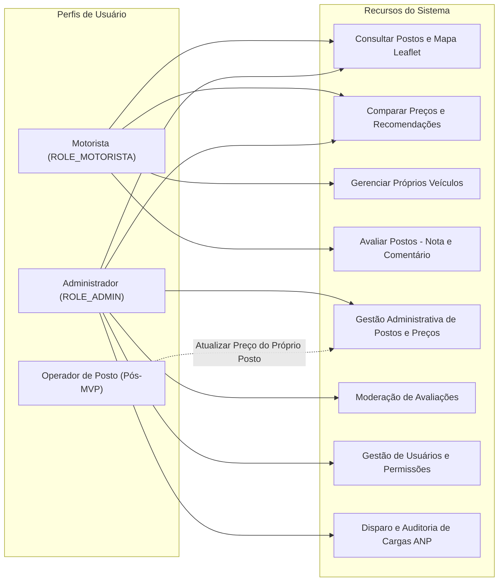
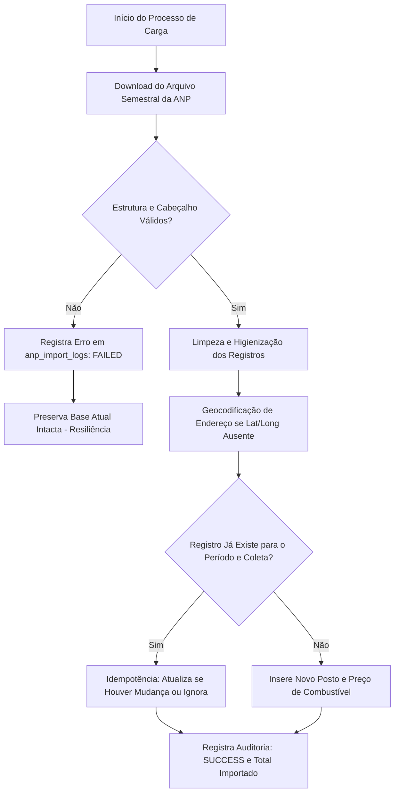

# Regras de Negócio e Domínio — FuelFinder

Este documento formaliza as regras de negócio, invariantes operacionais, fórmulas de cálculo, políticas de controle de acesso (RBAC) e diretrizes de integração da plataforma **FuelFinder**.

Esta versão consolida a revisão técnica completa, servindo como **especificação executável e base de implementação para a próxima aula**.

---

## 1. Usuários, Autenticação e Controle de Acesso (RBAC)

### 1.1 Autocadastro e Gestão de Contas
* **Cadastro de Motorista:** Qualquer condutor pode realizar o autocadastro informando Nome Completo, E-mail e Senha. A conta é criada com o papel `ROLE_MOTORISTA` e status `ACTIVE`.
* **Unicidade de Identificação:** O e-mail informado deve ser estritamente único no banco de dados. Tentativas de cadastro com e-mail duplicado retornam erro HTTP `409 Conflict`.
* **Segurança de Senhas:** Senhas devem ser armazenadas exclusivamente na forma de hash criptográfico seguro (BCrypt, custo mínimo 10). Requisitos mínimos: 8 caracteres, ao menos uma letra e um número.
* **Status da Conta:**
  * `ACTIVE`: Permissão regular para todas as operações do seu papel.
  * `INACTIVE`: Conta desativada temporariamente.
  * `BLOCKED`: Conta bloqueada administrativamente por violação das diretrizes. Impede login e revoga tokens imediatamente.

### 1.2 Sessão Stateless e Logout
* **Emissão de Token JWT:** A autenticação bem-sucedida (`POST /auth/login`) gera um token de acesso JWT contendo claims mínimas (`sub: userId`, `role`, `exp`).
* **Encerramento de Sessão (`logout`):** O cliente descarta o token localmente e a API invalida a sessão ativa (`POST /auth/logout`), retornando HTTP `204 No Content`.

### 1.3 Matriz de Permissões RBAC

| Funcionalidade / Recurso | `ROLE_MOTORISTA` | `ROLE_ADMIN` | `ROLE_OPERADOR` *(Pós-MVP)* |
| :--- | :---: | :---: | :---: |
| Consultar postos no mapa e lista | Sim | Sim | Sim |
| Comparar preços e obter rotas (Maps/Waze) | Sim | Sim | Sim |
| Obter recomendação personalizada de combustível | Sim | Sim | Sim |
| Cadastrar, editar e excluir seus próprios veículos | Sim | Não aplicável | Não aplicável |
| Registrar e editar sua própria avaliação de posto | Sim | Não *(apenas modera)*| Não |
| Cadastrar, editar ou inativar postos | Não | Sim | Não |
| Cadastrar ou retificar preços de combustíveis | Não | Sim | Sim *(posto vinculado)* |
| Moderar ou excluir avaliações de terceiros | Não | Sim | Não |
| Gerenciar status e papéis de usuários | Não | Sim | Não |
| Disparar e auditar cargas da base ANP | Não | Sim | Não |

---

## 2. Gestão de Veículos e Modelagem de Consumo

### 2.1 Cadastro de Veículos
* Cada motorista autenticado pode cadastrar um ou múltiplos veículos vinculados exclusivamente ao seu `user_id`.
* **Dados Obrigatórios:**
  * Apelido / Identificação (ex.: "Meu Carro", "Gol 1.6").
  * Marca (ex.: "Volkswagen", "Fiat", "Chevrolet").
  * Modelo (ex.: "Polo", "Onix", "Strada").
  * Ano de Fabricação (inteiro entre 1950 e o ano corrente + 1).
  * Tipo de Combustível Compatível: Enum `[GASOLINE, ETHANOL, FLEX, DIESEL, CNG]`.
  * Capacidade do Tanque: Valor decimal positivo em litros (`tank_capacity > 0`).

### 2.2 Consumo Médio Informado pelo Motorista
* **Premissa Central do Projeto:** O consumo médio é informado **diretamente pelo usuário condutor** com base na sua experiência prática de direção.
* **Isenção de Bases Externas:** O sistema **não** consulta manuais de montadoras ou tabelas do Inmetro no MVP.
* **Regra para Veículos Flex (Bicombustíveis):**
  * Para veículos do tipo `FLEX`, o usuário informa separadamente:
    1. `avg_consumption_gasoline` (km/L na gasolina)
    2. `avg_consumption_ethanol` (km/L no etanol)
  * *Justificativa:* Esta segregação é indispensável para viabilizar o cálculo da paridade real e a recomendação financeira personalizada de qual combustível é mais vantajoso.
* Para veículos de combustível único (ex.: Gasolina pura ou Diesel), informa-se apenas o consumo respectivo.
* **Validação Numérica:** Consumo médio deve ser um valor estritamente positivo (entre `1.0` e `40.0` km/L).

---

## 3. Postos de Combustível, Localização e Navegação

### 3.1 Cadastro e Identificação do Posto
* **Identificação Oficial:** Cada posto revendedor possui CNPJ único, Razão Social, Nome Fantasia e Bandeira cadastrada.
* **Endereço Completo:** Logradouro, número, complemento, bairro, município, estado (UF) e CEP.
* **Coordenadas Geográficas:** Latitude (`-90.0` a `+90.0`) e Longitude (`-180.0` a `+180.0`) em formato decimal.
* **Status do Posto:**
  * `ACTIVE`: Exibido publicamente no mapa e nas buscas de motoristas.
  * `INACTIVE`: Posto inativo ou fechado; excluído das consultas públicas sem perder histórico.

### 3.2 Busca de Proximidade e Visualização
* **Permissão de Geolocalização:** O sistema solicita acesso à localização atual via Geolocation API do navegador.
* **Busca Manual Obrigatória (Fallback):** Caso a permissão seja negada ou o dispositivo não possua GPS, o motorista pesquisa informando endereço, bairro, município ou CEP.
* **Apresentação Visual Dupla:** Os resultados são exibidos simultaneamente em:
  1. **Mapa Interativo:** Renderizado via biblioteca **Leaflet 1.9.4** com tiles do **OpenStreetMap**.
  2. **Lista Ordenada:** Contendo nome do posto, bandeira, endereço, distância calculada e preços.

### 3.3 Distância em Linha Reta e Redirecionamento de Rotas
* **Cálculo em Linha Reta:** No MVP, a distância é calculada em **linha reta** a partir da diferença das coordenadas geográficas pela **Fórmula de Haversine**:

$$d = 2 R \cdot \arcsin\left(\sqrt{\sin^2\left(\frac{\Delta \phi}{2}\right) + \cos(\phi_1)\cos(\phi_2)\sin^2\left(\frac{\Delta \lambda}{2}\right)}\right)$$

*Onde $R = 6.371\text{ km}$ (raio médio da Terra), $\phi$ é a latitude e $\lambda$ é a longitude em radianos.*

* **Botão "Rotas" e Integração Externa:**
  * O FuelFinder não executa roteamento viário complexo nem consome APIs de trânsito pagas.
  * Nos detalhes do posto, disponibiliza-se o botão **"Rotas"**, que dispara o aplicativo de navegação instalado no dispositivo do condutor por meio de deep links:
    * **Google Maps:** `https://www.google.com/maps/dir/?api=1&destination={latitude},{longitude}`
    * **Waze:** `https://waze.com/ul?ll={latitude},{longitude}&navigate=yes`

---

## 4. Integração com a Base de Dados da ANP

### 4.1 Origem Oficial e Caráter Informativo
* **Fonte Oficial:** Série Histórica de Preços de Combustíveis e de GLP da ANP (Portal de Dados Abertos do Governo Federal).
* **Arquivo de Referência Inicial:** Arquivo semestral referente ao **1º Semestre de 2026** (ou o mais recente publicado na fonte oficial).
* **Caráter Histórico Obrigatório:** Os preços têm caráter **informativo e histórico**, decorrentes das coletas periódicas da ANP. O sistema **não** garante preços em tempo real praticados na bomba no momento exato do abastecimento.
* **Exibição da Data de Coleta:** Toda exibição de preço na interface deve apresentar a **Data da Coleta** informada pela ANP.

### 4.2 Pipeline de Ingestão (ETL) e Regras de Carga

1. **Mapeamento de Campos do Arquivo ANP:**
   * `Regiao - Sigla` e `Estado - Sigla` $\rightarrow$ `station.state`
   * `Municipio` $\rightarrow$ `station.city`
   * `Revenda` $\rightarrow$ `station.corporate_name` e `station.trade_name`
   * `CNPJ da Revenda` $\rightarrow$ `station.cnpj` (identificador único da revenda)
   * `Nome da Rua`, `Numero Rua`, `Bairro`, `Cep` $\rightarrow$ Endereço do posto
   * `Bandeira` $\rightarrow$ `station.brand`
   * `Produto` $\rightarrow$ Mapeado para `fuel_type` (Gasolina Comum, Gasolina Aditivada, Etanol, Diesel S10, GNV)
   * `Data da Coleta` $\rightarrow$ `fuel_price.collection_date`
   * `Valor de Venda` $\rightarrow$ `fuel_price.sale_value`
   * `Unidade de Medida` $\rightarrow$ `R$ / litro` ou `R$ / m³`
2. **Idempotência Obrigatória:** Reexecuções do processo de carga para o mesmo arquivo semestral não podem gerar registros de preços duplicados. A chave de unicidade é `(station_id, fuel_type_id, collection_date)`.
3. **Resiliência e Fallback:** Se o download falhar, o layout for corrompido ou o processamento for interrompido, a transação da carga é abortada e o sistema **mantém disponíveis para consulta os últimos dados válidos previamente carregados**.
4. **Log de Auditoria (`anp_import_logs`):** Toda importação registra data/hora de início e fim, período de referência, quantidade de registros processados e status final (`SUCCESS`, `PARTIAL`, `FAILED`).

---

## 5. Fórmulas de Domínio e Lógica de Cálculo

### 5.1 Estimativa de Custo para Encher o Tanque
Determina o valor financeiro aproximado para abastecimento completo:

$$\text{Custo Tanque Cheio (R\$)} = \text{Capacidade do Tanque (L)} \times \text{Preço por Litro (R\$/L)}$$

### 5.2 Autonomia Estimada do Veículo
Projeta a distância que o automóvel pode percorrer com o reservatório abastecido:

$$\text{Autonomia Estimada (km)} = \text{Capacidade do Tanque (L)} \times \text{Consumo Médio (km/L)}$$

### 5.3 Custo por Quilômetro Rodado
Mede a eficiência financeira do combustível no veículo cadastrado:

$$\text{Custo por KM (R\$/km)} = \frac{\text{Preço por Litro (R\$/L)}}{\text{Consumo Médio do Veículo (km/L)}}$$

### 5.4 Paridade e Recomendação Etanol vs Gasolina

1. **Paridade Clássica dos 70% (Genérica - quando não há dados do veículo):**

$$\text{Índice de Paridade} = \left(\frac{\text{Preço do Etanol}}{\text{Preço da Gasolina}}\right) \times 100\%$$

* Se $\text{Índice} \le 70\%$: **Etanol é a opção mais vantajosa**.
* Se $\text{Índice} > 70\%$: **Gasolina é a opção mais vantajosa**.

2. **Paridade Real Personalizada (quando o condutor possui veículo Flex cadastrado):**
Calcula-se o custo por quilômetro real para cada um dos combustíveis:

$$\text{Custo por KM}_{\text{Etanol}} = \frac{\text{Preço Etanol}}{\text{Consumo Médio com Etanol (km/L)}}$$

$$\text{Custo por KM}_{\text{Gasolina}} = \frac{\text{Preço Gasolina}}{\text{Consumo Médio com Gasolina (km/L)}}$$

* Se $\text{Custo por KM}_{\text{Etanol}} < \text{Custo por KM}_{\text{Gasolina}}$: **Recomenda-se Etanol**.
* Caso contrário: **Recomenda-se Gasolina**.

### 5.5 Custo Efetivo de Deslocamento até o Posto
Evita a falsa economia de deslocar-se a postos muito distantes para economizar poucos centavos:

$$\text{Custo Efetivo Total} = \text{Custo do Abastecimento} + \left(2 \times \text{Distância em Linha Reta (km)} \times \text{Custo por KM}\right)$$

*O fator multiplicador $2$ contabiliza o trajeto de ida e volta ao estabelecimento.*

### 5.6 Consumo Médio Real por Abastecimentos Consecutivos (Pós-MVP)
Quando implementado o histórico de abastecimentos, o consumo médio real é calculado por:

$$\text{Consumo Médio Real (km/L)} = \frac{\text{Quilometragem Atual (km)} - \text{Quilometragem Anterior (km)}}{\text{Litros Abastecidos (L)}}$$

* **Condições Mandatórias de Validade:** Ambos os abastecimentos com tanque cheio; $\text{km\_atual} > \text{km\_anterior}$; $\text{litros} > 0$; mesmo veículo.

---

## 6. Avaliações de Postos e Moderação

* **Regras de Submissão:** Apenas motoristas autenticados podem avaliar estabelecimentos.
* **Escala de Nota:** Inteiro de **1 a 5 estrelas**.
* **Comentário Textual:** Opcional, limitado a 500 caracteres.
* **Unicidade de Avaliação:** Cada motorista mantém no máximo **1 avaliação ativa por posto**. O envio de nova avaliação para o mesmo posto atualiza a avaliação anterior.
* **Nota Média Agregada do Posto:**

$$\text{Nota Média} = \frac{\sum_{i=1}^{N} \text{Nota}_i}{N}$$

*Onde $N$ é o total de avaliações com status aprovado (`APPROVED`).*

* **Moderação Administrativa:** O Administrador (`ROLE_ADMIN`) pode aprovar, rejeitar ou excluir avaliações com conteúdo inconsistente, calunioso ou ofensivo.

---

## 7. Mapeamento e Resolução de Inconsistências da Especificação

1. **Método HTTP `PATH` nas Tabelas da Especificação:**
   * *Inconsistência:* A especificação base utilizou a palavra `PATH` para rotas de atualização (`/users/me`, `/vehicles/{id}`, `/stations/{id}`, `/stations/{id}/fuel-prices/{priceId}`, `/reviews/{id}`).
   * *Resolução Técnica:* Como `PATH` não existe no protocolo HTTP (RFC 9110), padronizou-se o método **`PATCH`** em toda a arquitetura e documentação da API.
2. **Histórico de Abastecimentos (MVP vs Pós-MVP):**
   * *Inconsistência:* O "Histórico de abastecimentos" consta na seção de evoluções Pós-MVP, mas é detalhado no item 5 de fluxos principais com fórmula de cálculo.
   * *Resolução Técnica:* O MVP baseia-se exclusivamente no **consumo médio informado pelo usuário**. A fórmula de abastecimentos consecutivos fica documentada como recurso planejado para a fase seguinte.
3. **Perfis de Usuário:**
   * *Inconsistência:* A especificação menciona "Operador de posto" ora como opcional no MVP, ora como recurso futuro para representantes.
   * *Resolução Técnica:* No MVP inicial para a aula, os papéis ativos são estritamente **`ROLE_MOTORISTA`** e **`ROLE_ADMIN`**. O operador de posto permanece como arquitetura preparada para o pós-MVP.
