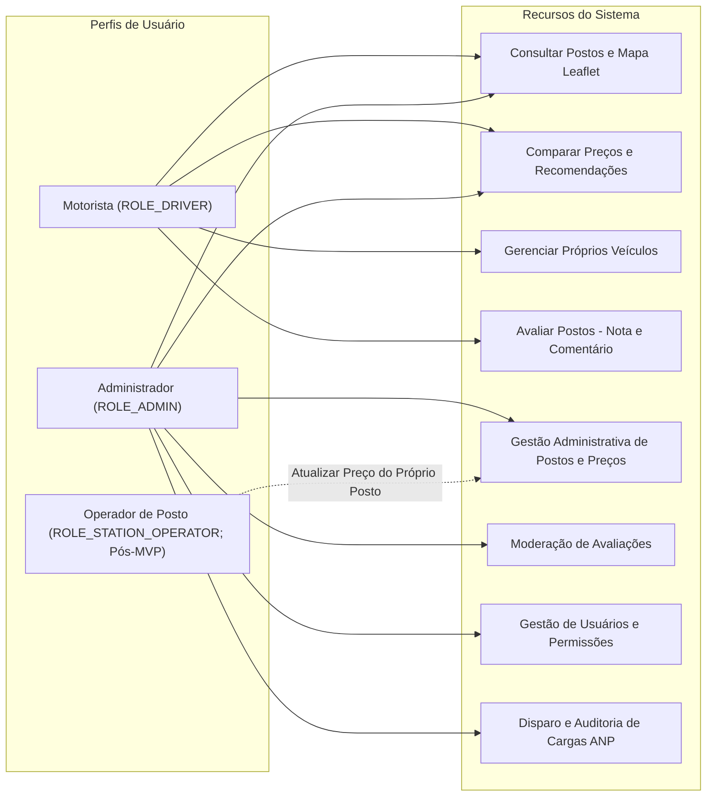
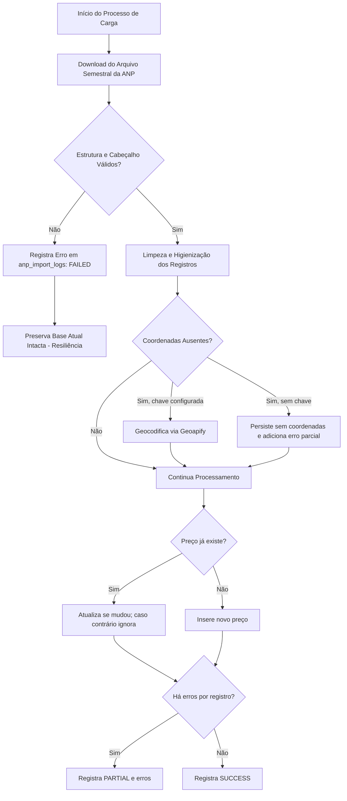

# Regras de Negócio e Domínio — FuelFinder

Este documento formaliza as regras de negócio, invariantes operacionais, fórmulas de cálculo, políticas de controle de acesso (RBAC) e diretrizes de integração da plataforma **FuelFinder**.

Esta versão consolida a revisão técnica completa, servindo como **especificação executável e base de implementação para a próxima aula**.

> **Acesso-alvo da aplicação:** login e cadastro são as únicas áreas funcionais públicas. Mapa e demais telas internas, bem como seus endpoints de dados, exigem autenticação. A implementação atual ainda permite carregar páginas estáticas sem sessão; o alinhamento é trabalho futuro documentado na Fase 9, não funcionalidade já entregue.

---

## 1. Usuários, Autenticação e Controle de Acesso (RBAC)

### 1.1 Autocadastro e Gestão de Contas
* **Cadastro de Motorista:** Qualquer condutor pode realizar o autocadastro informando Nome Completo, E-mail e Senha. A conta é criada com o papel `ROLE_DRIVER` e status `ACTIVE`.
* **Unicidade de Identificação:** O e-mail informado deve ser estritamente único no banco de dados. Tentativas de cadastro com e-mail duplicado retornam erro HTTP `409 Conflict`.
* **Segurança de Senhas:** Senhas devem ter no mínimo 8 caracteres, uma letra maiúscula, uma letra minúscula, um número e um caractere especial. Devem ser armazenadas exclusivamente como hash BCrypt com custo mínimo 12.
* **Status da Conta:**
  * `ACTIVE`: Permissão regular para todas as operações do seu papel.
  * `INACTIVE`: Conta desativada temporariamente.
  * `BLOCKED`: Conta bloqueada administrativamente por violação das diretrizes. Impede login e renovação de tokens, revoga todas as sessões e nega imediatamente o acesso às rotas protegidas.

### 1.2 Sessões, Tokens e Revogação
* **Access token:** Após autenticação bem-sucedida (`POST /auth/login`), a API emite um access token JWT de curta duração com `sub: userId`, `role`, `sid: sessionId` e `exp`. A duração deve ser configurável.
* **Refresh token:** O login também emite um refresh token opaco, de uso único e duração configurável. O servidor armazena somente seu hash criptográfico, nunca o valor original; o token é enviado somente em cookie `HttpOnly`, `SameSite` e `Secure` em produção, nunca no JSON.
* **Rotação:** Cada renovação (`POST /auth/refresh`) lê o refresh token do cookie, invalida o token apresentado e emite um novo refresh token em cookie e um novo access token no JSON. A renovação requer um refresh token válido e não depende de um access token ainda válido.
* **Reutilização:** A apresentação de um refresh token já utilizado é tratada como reutilização; a API revoga a sessão associada e rejeita a renovação.
* **Validação de sessão:** Em cada requisição protegida, a API valida assinatura e expiração do access token, verifica que a sessão identificada por `sid` continua ativa e confirma que a conta está `ACTIVE`. Assim, logout, revogação global e bloqueio impedem imediatamente o uso de access tokens já emitidos.
* **Armazenamento no cliente:** O access token permanece somente em memória; após recarregar a página, o frontend obtém outro pelo fluxo de renovação. Nunca armazenar tokens em `localStorage` ou `sessionStorage`, registrá-los em logs ou incluí-los em URLs.
* **Logout:** `POST /auth/logout` revoga a sessão autenticada atual no servidor, expira o cookie de refresh com os mesmos atributos e escopo usados para criá-lo, e retorna HTTP `204 No Content`. O cliente também descarta o access token em memória.
* **Proteção CSRF:** Endpoints autenticados por cookie, incluindo refresh e logout, validam a origem permitida e usam atributo `SameSite` apropriado; adicionar token anti-CSRF se essas medidas não forem suficientes para o contexto de implantação.
* **Revogação global:** `POST /auth/sessions/revoke-all` revoga todas as sessões ativas do usuário autenticado e retorna HTTP `204 No Content`.
* **Conta bloqueada:** O bloqueio revoga todas as sessões do usuário. A verificação do status da conta em cada rota protegida impede acesso imediatamente, e refresh tokens de contas bloqueadas são sempre rejeitados.

### 1.3 Matriz de Permissões RBAC

```mermaid
flowchart LR
    subgraph PERFIS[Perfis de Usuário]
        DRIVER["Motorista (ROLE_DRIVER)"]
        ADMIN["Administrador (ROLE_ADMIN)"]
        STATION_OPERATOR["Operador de Posto (ROLE_STATION_OPERATOR; Pós-MVP)"]
    end

    subgraph RECURSOS[Recursos do Sistema]
        R1[Consultar Postos e Mapa Leaflet]
        R2[Comparar Preços e Recomendações]
        R3[Gerenciar Próprios Veículos]
        R4[Avaliar Postos - Nota e Comentário]
        R5[Gestão Administrativa de Postos e Preços]
        R6[Moderação de Avaliações]
        R7[Gestão de Usuários e Permissões]
        R8[Disparo e Auditoria de Cargas ANP]
    end

    DRIVER --> R1
    DRIVER --> R2
    DRIVER --> R3
    DRIVER --> R4

    ADMIN --> R1
    ADMIN --> R2
    ADMIN --> R5
    ADMIN --> R6
    ADMIN --> R7
    ADMIN --> R8

    STATION_OPERATOR -. Atualizar Preço do Próprio Posto .-> R5
```

| Funcionalidade / Recurso | `ROLE_DRIVER` | `ROLE_ADMIN` | `ROLE_STATION_OPERATOR` *(Pós-MVP)* |
| :--- | :---: | :---: | :---: |
| Acessar mapa, consultar postos e lista (após login) | Sim | Sim | Sim |
| Comparar preços e obter rotas (Maps/Waze), após login | Sim | Sim | Sim |
| Obter recomendação personalizada de combustível, após login | Sim | Sim | Sim |
| Cadastrar, editar e excluir seus próprios veículos | Sim | Não aplicável | Não aplicável |
| Registrar e editar sua própria avaliação de posto | Sim | Não *(apenas modera)*| Não |
| Cadastrar, editar ou inativar postos | Não | Sim | Não |
| Cadastrar ou retificar preços de combustíveis | Não | Sim | Sim *(posto vinculado)* |
| Moderar ou excluir avaliações de terceiros | Não | Sim | Não |
| Gerenciar status e papéis de usuários | Não | Sim | Não |
| Disparar e auditar cargas da base ANP | Não | Sim | Não |

---

## 2. Gestão de Veículos e Modelagem de Consumo

### 2.1 Cadastro de Veículos
* Cada motorista autenticado pode cadastrar um ou múltiplos veículos vinculados exclusivamente ao seu `user_id`.
* **Dados Obrigatórios:**
  * Apelido / Identificação (ex.: "Meu Carro", "Gol 1.6").
  * Marca (ex.: "Volkswagen", "Fiat", "Chevrolet").
  * Modelo (ex.: "Polo", "Onix", "Strada").
  * Ano de Fabricação (inteiro entre 1950 e o ano corrente + 1).
  * Tipo de Combustível Compatível: Enum `[GASOLINE, ETHANOL, FLEX, DIESEL, CNG]`.
  * Capacidade do tanque: valor positivo com unidade; líquidos usam `LITER` e CNG usa `CUBIC_METER`.

### 2.2 Consumo Médio Informado pelo Motorista
* **Premissa Central do Projeto:** O consumo médio é informado **diretamente pelo usuário condutor** com base na sua experiência prática de direção.
* **Isenção de Bases Externas:** O sistema **não** consulta manuais de montadoras ou tabelas do Inmetro no MVP.
* **Regra para Veículos Flex (Bicombustíveis):**
  * Para veículos do tipo `FLEX`, o usuário informa separadamente:
    1. `avg_consumption_gasoline` (km/L na gasolina)
    2. `avg_consumption_ethanol` (km/L no etanol)
  * *Justificativa:* Esta segregação é indispensável para viabilizar o cálculo da paridade real e a recomendação financeira personalizada de qual combustível é mais vantajoso.
* Para veículos de combustível único, informa-se apenas o campo correspondente: gasolina, etanol, diesel ou `avg_consumption_cng`.
* Cada medida inclui valor e unidade. Gasolina, etanol e diesel usam `KM_PER_LITER`; CNG usa `KM_PER_CUBIC_METER`. O consumo deve estar entre `1.0` e `40.0`.
* CNG exige capacidade do tanque em `CUBIC_METER`; combustíveis líquidos exigem `LITER`.

---

## 3. Postos de Combustível, Localização e Navegação

### 3.1 Cadastro e Identificação do Posto
* **Identificação Oficial:** Cada posto revendedor possui CNPJ único, Razão Social, Nome Fantasia e Bandeira cadastrada.
* **Endereço Completo:** Logradouro, número, complemento, bairro, município, estado (UF) e CEP.
* **Coordenadas Geográficas:** Latitude (`-90.0` a `+90.0`) e Longitude (`-180.0` a `+180.0`) em formato decimal. O cadastro manual de posto segue a validação definida na Fase 4; postos recebidos na ANP podem ficar sem coordenadas conforme a migração V5 e a regra de geocodificação opcional.
* **Status do Posto:**
  * `ACTIVE`: Exibido no mapa e nas buscas de motoristas autenticados.
  * `INACTIVE`: Posto inativo ou fechado; excluído das consultas autenticadas sem perder histórico.

### 3.2 Busca de Proximidade e Visualização
* **Autenticação prévia:** O mapa e a busca de postos ficam disponíveis somente após autenticação (`ROLE_DRIVER` ou `ROLE_ADMIN`).
* **Permissão de Geolocalização:** Ao abrir a área do mapa, o sistema solicita consentimento do navegador para obter a localização atual. Sem consentimento, não tenta coletar coordenadas.
* **Busca próxima automática:** Quando a localização é obtida, o mapa é centralizado e a busca de postos próximos inicia automaticamente, sem exigir uma primeira busca manual. O raio deve permanecer configurável; a Fase 4 documenta atualmente 5 km como padrão. As opções de raio e eventual configuração administrativa ainda não estão definidas.
* **Estados e fallback:** A interface apresenta estados de carregamento, vazio, sucesso e erro para localização e resultados. Caso a permissão seja negada, a localização esteja indisponível ou ocorra erro, informa claramente e permite pesquisar/selecionar uma localização manualmente, sem bloquear outras funcionalidades autenticadas.
* **Geocodificação textual:** Chamadas reais de geocodificação usam Geoapify no backend e só são habilitadas quando `GEOAPIFY_API_KEY` está configurada no ambiente; sem a variável, a aplicação continua iniciando e as funcionalidades que não dependem do serviço permanecem disponíveis.
* **Geocodificação de Postos da ANP:** Quando um registro importado não possuir latitude/longitude, o backend usa Geoapify se `GEOAPIFY_API_KEY` estiver configurada no ambiente. A chave é necessária somente para testar chamadas reais ao serviço; sem ela, registra o resultado parcial e mantém o posto sem coordenadas. Falhas devem ser rastreáveis. A chave nunca pode ser armazenada no código ou no Git nem exposta ao frontend. Os limites do plano gratuito podem mudar.
* **Apresentação Visual Dupla:** Os resultados são exibidos simultaneamente em:
  1. **Mapa Interativo:** Renderizado via biblioteca **Leaflet 1.9.4** com tiles do **OpenStreetMap**.
  2. **Lista Ordenada:** Contendo nome do posto, bandeira, endereço, distância calculada e preços.

### 3.3 Distância em Linha Reta e Redirecionamento de Rotas
* **Cálculo em Linha Reta:** No MVP, a distância é calculada em **linha reta** a partir da diferença das coordenadas geográficas pela **Fórmula de Haversine**:

$$d = 2 R \cdot \arcsin\left(\sqrt{\sin^2\left(\frac{\Delta \phi}{2}\right) + \cos(\phi_1)\cos(\phi_2)\sin^2\left(\frac{\Delta \lambda}{2}\right)}\right)$$

*Onde $R = 6.371\text{ km}$ (raio médio da Terra), $\phi$ é a latitude e $\lambda$ é a longitude em radianos.*

* **Botão "Rotas" e Integração Externa:**
  * O FuelFinder não executa roteamento viário complexo nem consome APIs de trânsito pagas.
  * Nos detalhes do posto, disponibiliza-se o botão **"Rotas"**, que dispara o aplicativo de navegação instalado no dispositivo do condutor por meio de deep links:
    * **Google Maps:** `https://www.google.com/maps/dir/?api=1&destination={latitude},{longitude}`
    * **Waze:** `https://waze.com/ul?ll={latitude},{longitude}&navigate=yes`

---

## 4. Integração com a Base de Dados da ANP

### 4.1 Origem Oficial e Caráter Informativo
* **Fonte Oficial:** Série Histórica de Preços de Combustíveis e de GLP da ANP (Portal de Dados Abertos do Governo Federal).
* **Arquivo de Referência Inicial:** Arquivo semestral referente ao **1º Semestre de 2026** (ou o mais recente publicado na fonte oficial).
* **Caráter Histórico Obrigatório:** Os preços têm caráter **informativo e histórico**, decorrentes das coletas periódicas da ANP. O sistema **não** garante preços em tempo real praticados na bomba no momento exato do abastecimento.
* **Exibição da Data de Coleta:** Toda exibição de preço na interface deve apresentar a **Data da Coleta** informada pela ANP.

### 4.2 Pipeline de Ingestão (ETL) e Regras de Carga

```mermaid
flowchart TD
    A[Início do Processo de Carga] --> B[Download do Arquivo Semestral da ANP]
    B --> C{Estrutura e Cabeçalho Válidos?}
    C -- Não --> D[Registra Erro em anp_import_logs: FAILED]
    D --> E[Preserva Base Atual Intacta - Resiliência]
    C -- Sim --> F[Limpeza e Higienização dos Registros]
    F --> G{Coordenadas Ausentes?}
    G -- Não --> H[Continua Processamento]
    G -- Sim, chave configurada --> I[Geocodifica via Geoapify]
    G -- Sim, sem chave --> J[Persiste sem coordenadas e adiciona erro parcial]
    I --> H
    J --> H
    H --> K{Preço já existe?}
    K -- Sim --> L[Atualiza se mudou; caso contrário ignora]
    K -- Não --> M[Insere novo preço]
    L --> N{Há erros por registro?}
    M --> N
    N -- Sim --> O[Registra PARTIAL e erros]
    N -- Não --> P[Registra SUCCESS]
```

1. **Mapeamento de Campos do Arquivo ANP:**
   * `Estado - Sigla` $\rightarrow$ `station.state`
   * `Municipio` $\rightarrow$ `station.city`
   * `Revenda` $\rightarrow$ `station.corporate_name` e `station.trade_name`
   * `CNPJ da Revenda` $\rightarrow$ `station.cnpj` (identificador único da revenda)
   * `Nome da Rua`, `Numero Rua`, `Bairro`, `Cep` $\rightarrow$ Endereço do posto
   * `Bandeira` $\rightarrow$ `station.brand`
   * `Produto` $\rightarrow$ Mapeado para o catálogo canônico `fuel_types.code`: `GASOLINE_REGULAR`, `GASOLINE_PREMIUM` (Gasolina Aditivada), `ETHANOL`, `DIESEL_S10`, `DIESEL_S500` e `CNG`.
   * `Data da Coleta` $\rightarrow$ `fuel_price.collection_date`
   * `Valor de Venda` $\rightarrow$ `fuel_price.sale_value`
   * `Unidade de Medida` $\rightarrow$ `R$ / litro` ou `R$ / m³`
2. **Idempotência Obrigatória:** Reexecuções do processo de carga para o mesmo arquivo semestral não podem gerar registros de preços duplicados. A chave de unicidade é `(station_id, fuel_type_id, collection_date)`.
3. **Resiliência e Fallback:** Falha de download/layout registra `FAILED`; falha interna no processamento reverte a transação e mantém disponíveis os dados válidos anteriores. Erros isolados por registro não descartam os registros válidos: a importação termina como `PARTIAL`.
4. **Log de Auditoria (`anp_import_logs`):** Toda importação registra data/hora de início e fim, período de referência, quantidade de registros processados e status final (`SUCCESS`, `PARTIAL`, `FAILED`).
5. **Coordenadas ausentes:** A geocodificação é opcional. Sem `GEOAPIFY_API_KEY`, o posto e o preço podem ser persistidos com latitude/longitude nulas; o resultado é `PARTIAL`. A migração V5 permite coordenadas nulas, e postos sem coordenadas não entram em consultas geográficas.

### 4.3 Arquivos ZIP/CSV, Período e Cadastro Controlado de Postos (trabalho planejado)

* A origem oficial pode entregar diretamente CSV/TSV ou um ZIP contendo CSV. O pipeline futuro deve validar o tipo/conteúdo, inspecionar o ZIP com limites contra arquivos excessivos ou expansão maliciosa e processar o CSV contido sem confiar em nomes de caminhos fornecidos pelo arquivo.
* A detecção do delimitador deve considerar o cabeçalho e a consistência das colunas; quando o arquivo usar ponto e vírgula (`;`), separar colunas por `;`. A vírgula decimal pertence ao valor numérico e não pode ser tratada como delimitador de coluna. A leitura numérica deve reconhecer os formatos observados em amostras oficiais e validar separadores decimais/de milhar sem conversões ambíguas.
* Cabeçalhos reconhecidos, encoding e estrutura devem ser validados antes de persistir dados. Erros de arquivo/layout devem informar a causa; erros por linha devem indicar linha/campo sem incluir segredos. O resumo deve distinguir registros lidos, importados, ignorados e falhos, com classificação mutuamente exclusiva a ser definida no contrato da importação.
* O posto é localizado por CNPJ normalizado. Se já existir, usar esse posto; se ainda não existir, criá-lo somente quando CNPJ e demais campos obrigatórios permitirem identificar e cadastrar o estabelecimento com segurança. Não usar correspondência aproximada para criar posto nem criar silenciosamente duplicatas.
* Sem CNPJ válido ou dados obrigatórios suficientes para um novo posto, não criar posto nem o preço dependente; registrar a linha como falha com motivo. Conflitos entre os dados cadastrais da linha e os dados de um posto já identificado pelo mesmo CNPJ devem ser reportados, sem sobrescrita silenciosa.
* O período é composto de `reference_year` e `reference_semester`: ano informado com quatro algarismos e semestre inteiro `1` ou `2`. Persistir ambos separadamente e apresentar, por exemplo, “1º semestre de 2026”. A faixa histórica permitida e a política para datas de coleta fora do semestre informado permanecem pendentes.

---

## 5. Fórmulas de Domínio e Lógica de Cálculo

### 5.1 Estimativa de Custo para Encher o Tanque
Determina o valor financeiro aproximado para abastecimento completo:

$$\text{Custo Tanque Cheio (R\$)} = \text{Capacidade (L ou m³)} \times \text{Preço na mesma unidade (R\$/L ou R\$/m³)}$$

### 5.2 Autonomia Estimada do Veículo
Projeta a distância que o automóvel pode percorrer com o reservatório abastecido:

$$\text{Autonomia Estimada (km)} = \text{Capacidade (L ou m³)} \times \text{Consumo na mesma unidade (km/L ou km/m³)}$$

### 5.3 Custo por Quilômetro Rodado
Mede a eficiência financeira do combustível no veículo cadastrado:

$$\text{Custo por KM (R\$/km)} = \frac{\text{Preço por unidade (R\$/L ou R\$/m³)}}{\text{Consumo correspondente (km/L ou km/m³)}}$$

Na comparação, `estimatedFullTankCost` e `estimatedRoundTripCost` são retornados
separadamente. O custo efetivo de abastecer e ir/voltar ao posto é a soma desses
dois valores; `estimatedRoundTripCost` sozinho cobre somente o trajeto de ida e volta.

### 5.4 Paridade e Recomendação Etanol vs Gasolina

1. **Regra genérica dos 70% (apenas referência):**

$$\text{Índice de Paridade} = \left(\frac{\text{Preço do Etanol}}{\text{Preço da Gasolina}}\right) \times 100\%$$

Esta regra não decide a recomendação personalizada da API.

2. **Recomendação personalizada (veículo cadastrado):**

A API `GET /recommendations/fuel` exige veículo pertencente ao condutor. A
decisão é baseada no menor custo por quilômetro, calculado com consumo
informado pelo usuário:

$$\text{Custo por KM}_{\text{Etanol}} = \frac{\text{Preço Etanol}}{\text{Consumo Médio com Etanol (km/L)}}$$

$$\text{Custo por KM}_{\text{Gasolina}} = \frac{\text{Preço por litro}}{\text{Consumo Médio com Gasolina (km/L)}}$$

Para GNV, a divisão usa preço em `R$/m³` e consumo em `km/m³`. Combustíveis
líquidos usam preço em `R$/litro` e consumo em `km/L`. A capacidade do veículo
deve usar a mesma unidade volumétrica do preço.

* Para `FLEX`, compara-se `ETHANOL` com a variante de gasolina de menor custo/km.
  São consideradas `GASOLINE_REGULAR` e `GASOLINE_PREMIUM`.
* Para `GASOLINE`, são consideradas as duas variantes de gasolina; para
  `DIESEL`, `DIESEL_S10` e `DIESEL_S500`. O código retornado identifica a
  variante escolhida.
* `ETHANOL` e `CNG` usam seus respectivos tipos de combustível.
* Se houver empate entre custo/km de etanol e gasolina para um veículo `FLEX`,
  recomenda-se gasolina. Sem preço em um dos grupos, recomenda-se o grupo
  disponível e não se retorna paridade.
* A paridade retornada para veículos `FLEX` com preços em ambos os grupos é
  `(preço do melhor etanol / preço da melhor gasolina) × 100`.

* Se $\text{Custo por KM}_{\text{Etanol}} < \text{Custo por KM}_{\text{Gasolina}}$: **Recomenda-se Etanol**.
* Caso contrário: **Recomenda-se a variante de gasolina com menor custo por KM**.

### 5.5 Custo Efetivo de Deslocamento até o Posto
Evita a falsa economia de deslocar-se a postos muito distantes para economizar poucos centavos:

$$\text{Custo Efetivo Total} = \text{Capacidade (L ou m³)} \times \text{Preço por unidade} + \left(2 \times \text{Distância Haversine (km)} \times \text{Custo por KM}\right)$$

*O fator multiplicador $2$ contabiliza o trajeto de ida e volta ao estabelecimento. As opções do combustível recomendado são ordenadas pelo custo efetivo crescente.*

### 5.6 Consumo Médio Real por Abastecimentos Consecutivos (Pós-MVP)
Quando implementado o histórico de abastecimentos, o consumo médio real é calculado por:

$$\text{Consumo Médio Real (km/L)} = \frac{\text{Quilometragem Atual (km)} - \text{Quilometragem Anterior (km)}}{\text{Litros Abastecidos (L)}}$$

* **Condições Mandatórias de Validade:** Ambos os abastecimentos com tanque cheio; $\text{km\_atual} > \text{km\_anterior}$; $\text{litros} > 0$; mesmo veículo.

---

## 6. Avaliações de Postos e Moderação

* **Regras de Submissão:** Apenas motoristas autenticados podem avaliar estabelecimentos.
* **Escala de Nota:** Inteiro de **1 a 5 estrelas**.
* **Comentário Textual:** Opcional, limitado a 500 caracteres.
* **Unicidade de Avaliação:** Cada motorista mantém no máximo **1 avaliação por posto**, independentemente do status. O envio de nova avaliação faz *upsert* e preserva o status de moderação existente.
* **Nota Média Agregada do Posto:**

$$\text{Nota Média} = \frac{\sum_{i=1}^{N} \text{Nota}_i}{N}$$

*Onde $N$ é o total de avaliações com status aprovado (`APPROVED`).*

* **Moderação Administrativa:** O Administrador (`ROLE_ADMIN`) pode aprovar, rejeitar ou excluir avaliações. A alteração de status usa `PATCH /reviews/{id}/moderation`; somente avaliações `APPROVED` são visíveis a usuários autenticados e entram no cálculo agregado. Novas avaliações iniciam `APPROVED`.

---

## 7. Mapeamento e Resolução de Inconsistências da Especificação

1. **Método HTTP `PATH` nas Tabelas da Especificação:**
   * *Inconsistência:* A especificação base utilizou a palavra `PATH` para rotas de atualização (`/users/me`, `/vehicles/{id}`, `/stations/{id}`, `/stations/{id}/fuel-prices/{priceId}`, `/reviews/{id}`).
   * *Resolução Técnica:* Como `PATH` não existe no protocolo HTTP (RFC 9110), padronizou-se o método **`PATCH`** em toda a arquitetura e documentação da API.
2. **Histórico de Abastecimentos (MVP vs Pós-MVP):**
   * *Inconsistência:* O "Histórico de abastecimentos" consta na seção de evoluções Pós-MVP, mas é detalhado no item 5 de fluxos principais com fórmula de cálculo.
   * *Resolução Técnica:* O MVP baseia-se exclusivamente no **consumo médio informado pelo usuário**. A fórmula de abastecimentos consecutivos fica documentada como recurso planejado para a fase seguinte.
3. **Perfis de Usuário:**
   * *Inconsistência:* A especificação menciona "Operador de posto" ora como opcional no MVP, ora como recurso futuro para representantes.
   * *Resolução Técnica:* No MVP inicial para a aula, os papéis ativos são estritamente **`ROLE_DRIVER`** e **`ROLE_ADMIN`**. O papel `ROLE_STATION_OPERATOR` permanece como arquitetura preparada para o pós-MVP.
