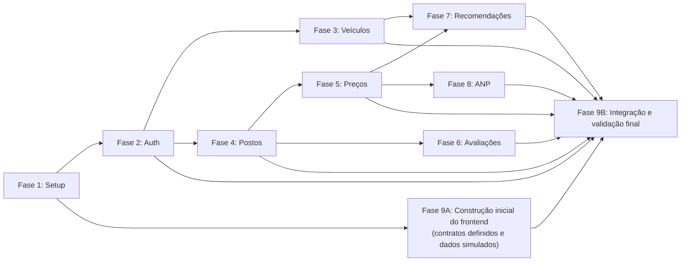

# Fase 0 — Visão Geral do Plano de Desenvolvimento

## 1. Sobre o FuelFinder

O **FuelFinder** é uma plataforma web responsiva para consulta, localização e comparação de preços de combustíveis no Brasil. Permite que motoristas encontrem postos próximos com os melhores preços, recebam recomendações personalizadas de combustível (etanol vs gasolina) e avaliem os estabelecimentos.

**Acesso-alvo:** login e cadastro são as áreas funcionais públicas; o mapa e
as demais funcionalidades internas exigem autenticação, além das permissões
administrativas. Na implementação atual, o frontend guarda essas telas por
sessão/papel, mas os HTML estáticos são públicos no servidor. Também são
públicas as rotas `GET /stations/**` e `GET /fuel-prices/compare`. Após
autenticar, o usuário pode continuar para um caminho interno permitido.

Como referência visual para a evolução do frontend, usar o template
[LUNO Bootstrap 5](../Layout/README.md), na raiz do repositório, conforme a
análise, os limites de reutilização e as orientações por tela documentados em
[Fase 9 — Frontend](./09-frontend-integracao.md). A migração para Bootstrap
5.2.3 foi aprovada e aplicada às telas; Tailwind é substituído, sem combinação
dos frameworks. A validação visual abrangente e a integração de todos os estados
com backend/sessão reais continuam pendentes e estão detalhadas na Fase 9.

---

## 2. Decisões Técnicas Consolidadas

| Decisão | Escolha | Justificativa |
|---------|---------|---------------|
| **Linguagem / Runtime** | Java 21 LTS | Suporte a Records, Pattern Matching, Virtual Threads. Versão LTS estável. |
| **Framework Backend** | Spring Boot 3.4.x | Monólito modular, REST nativo, alta produtividade |
| **Banco de Dados** | PostgreSQL 16+ | ACID, funções trigonométricas nativas para Haversine |
| **Migrações** | Flyway 10.x+ | Versionamento declarativo do esquema |
| **Build** | Maven 3.9+ | Gerenciamento padronizado de dependências |
| **Frontend** | HTML5 + Bootstrap 5.2.3 via CDN + CSS próprio + Vanilla JS ES modules + Leaflet 1.9.4 | Bootstrap aplicado; validação visual/funcional ampla pendente, conforme Fase 9 |
| **Direção visual** | LUNO / Bootstrap 5 | Referência disponível em `../Layout/`; usar apenas os padrões adequados ao FuelFinder, sem copiar conteúdo demonstrativo nem importar plugins/assets não auditados |
| **Mapas** | Leaflet 1.9.4 + OpenStreetMap | Gratuito, leve, compatível com mobile |
| **Autenticação** | JWT (JJWT 0.12.6+) + Spring Security 6.4+ | Access JWT curto e sessões server-side para refresh rotativo e revogação; RBAC com BCrypt |
| **Validação** | Jakarta Bean Validation 3.0+ | Validação declarativa nos DTOs |
| **Documentação API** | Springdoc OpenAPI (Swagger) 2.7.x | Swagger UI interativo |
| **Recomendações** | Algoritmo determinístico; adaptador de IA opcional e pendente de aprovação | Fluxos essenciais não dependem de provedor, modelo ou credenciais |
| **Geocodificação** | Geoapify opcional (plano gratuito) | `GEOAPIFY_API_KEY` só é necessária para testar chamadas reais; sem a chave, a aplicação e os demais fluxos continuam disponíveis |
| **Busca geográfica** | Fórmula de Haversine | PostGIS fica para evolução futura, fora do MVP |
| **Navegação** | Deep links Google Maps / Waze | Sem custo com APIs de roteamento |
| **Testes** | JUnit 5 + Mockito + AssertJ | Unitários + integração |

---

## 3. Pré-requisitos do Ambiente Local para a Fase 1

São requisitos para executar os comandos e critérios de aceitação da configuração inicial, não pendências de decisão:

- JDK 21 LTS.
- Maven 3.9 ou superior.
- Docker e Docker Compose.

Validar com `java --version`, `mvn --version`, `docker --version` e `docker compose version`.

As variáveis opcionais de integrações externas não são pré-requisitos para iniciar a aplicação: `GEOAPIFY_API_KEY` só é necessária para testar chamadas reais de geocodificação; as credenciais de IA dependerão da futura escolha de provedor/modelo.

---

## 4. Arquitetura de Alto Nível

```text
[ Cliente Web Responsivo ] (HTML5 / Bootstrap 5.2.3 / CSS próprio / Vanilla JS / Leaflet 1.9.4)
              │
              │ HTTPS / JSON (Bearer JWT)
              ▼
[ Backend Monólito Modular ] (Spring Boot 3.4 / Java 21 LTS)
  ├── Security Filter (JWT & RBAC)
  ├── Controllers REST & DTOs (Records)
  ├── Services de Domínio & Recomendações (Algoritmo Puro)
  └── Repositories (Spring Data JPA)
              │
              │ JDBC / SQL
              ▼
[ Banco de Dados Relacional ] (PostgreSQL 16+)
```

---

## 5. Fases do Desenvolvimento

O projeto está organizado em **9 fases incrementais**, cada uma com escopo definido, entregáveis e critérios de aceitação.

| Fase | Nome | Descrição |
|------|------|-----------|
| **1** | [Setup & Infraestrutura](01-setup-infraestrutura.md) | Projeto Spring Boot, PostgreSQL, Flyway, configs globais |
| **2** | [Autenticação & Usuários](02-autenticacao-usuarios.md) | JWT, registro, login, RBAC, gestão de contas |
| **3** | [Veículos](03-veiculos.md) | CRUD de veículos com consumo informado |
| **4** | [Postos & Geolocalização](04-postos-geolocalizacao.md) | CRUD de postos, busca por raio (Haversine) |
| **5** | [Preços de Combustíveis](05-precos-combustiveis.md) | Gestão de preços, tipos de combustível, comparação |
| **6** | [Avaliações & Moderação](06-avaliacoes-moderacao.md) | Reviews 1-5 estrelas, nota média, moderação admin |
| **7** | [Recomendações](07-recomendacoes.md) | Paridade etanol/gasolina, custo/km personalizado |
| **8** | [Integração ANP](08-integracao-anp.md) | Pipeline ETL para ZIP/CSV semestral, cadastro controlado de postos, idempotência e auditoria |
| **9** | [Frontend & Integração](09-frontend-integracao.md) | Home pública, mapa autenticado, navegação por sessão e migração visual Bootstrap/LUNO |

---

## 6. Diagrama de Dependências entre Fases


```mermaid
flowchart LR
    F1["Fase 1: Setup"] --> F2["Fase 2: Auth"]
    F2 --> F3["Fase 3: Veículos"]
    F2 --> F4["Fase 4: Postos"]
    F4 --> F5["Fase 5: Preços"]
    F4 --> F6["Fase 6: Avaliações"]
    F3 --> F7["Fase 7: Recomendações"]
    F5 --> F7
    F5 --> F8["Fase 8: ANP"]
    F1 --> F9A["Fase 9A: Construção inicial do frontend<br/>(contratos definidos e dados simulados)"]
    F9A --> F9B["Fase 9B: Integração e validação final"]
    F2 --> F9B
    F3 --> F9B
    F4 --> F9B
    F5 --> F9B
    F6 --> F9B
    F7 --> F9B
    F8 --> F9B
```

**Leitura do diagrama:**
- Fase 1 é pré-requisito de todas as demais
- Fases 3 e 4 podem ser desenvolvidas em paralelo (ambas dependem apenas da Fase 2)
- Fases 5 e 6 podem ser desenvolvidas em paralelo (ambas dependem da Fase 4)
- Fase 7 requer Fases 3 e 5 concluídas
- Fase 8 requer Fase 5 concluída
- A construção inicial do frontend (Fase 9A) pode começar após a Fase 1, em paralelo com as fases de backend, usando os contratos de API documentados e dados simulados.
- A integração e validação final do frontend (Fase 9B) dependem das Fases 2 a 8: autenticação, veículos, postos, preços, avaliações, recomendações e integração/dados ANP. Assim, as telas de avaliações e as informações originadas da ANP só são integradas e validadas quando as respectivas fases estiverem concluídas.

### Ajustes planejados após validação de uso

A implementação funcional inicial das Fases 1 a 9 foi entregue. Na Fase 9, a home pública, o redirecionamento pós-login para caminhos internos permitidos, a guarda de páginas no cliente, a busca automática após consentimento de geolocalização e a interface Bootstrap foram implementados. A proteção server-side dos arquivos HTML e a exigência de autenticação para todas as leituras de dados continuam pendentes: atualmente os arquivos estáticos são públicos e `GET /stations/**` e `GET /fuel-prices/compare` também são públicos. A validação visual/funcional ampla, a integração de sessão/API reais e as decisões operacionais sobre CDNs/licenças estão detalhadas na Fase 9.

---

## 7. Perfis de Usuário (MVP)

| Perfil | Role | Descrição |
|--------|------|-----------|
| **Motorista** | `ROLE_DRIVER` | Consulta postos, compara preços, registra veículos, avalia postos, recebe recomendações |
| **Administrador** | `ROLE_ADMIN` | Gerencia postos e preços, modera avaliações, gerencia usuários, dispara cargas ANP |

> **Nota:** O perfil `ROLE_STATION_OPERATOR` (Operador de Posto) está previsto para o Pós-MVP.

---

## 8. Convenções de Desenvolvimento

### 7.1 Branches

| Tipo | Padrão | Exemplo |
|------|--------|---------|
| Principal | `main` | Código estável homologado |
| Feature | `feature/<nome>` | `feature/autenticacao-jwt` |

### 7.2 Conventional Commits

| Prefixo | Uso |
|---------|-----|
| `feat:` | Nova funcionalidade |
| `fix:` | Correção de bug |
| `docs:` | Documentação |
| `style:` | Formatação sem alteração semântica |
| `refactor:` | Refatoração sem alteração funcional |
| `test:` | Adição ou modificação de testes |
| `chore:` | Configuração, dependências, infraestrutura |

### 7.3 Idioma

- **Código-fonte:** Inglês (classes, métodos, variáveis, tabelas, colunas)
- **Documentação e UI:** Português

### 7.4 Nomenclatura

| Elemento | Convenção | Exemplo |
|----------|-----------|---------|
| Classes, Records, Enums | `PascalCase` | `StationService`, `FuelType` |
| Métodos, variáveis | `camelCase` | `calculateHaversineDistance` |
| Constantes, enum values | `UPPER_SNAKE_CASE` | `ROLE_DRIVER`, `GASOLINE_REGULAR`, `GASOLINE_PREMIUM` |
| Tabelas do banco | `snake_case` plural | `fuel_prices`, `anp_import_logs` |
| Colunas do banco | `snake_case` | `tank_capacity`, `user_id` |
| Rotas REST | `kebab-case` plural | `/fuel-prices/compare` |

---

## 9. Estrutura de Pacotes

```text
com.fuelfinder/
├── config/                  # Security, WebMvc, Swagger/OpenAPI, CORS
├── common/
│   ├── exception/           # GlobalExceptionHandler, exceções base
│   ├── util/                # HaversineCalculator, utilitários
│   └── dto/                 # DTOs compartilhados (paginação, ProblemDetail)
└── modules/
    ├── auth/                # Autenticação, JWT, registro/login
    ├── user/                # Gestão de usuários, perfis, status
    ├── vehicle/             # Veículos e consumo informado
    ├── station/             # Postos, localização, geolocalização
    ├── fuel/                # Catálogo de tipos de combustíveis
    ├── price/               # Preços históricos e correntes
    ├── review/              # Avaliações e moderação
    ├── recommendation/      # Comparação de preços e paridade
    └── anp/                 # Pipeline ETL da base ANP
```

### Estrutura interna de cada módulo:

```text
modules/<dominio>/
├── controller/              # @RestController
├── service/                 # Regras de negócio
├── repository/              # Spring Data JPA
├── entity/                  # @Entity JPA
├── dto/                     # Records (Request/Response)
├── mapper/                  # Entity ↔ DTO
└── exception/               # Exceções do domínio
```

---

## 10. Funcionalidades Pós-MVP (Fora do Escopo)

As seguintes funcionalidades estão documentadas mas **não fazem parte** deste plano:

- `ROLE_STATION_OPERATOR` (Operador de Posto)
- Histórico de abastecimentos e cálculo de consumo real
- OCR / Processamento de imagens de totens de preço
- PostGIS para índices espaciais avançados (não necessário no MVP)
- Notificações push de variação de preços
