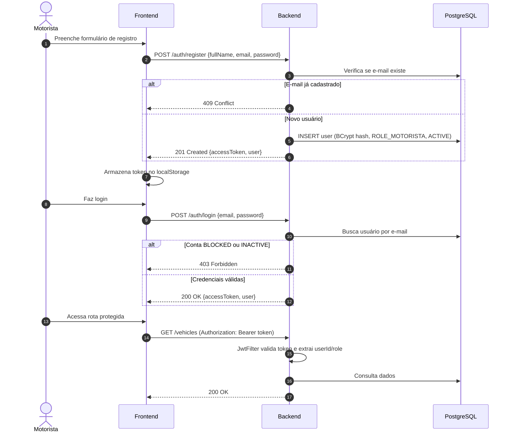

# Fase 2 — Autenticação e Gestão de Usuários

## Objetivo

Implementar o sistema de autenticação stateless com JWT (JJWT), registro de motoristas, login, refresh de token, logout, controle de acesso baseado em papéis (RBAC) e gestão de status de contas.

**Branch:** `feature/autenticacao-jwt`
**Dependência:** Fase 1 (Setup e Infraestrutura)

---

## Endpoints

| Método | Rota | Objetivo | Acesso | Status HTTP |
|--------|------|----------|--------|-------------|
| `POST` | `/auth/register` | Cadastra novo motorista | Público | `201 Created` |
| `POST` | `/auth/login` | Autentica e emite JWT | Público | `200 OK` |
| `POST` | `/auth/logout` | Encerra sessão (descarte no cliente) | Autenticado | `204 No Content` |
| `POST` | `/auth/refresh` | Renova token de acesso | Autenticado | `200 OK` |
| `GET`  | `/auth/me` | Retorna dados do usuário autenticado | Autenticado | `200 OK` |
| `PATCH`| `/users/me` | Atualiza dados cadastrais próprios | Autenticado | `200 OK` |

---

## Regras de Negócio

### Registro (`POST /auth/register`)
1. O cadastro cria o usuário com papel `ROLE_MOTORISTA` e status `ACTIVE`
2. O e-mail deve ser **único** no banco de dados → `409 Conflict` em caso de duplicata
3. Senha armazenada como hash BCrypt com custo mínimo 10
4. **Requisitos mínimos de senha:** 8+ caracteres, ao menos 1 letra e 1 número
5. Campos obrigatórios: `fullName`, `email`, `password`

### Login (`POST /auth/login`)
1. Verifica e-mail e senha (BCrypt match)
2. Conta com status `BLOCKED` → `403 Forbidden` (impede login)
3. Conta com status `INACTIVE` → `403 Forbidden`
4. Gera token JWT com claims: `sub: userId`, `role`, `exp`
5. Retorna `accessToken`, `tokenType: "Bearer"`, `expiresIn` e dados do usuário

### Token JWT
1. Algoritmo: HMAC-SHA256
2. Expiração: 24 horas (86400 segundos, configurável)
3. Claims obrigatórias: `sub` (UUID do usuário), `role`, `iat`, `exp`

### Logout (`POST /auth/logout`)
1. O backend não mantém estado de sessão (stateless)
2. O cliente descarta o token localmente
3. Retorna `204 No Content`

### Filtro de Segurança JWT
1. `OncePerRequestFilter` que intercepta todas as requisições
2. Extrai token do header `Authorization: Bearer <token>`
3. Valida assinatura, expiração e integridade
4. Injeta `Authentication` no `SecurityContext`
5. Rotas públicas passam sem token

---

## Tarefas de Implementação

### 2.1 Entidade `User`

```java
// com.fuelfinder.modules.user.entity.User

@Entity
@Table(name = "users")
public class User {

    @Id
    @GeneratedValue(strategy = GenerationType.UUID)
    private UUID id;

    @Column(nullable = false, unique = true)
    private String email;

    @Column(name = "password_hash", nullable = false)
    private String passwordHash;

    @Column(name = "full_name", nullable = false)
    private String fullName;

    @Column(nullable = false)
    @Enumerated(EnumType.STRING)
    private Role role = Role.ROLE_MOTORISTA;

    @Column(nullable = false)
    @Enumerated(EnumType.STRING)
    private AccountStatus status = AccountStatus.ACTIVE;

    @Column(name = "created_at", nullable = false, updatable = false)
    private LocalDateTime createdAt = LocalDateTime.now();

    @Column(name = "updated_at", nullable = false)
    private LocalDateTime updatedAt = LocalDateTime.now();

    // Construtores, getters e setters
}
```

### 2.2 Enums

```java
public enum Role {
    ROLE_MOTORISTA,
    ROLE_ADMIN
}

public enum AccountStatus {
    ACTIVE,
    INACTIVE,
    BLOCKED
}
```

### 2.3 UserRepository

```java
public interface UserRepository extends JpaRepository<User, UUID> {
    Optional<User> findByEmail(String email);
    boolean existsByEmail(String email);
}
```

### 2.4 DTOs (Records Imutáveis)

```java
// RegisterRequestDTO
public record RegisterRequestDTO(
    @NotBlank(message = "O nome completo é obrigatório")
    String fullName,

    @NotBlank(message = "O e-mail é obrigatório")
    @Email(message = "E-mail inválido")
    String email,

    @NotBlank(message = "A senha é obrigatória")
    @Size(min = 8, message = "A senha deve ter no mínimo 8 caracteres")
    @Pattern(regexp = "^(?=.*[a-zA-Z])(?=.*\\d).+$",
             message = "A senha deve conter ao menos uma letra e um número")
    String password
) {}

// LoginRequestDTO
public record LoginRequestDTO(
    @NotBlank String email,
    @NotBlank String password
) {}

// AuthResponseDTO
public record AuthResponseDTO(
    String accessToken,
    String tokenType,
    long expiresIn,
    UserProfileDTO user
) {}

// UserProfileDTO
public record UserProfileDTO(
    UUID id,
    String fullName,
    String email,
    String role
) {}

// UpdateUserRequestDTO
public record UpdateUserRequestDTO(
    @Size(min = 2, max = 255) String fullName,
    @Email String email
) {}
```

### 2.5 JwtService

```java
// com.fuelfinder.modules.auth.service.JwtService

@Service
public class JwtService {

    @Value("${jwt.secret}")
    private String secret;

    @Value("${jwt.expiration}")
    private long expirationMs;

    public String generateToken(User user) {
        return Jwts.builder()
                .subject(user.getId().toString())
                .claim("role", user.getRole().name())
                .issuedAt(new Date())
                .expiration(new Date(System.currentTimeMillis() + expirationMs))
                .signWith(getSigningKey())
                .compact();
    }

    public String extractUserId(String token) {
        return extractClaims(token).getSubject();
    }

    public String extractRole(String token) {
        return extractClaims(token).get("role", String.class);
    }

    public boolean isTokenValid(String token) {
        try {
            extractClaims(token);
            return true;
        } catch (JwtException | IllegalArgumentException e) {
            return false;
        }
    }

    private Claims extractClaims(String token) {
        return Jwts.parser()
                .verifyWith(getSigningKey())
                .build()
                .parseSignedClaims(token)
                .getPayload();
    }

    private SecretKey getSigningKey() {
        return Keys.hmacShaKeyFor(secret.getBytes(StandardCharsets.UTF_8));
    }

    public long getExpirationSeconds() {
        return expirationMs / 1000;
    }
}
```

### 2.6 JwtAuthenticationFilter

```java
// com.fuelfinder.config.JwtAuthenticationFilter

@Component
public class JwtAuthenticationFilter extends OncePerRequestFilter {

    private final JwtService jwtService;
    private final UserRepository userRepository;

    // Construtor com injeção

    @Override
    protected void doFilterInternal(HttpServletRequest request,
                                    HttpServletResponse response,
                                    FilterChain filterChain)
            throws ServletException, IOException {

        String authHeader = request.getHeader("Authorization");

        if (authHeader == null || !authHeader.startsWith("Bearer ")) {
            filterChain.doFilter(request, response);
            return;
        }

        String token = authHeader.substring(7);

        if (jwtService.isTokenValid(token)) {
            String userId = jwtService.extractUserId(token);
            String role = jwtService.extractRole(token);

            UsernamePasswordAuthenticationToken authentication =
                new UsernamePasswordAuthenticationToken(
                    userId,
                    null,
                    List.of(new SimpleGrantedAuthority(role))
                );

            SecurityContextHolder.getContext().setAuthentication(authentication);
        }

        filterChain.doFilter(request, response);
    }
}
```

### 2.7 SecurityConfig

```java
// com.fuelfinder.config.SecurityConfig

@Configuration
@EnableWebSecurity
@EnableMethodSecurity
public class SecurityConfig {

    private final JwtAuthenticationFilter jwtFilter;

    // Construtor com injeção

    @Bean
    public SecurityFilterChain securityFilterChain(HttpSecurity http) throws Exception {
        return http
            .csrf(csrf -> csrf.disable())
            .sessionManagement(session ->
                session.sessionCreationPolicy(SessionCreationPolicy.STATELESS))
            .authorizeHttpRequests(auth -> auth
                .requestMatchers("/auth/register", "/auth/login").permitAll()
                .requestMatchers("/swagger-ui/**", "/api-docs/**").permitAll()
                .requestMatchers(HttpMethod.GET, "/stations/**").permitAll()
                .requestMatchers(HttpMethod.GET, "/fuel-prices/compare").permitAll()
                .anyRequest().authenticated()
            )
            .addFilterBefore(jwtFilter, UsernamePasswordAuthenticationFilter.class)
            .build();
    }

    @Bean
    public PasswordEncoder passwordEncoder() {
        return new BCryptPasswordEncoder(10);
    }
}
```

### 2.8 AuthService

```java
// com.fuelfinder.modules.auth.service.AuthService

@Service
@Transactional(readOnly = true)
public class AuthService {

    private final UserRepository userRepository;
    private final PasswordEncoder passwordEncoder;
    private final JwtService jwtService;

    // Construtor com injeção

    @Transactional
    public AuthResponseDTO register(RegisterRequestDTO request) {
        if (userRepository.existsByEmail(request.email())) {
            throw new DuplicateResourceException(
                "Já existe um usuário cadastrado com o e-mail: " + request.email());
        }

        User user = new User();
        user.setFullName(request.fullName());
        user.setEmail(request.email());
        user.setPasswordHash(passwordEncoder.encode(request.password()));
        user.setRole(Role.ROLE_MOTORISTA);
        user.setStatus(AccountStatus.ACTIVE);

        User saved = userRepository.save(user);
        String token = jwtService.generateToken(saved);

        return new AuthResponseDTO(
            token,
            "Bearer",
            jwtService.getExpirationSeconds(),
            toProfileDTO(saved)
        );
    }

    public AuthResponseDTO login(LoginRequestDTO request) {
        User user = userRepository.findByEmail(request.email())
            .orElseThrow(() -> new BusinessException("Credenciais inválidas."));

        if (user.getStatus() == AccountStatus.BLOCKED) {
            throw new BusinessException("Conta bloqueada. Entre em contato com o suporte.");
        }

        if (user.getStatus() == AccountStatus.INACTIVE) {
            throw new BusinessException("Conta inativa.");
        }

        if (!passwordEncoder.matches(request.password(), user.getPasswordHash())) {
            throw new BusinessException("Credenciais inválidas.");
        }

        String token = jwtService.generateToken(user);

        return new AuthResponseDTO(
            token,
            "Bearer",
            jwtService.getExpirationSeconds(),
            toProfileDTO(user)
        );
    }

    public UserProfileDTO getProfile(UUID userId) {
        User user = userRepository.findById(userId)
            .orElseThrow(() -> new ResourceNotFoundException("Usuário não encontrado."));
        return toProfileDTO(user);
    }

    private UserProfileDTO toProfileDTO(User user) {
        return new UserProfileDTO(
            user.getId(),
            user.getFullName(),
            user.getEmail(),
            user.getRole().name()
        );
    }
}
```

### 2.9 AuthController

```java
// com.fuelfinder.modules.auth.controller.AuthController

@RestController
@RequestMapping("/auth")
public class AuthController {

    private final AuthService authService;

    // Construtor

    @PostMapping("/register")
    public ResponseEntity<AuthResponseDTO> register(
            @Valid @RequestBody RegisterRequestDTO request) {
        AuthResponseDTO response = authService.register(request);
        return ResponseEntity.status(HttpStatus.CREATED).body(response);
    }

    @PostMapping("/login")
    public ResponseEntity<AuthResponseDTO> login(
            @Valid @RequestBody LoginRequestDTO request) {
        return ResponseEntity.ok(authService.login(request));
    }

    @PostMapping("/logout")
    public ResponseEntity<Void> logout() {
        return ResponseEntity.noContent().build();
    }

    @PostMapping("/refresh")
    public ResponseEntity<AuthResponseDTO> refresh(
            @AuthenticationPrincipal String userId) {
        // Re-emite token com base no userId do token atual
        return ResponseEntity.ok(authService.refreshToken(UUID.fromString(userId)));
    }

    @GetMapping("/me")
    public ResponseEntity<UserProfileDTO> me(
            @AuthenticationPrincipal String userId) {
        return ResponseEntity.ok(authService.getProfile(UUID.fromString(userId)));
    }
}
```

---

## Fluxo de Autenticação



---

## Testes

### Testes Unitários
- `JwtServiceTest`: geração, validação, expiração, claims
- `AuthServiceTest`: registro com sucesso, e-mail duplicado, login correto, login com conta bloqueada, senha incorreta

### Testes de Integração
- `AuthControllerIntegrationTest` com `@SpringBootTest` + `MockMvc`:
  - Registro retorna 201
  - Registro com e-mail duplicado retorna 409
  - Login com credenciais válidas retorna 200 com token
  - Login com conta BLOCKED retorna 403
  - Rota protegida sem token retorna 401
  - Rota ADMIN acessada por MOTORISTA retorna 403

---

## Critérios de Aceitação

- [ ] `POST /auth/register` cria usuário com `ROLE_MOTORISTA` e `ACTIVE`
- [ ] `POST /auth/register` com e-mail duplicado retorna `409 Conflict`
- [ ] Senha é armazenada como hash BCrypt (nunca em texto plano)
- [ ] `POST /auth/login` retorna JWT válido com claims corretas
- [ ] Conta `BLOCKED` não consegue fazer login
- [ ] Rotas protegidas rejeitam requisição sem token (`401`)
- [ ] Rotas `ROLE_ADMIN` rejeitam motorista (`403`)
- [ ] `GET /auth/me` retorna dados do usuário autenticado
- [ ] Testes unitários e de integração passam

---

## Commit Sugerido

```
feat: implement JWT authentication with registration, login and RBAC
```
