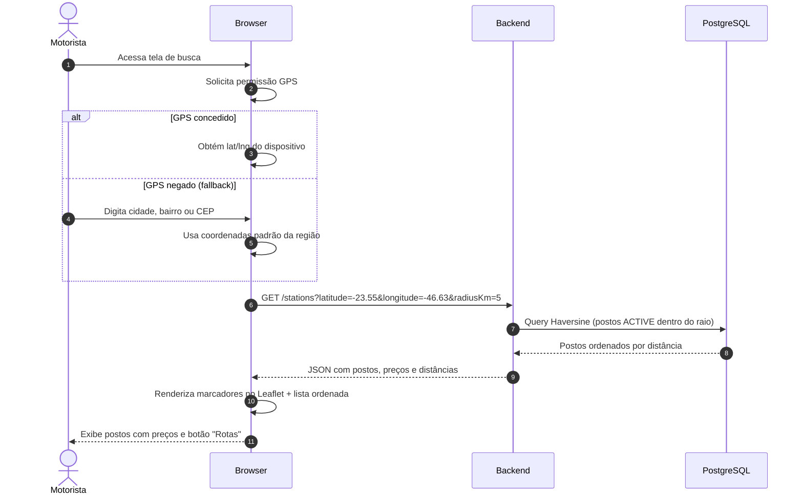

# Fase 4 — Postos de Combustível e Geolocalização

## Objetivo

Implementar o CRUD de postos de combustível com busca por proximidade geográfica usando a Fórmula de Haversine, inativação lógica e exibição de postos ativos.

**Branch:** `feature/postos-geolocalizacao`
**Dependência:** Fase 2 (Autenticação e Usuários)

---

## Endpoints

| Método | Rota | Objetivo | Acesso | Status HTTP |
|--------|------|----------|--------|-------------|
| `GET`  | `/stations` | Busca postos por geolocalização ou texto | Público / Autenticado | `200 OK` |
| `GET`  | `/stations/{id}` | Detalhes do posto com preços vigentes | Público / Autenticado | `200 OK` |
| `POST` | `/stations` | Cadastra novo posto revendedor | `ROLE_ADMIN` | `201 Created` |
| `PATCH`| `/stations/{id}` | Atualiza informações do posto | `ROLE_ADMIN` | `200 OK` |
| `DELETE`| `/stations/{id}` | Inativa logicamente um posto | `ROLE_ADMIN` | `204 No Content` |

---

## Regras de Negócio

### Cadastro do Posto
1. CNPJ é o identificador único oficial → `409 Conflict` em duplicata
2. Campos obrigatórios: CNPJ, Razão Social, Cidade, UF, Latitude, Longitude
3. Status padrão: `ACTIVE`
4. Latitude: -90.0 a +90.0 / Longitude: -180.0 a +180.0

### Busca por Proximidade
1. **Parâmetros:** `latitude`, `longitude`, `radiusKm` (raio em quilômetros)
2. Distância calculada em **linha reta** pela **Fórmula de Haversine**
3. Somente postos com status `ACTIVE` são retornados
4. Resultados ordenados por distância (mais próximo primeiro)

### Inativação Lógica
1. `DELETE /stations/{id}` **não exclui** fisicamente o registro
2. Altera o status para `INACTIVE`
3. Postos inativos não aparecem em buscas públicas mas preservam histórico

### Fórmula de Haversine

$$d = 2R \cdot \arcsin\left(\sqrt{\sin^2\left(\frac{\Delta\phi}{2}\right) + \cos(\phi_1)\cos(\phi_2)\sin^2\left(\frac{\Delta\lambda}{2}\right)}\right)$$

Onde:
- $R = 6.371$ km (raio médio da Terra)
- $\phi$ = latitude em radianos
- $\lambda$ = longitude em radianos

---

## Tarefas de Implementação

### 4.1 Entidade Station

```java
@Entity
@Table(name = "stations")
public class Station {

    @Id
    @GeneratedValue(strategy = GenerationType.UUID)
    private UUID id;

    @Column(nullable = false, unique = true, length = 18)
    private String cnpj;

    @Column(name = "corporate_name", nullable = false)
    private String corporateName;

    @Column(name = "trade_name")
    private String tradeName;

    @Column(length = 100)
    private String brand;

    private String street;
    private String number;
    private String neighborhood;

    @Column(nullable = false, length = 100)
    private String city;

    @Column(nullable = false, length = 2)
    private String state;

    @Column(name = "postal_code", length = 10)
    private String postalCode;

    @Column(nullable = false, precision = 10, scale = 7)
    private BigDecimal latitude;

    @Column(nullable = false, precision = 10, scale = 7)
    private BigDecimal longitude;

    @Column(name = "average_rating", precision = 3, scale = 2)
    private BigDecimal averageRating = BigDecimal.ZERO;

    @Column(name = "total_reviews")
    private Integer totalReviews = 0;

    @Column(nullable = false, length = 20)
    @Enumerated(EnumType.STRING)
    private StationStatus status = StationStatus.ACTIVE;

    @Column(name = "created_at", nullable = false, updatable = false)
    private LocalDateTime createdAt = LocalDateTime.now();

    @Column(name = "updated_at", nullable = false)
    private LocalDateTime updatedAt = LocalDateTime.now();

    // Construtores, getters, setters
}
```

### 4.2 StationRepository com Haversine no PostgreSQL

```java
public interface StationRepository extends JpaRepository<Station, UUID> {

    /**
     * Busca postos ativos dentro de um raio usando a Fórmula de Haversine
     * calculada diretamente no PostgreSQL.
     */
    @Query(value = """
        SELECT s.*,
               (6371 * acos(
                   cos(radians(:lat)) * cos(radians(s.latitude)) *
                   cos(radians(s.longitude) - radians(:lng)) +
                   sin(radians(:lat)) * sin(radians(s.latitude))
               )) AS distance_km
        FROM stations s
        WHERE s.status = 'ACTIVE'
          AND (6371 * acos(
                   cos(radians(:lat)) * cos(radians(s.latitude)) *
                   cos(radians(s.longitude) - radians(:lng)) +
                   sin(radians(:lat)) * sin(radians(s.latitude))
               )) <= :radius
        ORDER BY distance_km ASC
        """, nativeQuery = true)
    List<Object[]> findStationsWithinRadius(
            @Param("lat") double lat,
            @Param("lng") double lng,
            @Param("radius") double radiusKm);

    Optional<Station> findByCnpj(String cnpj);
    boolean existsByCnpj(String cnpj);

    List<Station> findByStatusAndCityIgnoreCase(StationStatus status, String city);
}
```

### 4.3 DTOs

```java
// CreateStationRequestDTO
public record CreateStationRequestDTO(
    @NotBlank(message = "O CNPJ é obrigatório")
    String cnpj,

    @NotBlank(message = "A razão social é obrigatória")
    String corporateName,

    String tradeName,
    String brand,
    String street,
    String number,
    String neighborhood,

    @NotBlank(message = "A cidade é obrigatória")
    String city,

    @NotBlank(message = "O estado é obrigatório")
    @Size(min = 2, max = 2, message = "O estado deve ter exatamente 2 caracteres")
    String state,

    String postalCode,

    @NotNull(message = "A latitude é obrigatória")
    @DecimalMin(value = "-90.0") @DecimalMax(value = "90.0")
    BigDecimal latitude,

    @NotNull(message = "A longitude é obrigatória")
    @DecimalMin(value = "-180.0") @DecimalMax(value = "180.0")
    BigDecimal longitude
) {}

// StationResponseDTO (com distância)
public record StationResponseDTO(
    UUID id,
    String cnpj,
    String corporateName,
    String tradeName,
    String brand,
    String address,
    String city,
    String state,
    BigDecimal latitude,
    BigDecimal longitude,
    Double distanceKm,
    BigDecimal averageRating,
    Integer totalReviews,
    String status
) {}
```

### 4.4 StationService

```java
@Service
@Transactional(readOnly = true)
public class StationService {

    private final StationRepository stationRepository;

    public List<StationResponseDTO> findNearby(
            double latitude, double longitude, double radiusKm) {
        List<Object[]> results = stationRepository
                .findStationsWithinRadius(latitude, longitude, radiusKm);

        return results.stream()
                .map(row -> {
                    Station s = (Station) row[0];
                    double distance = ((Number) row[1]).doubleValue();
                    return toDTO(s, distance);
                })
                .toList();
    }

    @Transactional
    public StationResponseDTO create(CreateStationRequestDTO request) {
        if (stationRepository.existsByCnpj(request.cnpj())) {
            throw new DuplicateResourceException(
                "Já existe um posto cadastrado com o CNPJ: " + request.cnpj());
        }
        Station station = mapToEntity(request);
        Station saved = stationRepository.save(station);
        return toDTO(saved, null);
    }

    @Transactional
    public void deactivate(UUID stationId) {
        Station station = stationRepository.findById(stationId)
                .orElseThrow(() -> new ResourceNotFoundException("Posto não encontrado."));
        station.setStatus(StationStatus.INACTIVE);
        station.setUpdatedAt(LocalDateTime.now());
        stationRepository.save(station);
    }

    // Métodos auxiliares: mapToEntity, toDTO
}
```

---

## Fluxo de Busca Geolocalizada



---

## Testes

### Unitários
- `StationServiceTest`: criação, CNPJ duplicado, inativação, busca por raio
- `HaversineCalculatorTest`: distância SP ↔ RJ ≈ 357 km, mesma localização = 0 km

### Integração
- `StationControllerIntegrationTest`:
  - GET /stations com parâmetros de geolocalização
  - POST /stations como ADMIN retorna 201
  - POST /stations como MOTORISTA retorna 403
  - DELETE inativa logicamente (GET subsequente não retorna o posto)

---

## Critérios de Aceitação

- [ ] Busca por raio retorna postos ordenados por distância
- [ ] Somente postos `ACTIVE` aparecem na busca
- [ ] CNPJ duplicado retorna `409 Conflict`
- [ ] DELETE faz inativação lógica, não exclusão física
- [ ] Haversine calcula distâncias com precisão aceitável (±1% do valor real)
- [ ] Testes passam

---

## Commit Sugerido

```
feat: implement station CRUD with Haversine proximity search
```
