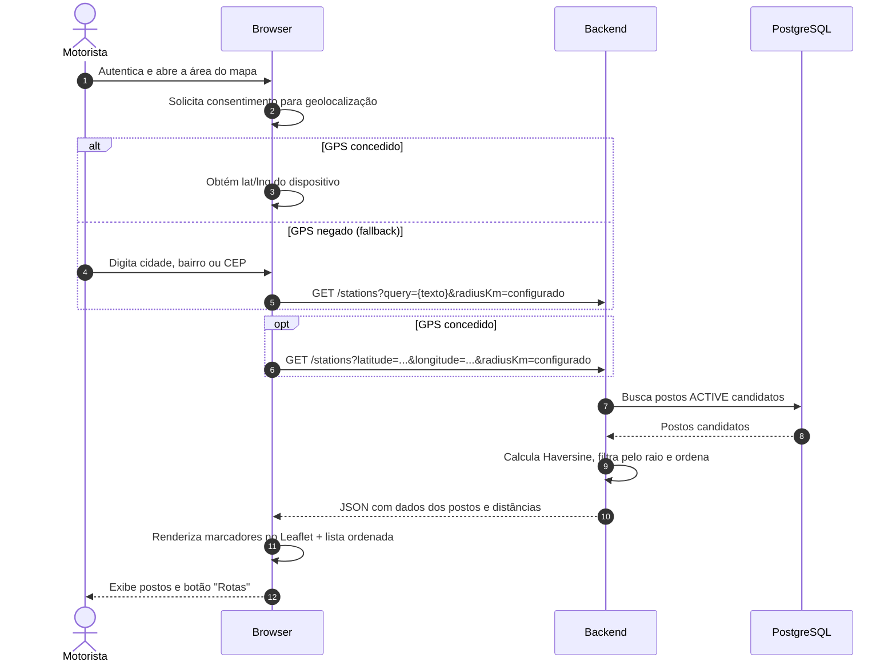

# Fase 4 — Postos de Combustível e Geolocalização

## Objetivo

Implementar o CRUD de postos de combustível com busca por proximidade geográfica usando a Fórmula de Haversine, inativação lógica e exibição de postos ativos.

**Branch:** `feature/postos-geolocalizacao`
**Dependência:** Fase 2 (Autenticação e Usuários)

**Acesso-alvo:** mapa, busca e detalhes de postos estão disponíveis somente após login. **Estado atual:** as páginas estáticas são entregues publicamente e a UI faz a guarda no cliente; `GET /stations/**` também está público na configuração de segurança. A guarda no cliente não substitui autorização no servidor.

---

## Endpoints

| Método | Rota | Objetivo | Acesso | Status HTTP |
|--------|------|----------|--------|-------------|
| `GET`  | `/stations` | Busca postos por geolocalização ou texto | Público atualmente; alvo `ROLE_DRIVER` / `ROLE_ADMIN` | `200 OK` |
| `GET`  | `/stations/{id}` | Detalhes do posto ativo | Público atualmente; alvo `ROLE_DRIVER` / `ROLE_ADMIN` | `200 OK` |
| `POST` | `/stations` | Cadastra novo posto revendedor | `ROLE_ADMIN` | `201 Created` |
| `PATCH`| `/stations/{id}` | Atualiza informações do posto | `ROLE_ADMIN` | `200 OK` |
| `DELETE`| `/stations/{id}` | Inativa logicamente um posto | `ROLE_ADMIN` | `204 No Content` |

---

## Regras de Negócio

### Cadastro do Posto
1. CNPJ é o identificador único oficial → `409 Conflict` em duplicata
2. Campos obrigatórios: CNPJ, Razão Social, Cidade, UF, Latitude, Longitude
3. Status padrão: `ACTIVE`
4. Latitude: -90.0 a +90.0 / Longitude: -180.0 a +180.0
5. O cadastro manual mantém coordenadas obrigatórias conforme esta regra. A importação da ANP é uma exceção controlada: pode criar posto sem coordenadas, pois a migração V5 permite valores nulos; esse posto não participa da busca geográfica até ser geocodificado.

### Busca por Proximidade
1. **Parâmetros:** `latitude`, `longitude`, `radiusKm` (raio em quilômetros)
2. Distância calculada em **linha reta** pela **Fórmula de Haversine**
3. Somente postos com status `ACTIVE` são retornados
4. Resultados ordenados por distância (mais próximo primeiro)
5. Latitude e longitude devem ser informadas juntas; o raio padrão é 5 km quando omitido e deve ser positivo
6. No MVP, o cálculo Haversine ocorre na aplicação Java; PostGIS não é requisito desta fase

### Entrada no mapa e localização atual

1. Após autenticar e abrir a área do mapa, solicitar permissão para geolocalização pelo navegador/dispositivo; não obter coordenadas sem consentimento.
2. Enquanto aguarda a localização, apresentar estado de carregamento. Com a permissão concedida, centralizar o mapa na posição obtida e iniciar automaticamente a busca de postos próximos no raio selecionado, sem exigir uma busca manual inicial.
3. O raio é configurável no mapa; o seletor oferece 5, 10, 20 e 50 km, com 5 km como padrão. Ainda não existe configuração administrativa.
4. Apresentar estados de carregamento, lista vazia, resultados e erro para busca/localização.
5. Se a permissão for negada, a posição estiver indisponível ou ocorrer erro, explicar a situação e permitir pesquisar ou selecionar local manualmente. Não bloquear o restante das áreas autenticadas.

### Busca por Texto e Geocodificação
1. `GET /stations?query={texto}` pesquisa postos ativos por nome, marca, endereço, bairro, cidade, UF ou CEP
2. Quando `GEOAPIFY_API_KEY` está configurada, a consulta textual também pode ser geocodificada no backend e usada para busca por proximidade
3. Sem a chave, a busca textual local continua disponível e a aplicação inicia normalmente
4. A chave é lida exclusivamente da variável de ambiente; chamadas reais ao serviço não são necessárias para os testes locais
5. Entradas numéricas no campo de busca são formatadas como CEP `00000-000` e limitadas a oito dígitos; o backend normaliza valores com ou sem hífen e consulta os CEPs cadastrados sem geocodificação.

### Inativação Lógica
1. `DELETE /stations/{id}` **não exclui** fisicamente o registro
2. Altera o status para `INACTIVE`
3. Postos inativos não aparecem nas buscas de usuários autenticados, mas preservam histórico

### Fórmula de Haversine

$$d = 2R \cdot \arcsin\left(\sqrt{\sin^2\left(\frac{\Delta\phi}{2}\right) + \cos(\phi_1)\cos(\phi_2)\sin^2\left(\frac{\Delta\lambda}{2}\right)}\right)$$

Onde:
- $R = 6.371$ km (raio médio da Terra)
- $\phi$ = latitude em radianos
- $\lambda$ = longitude em radianos

---

## Tarefas de Implementação

### 4.1 Entidade Station

```java
@Entity
@Table(name = "stations")
public class Station {

    @Id
    @GeneratedValue(strategy = GenerationType.UUID)
    private UUID id;

    @Column(nullable = false, unique = true, length = 18)
    private String cnpj;

    @Column(name = "corporate_name", nullable = false)
    private String corporateName;

    @Column(name = "trade_name")
    private String tradeName;

    @Column(length = 100)
    private String brand;

    private String street;
    private String number;
    private String neighborhood;

    @Column(nullable = false, length = 100)
    private String city;

    @Column(nullable = false, length = 2)
    private String state;

    @Column(name = "postal_code", length = 10)
    private String postalCode;

    @Column(nullable = false, precision = 10, scale = 7)
    private BigDecimal latitude;

    @Column(nullable = false, precision = 10, scale = 7)
    private BigDecimal longitude;

    @Column(name = "average_rating", precision = 3, scale = 2)
    private BigDecimal averageRating = BigDecimal.ZERO;

    @Column(name = "total_reviews")
    private Integer totalReviews = 0;

    @Column(nullable = false, length = 20)
    @Enumerated(EnumType.STRING)
    private StationStatus status = StationStatus.ACTIVE;

    @Column(name = "created_at", nullable = false, updatable = false)
    private LocalDateTime createdAt;

    @Column(name = "updated_at", nullable = false)
    private LocalDateTime updatedAt;

    // Construtores, getters, setters e callbacks de persistência
}
```

### 4.2 StationRepository e busca por Haversine na aplicação

```java
public interface StationRepository extends JpaRepository<Station, UUID> {

    boolean existsByCnpj(String cnpj);
    Optional<Station> findByIdAndStatus(UUID id, StationStatus status);
    List<Station> findByStatusAndLatitudeBetween(
            StationStatus status, BigDecimal minimumLatitude, BigDecimal maximumLatitude);
    List<Station> findByStatusAndLatitudeBetweenAndLongitudeBetween(
            StationStatus status, BigDecimal minimumLatitude, BigDecimal maximumLatitude,
            BigDecimal minimumLongitude, BigDecimal maximumLongitude);
    List<Station> searchByText(StationStatus status, String query);
}
```

O repositório reduz os candidatos por uma janela geográfica (incluindo os casos de cruzamento do antimeridiano e proximidade dos polos). O serviço calcula a distância exata com `HaversineCalculator`, filtra pelo raio e ordena os resultados em memória.

### 4.3 DTOs

```java
// CreateStationRequestDTO
public record CreateStationRequestDTO(
    @NotBlank(message = "O CNPJ é obrigatório")
    String cnpj,

    @NotBlank(message = "A razão social é obrigatória")
    String corporateName,

    String tradeName,
    String brand,
    String street,
    String number,
    String neighborhood,

    @NotBlank(message = "A cidade é obrigatória")
    String city,

    @NotBlank(message = "O estado é obrigatório")
    @Size(min = 2, max = 2, message = "O estado deve ter exatamente 2 caracteres")
    String state,

    String postalCode,

    @NotNull(message = "A latitude é obrigatória")
    @DecimalMin(value = "-90.0") @DecimalMax(value = "90.0")
    BigDecimal latitude,

    @NotNull(message = "A longitude é obrigatória")
    @DecimalMin(value = "-180.0") @DecimalMax(value = "180.0")
    BigDecimal longitude
) {}

// StationResponseDTO (com distância)
public record StationResponseDTO(
    UUID id,
    String cnpj,
    String corporateName,
    String tradeName,
    String brand,
    String address,
    String city,
    String state,
    BigDecimal latitude,
    BigDecimal longitude,
    Double distanceKm,
    BigDecimal averageRating,
    Integer totalReviews,
    String status
) {}
```

### 4.4 StationService

```java
@Service
public class StationService {

    private final StationRepository stationRepository;

    public List<StationResponseDTO> findNearby(
            double latitude, double longitude, double radiusKm) {
        List<Station> candidates = findCandidatesInBoundingBox(latitude, longitude, radiusKm);
        return candidates.stream()
                .map(station -> new StationDistance(
                        station,
                        HaversineCalculator.calculateDistanceKm(
                                latitude, longitude,
                                station.getLatitude().doubleValue(),
                                station.getLongitude().doubleValue())))
                .filter(result -> result.distanceKm() <= radiusKm)
                .sorted(Comparator.comparingDouble(StationDistance::distanceKm))
                .map(result -> toDTO(result.station(), result.distanceKm()))
                .toList();
    }

    @Transactional
    public StationResponseDTO create(CreateStationRequestDTO request) {
        if (stationRepository.existsByCnpj(request.cnpj())) {
            throw new DuplicateResourceException(
                "Já existe um posto cadastrado com o CNPJ: " + request.cnpj());
        }
        Station station = mapToEntity(request);
        Station saved = stationRepository.save(station);
        return toDTO(saved, null);
    }

    @Transactional
    public void deactivate(UUID stationId) {
        Station station = stationRepository.findById(stationId)
                .orElseThrow(() -> new ResourceNotFoundException("Posto não encontrado."));
        station.setStatus(StationStatus.INACTIVE);
        stationRepository.save(station);
    }

    // Métodos auxiliares: mapToEntity, findCandidatesInBoundingBox e toDTO
}
```

---

## Fluxo de Busca Geolocalizada


```mermaid
sequenceDiagram
    autonumber
    actor M as Motorista
    participant B as Browser
    participant API as Backend
    participant DB as PostgreSQL

    M->>B: Autentica e abre a área do mapa
    B->>B: Solicita consentimento para geolocalização
    alt GPS concedido
        B->>B: Obtém lat/lng do dispositivo
    else GPS negado (fallback)
        M->>B: Digita cidade, bairro ou CEP
        B->>API: GET /stations?query={texto}&radiusKm=configurado
    end
    opt GPS concedido
        B->>API: GET /stations?latitude=...&longitude=...&radiusKm=configurado
    end
    API->>DB: Busca postos ACTIVE candidatos
    DB-->>API: Postos candidatos
    API->>API: Calcula Haversine, filtra pelo raio e ordena
    API-->>B: JSON com dados dos postos e distâncias
    B->>B: Renderiza marcadores no Leaflet + lista ordenada
    B-->>M: Exibe postos e botão "Rotas"
```

Os preços vigentes serão agregados aos detalhes do posto na Fase 5, quando o módulo de preços for implementado.

---

## Testes

### Unitários
- `StationServiceTest`: criação, CNPJ duplicado, inativação, busca por raio
- `HaversineCalculatorTest`: distância SP ↔ RJ ≈ 357 km, mesma localização = 0 km

### Integração
- `StationControllerIntegrationTest`:
  - GET /stations com parâmetros de geolocalização
  - POST /stations como ADMIN retorna 201
  - POST /stations como `ROLE_DRIVER` retorna 403
  - DELETE inativa logicamente (GET subsequente não retorna o posto)

---

## Critérios de Aceitação

- [x] Busca por raio retorna postos ordenados por distância
- [x] Somente postos `ACTIVE` aparecem na busca
- [x] CNPJ duplicado retorna `409 Conflict`
- [x] DELETE faz inativação lógica, não exclusão física
- [x] Haversine calcula distâncias com precisão aceitável (±1% do valor real)
- [x] Busca textual local funciona sem a chave Geoapify
- [x] Geoapify é opcional, usa chave somente do ambiente e não impede a inicialização
- [x] Testes passam

---

## Commit Sugerido

```
feat: implement station CRUD with Haversine proximity search
```
