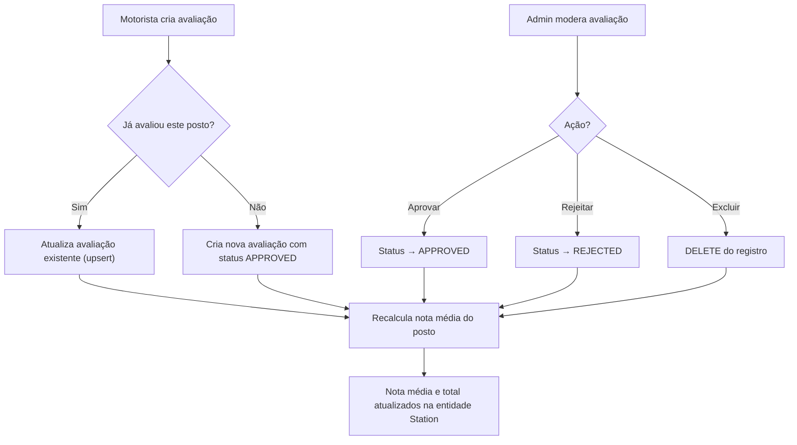

# Fase 6 — Avaliações e Moderação

## Objetivo

Implementar o sistema de avaliações de postos com nota (1-5 estrelas), comentário opcional, nota média agregada e moderação administrativa.

**Branch:** `feature/avaliacoes`
**Dependência:** Fase 4 (Postos e Geolocalização)

---

## Endpoints

| Método | Rota | Objetivo | Acesso | Status HTTP |
|--------|------|----------|--------|-------------|
| `GET`  | `/stations/{id}/reviews` | Lista avaliações aprovadas do posto | Público / Autenticado | `200 OK` |
| `POST` | `/stations/{id}/reviews` | Registra avaliação com nota (1-5) | `ROLE_MOTORISTA` | `201 Created` |
| `PATCH`| `/reviews/{id}` | Edita a própria avaliação | `ROLE_MOTORISTA` | `200 OK` |
| `DELETE`| `/reviews/{id}` | Remove avaliação (autor ou admin) | `ROLE_MOTORISTA` / `ROLE_ADMIN` | `204 No Content` |

---

## Regras de Negócio

### Submissão de Avaliação
1. Apenas motoristas autenticados (`ROLE_MOTORISTA`) podem avaliar
2. **Nota obrigatória:** inteiro de 1 a 5 estrelas
3. **Comentário opcional:** limitado a 500 caracteres
4. **Unicidade:** cada motorista mantém **no máximo 1 avaliação ativa por posto**
5. Nova avaliação para o mesmo posto **atualiza** a avaliação anterior (upsert)
6. Status padrão: `APPROVED`

### Nota Média Agregada

$$\text{Nota Média} = \frac{\sum_{i=1}^{N} \text{Nota}_i}{N}$$

Onde $N$ é o total de avaliações com status `APPROVED`.

- A nota média é armazenada na entidade `Station` (`average_rating`)
- O total de avaliações é armazenado em `total_reviews`
- **Recalculados** a cada criação, edição ou exclusão de avaliação

### Moderação Administrativa
1. Admin (`ROLE_ADMIN`) pode alterar o status de qualquer avaliação
2. Status possíveis: `APPROVED`, `PENDING`, `REJECTED`
3. Avaliações `REJECTED` não contam na nota média
4. Admin pode excluir avaliações com conteúdo inadequado

### Permissões de Exclusão
- **Motorista:** pode excluir **apenas sua própria** avaliação
- **Admin:** pode excluir **qualquer** avaliação (moderação)

---

## Tarefas de Implementação

### 6.1 Entidade Review

```java
@Entity
@Table(name = "reviews",
       uniqueConstraints = @UniqueConstraint(
           columnNames = {"user_id", "station_id"}))
public class Review {

    @Id
    @GeneratedValue(strategy = GenerationType.UUID)
    private UUID id;

    @Column(name = "user_id", nullable = false)
    private UUID userId;

    @ManyToOne(fetch = FetchType.LAZY)
    @JoinColumn(name = "station_id", nullable = false)
    private Station station;

    @Column(nullable = false)
    private Integer rating;

    @Column(length = 500)
    private String comment;

    @Column(nullable = false, length = 20)
    @Enumerated(EnumType.STRING)
    private ReviewStatus status = ReviewStatus.APPROVED;

    @Column(name = "created_at", nullable = false, updatable = false)
    private LocalDateTime createdAt = LocalDateTime.now();

    @Column(name = "updated_at", nullable = false)
    private LocalDateTime updatedAt = LocalDateTime.now();

    // Construtores, getters, setters
}
```

### 6.2 ReviewRepository

```java
public interface ReviewRepository extends JpaRepository<Review, UUID> {
    List<Review> findByStationIdAndStatus(UUID stationId, ReviewStatus status);
    Optional<Review> findByUserIdAndStationId(UUID userId, UUID stationId);
    boolean existsByUserIdAndStationId(UUID userId, UUID stationId);

    @Query("""
        SELECT AVG(r.rating) FROM Review r
        WHERE r.station.id = :stationId AND r.status = 'APPROVED'
        """)
    Optional<Double> calculateAverageRating(@Param("stationId") UUID stationId);

    @Query("""
        SELECT COUNT(r) FROM Review r
        WHERE r.station.id = :stationId AND r.status = 'APPROVED'
        """)
    long countApprovedByStation(@Param("stationId") UUID stationId);
}
```

### 6.3 DTOs

```java
// CreateReviewRequestDTO
public record CreateReviewRequestDTO(
    @NotNull(message = "A nota é obrigatória")
    @Min(value = 1, message = "A nota mínima é 1")
    @Max(value = 5, message = "A nota máxima é 5")
    Integer rating,

    @Size(max = 500, message = "O comentário deve ter no máximo 500 caracteres")
    String comment
) {}

// ReviewResponseDTO
public record ReviewResponseDTO(
    UUID id,
    UUID userId,
    String userName,
    UUID stationId,
    Integer rating,
    String comment,
    String status,
    LocalDateTime createdAt,
    LocalDateTime updatedAt
) {}
```

### 6.4 ReviewService

```java
@Service
@Transactional(readOnly = true)
public class ReviewService {

    private final ReviewRepository reviewRepository;
    private final StationRepository stationRepository;
    private final UserRepository userRepository;

    @Transactional
    public ReviewResponseDTO createOrUpdate(
            UUID stationId, CreateReviewRequestDTO request, UUID userId) {

        Station station = stationRepository.findById(stationId)
                .orElseThrow(() -> new ResourceNotFoundException("Posto não encontrado."));

        // Upsert: atualiza se já existe
        Optional<Review> existing = reviewRepository
                .findByUserIdAndStationId(userId, stationId);

        Review review;
        if (existing.isPresent()) {
            review = existing.get();
            review.setRating(request.rating());
            review.setComment(request.comment());
            review.setUpdatedAt(LocalDateTime.now());
        } else {
            review = new Review();
            review.setUserId(userId);
            review.setStation(station);
            review.setRating(request.rating());
            review.setComment(request.comment());
            review.setStatus(ReviewStatus.APPROVED);
        }

        Review saved = reviewRepository.save(review);
        updateStationRating(stationId);

        return toDTO(saved);
    }

    @Transactional
    public void delete(UUID reviewId, UUID userId, String userRole) {
        Review review = reviewRepository.findById(reviewId)
                .orElseThrow(() -> new ResourceNotFoundException("Avaliação não encontrada."));

        // Motorista só pode excluir a própria
        if ("ROLE_MOTORISTA".equals(userRole)
                && !review.getUserId().equals(userId)) {
            throw new BusinessException("Você só pode excluir sua própria avaliação.");
        }

        UUID stationId = review.getStation().getId();
        reviewRepository.delete(review);
        updateStationRating(stationId);
    }

    /**
     * Recalcula a nota média e total de avaliações do posto
     */
    private void updateStationRating(UUID stationId) {
        Station station = stationRepository.findById(stationId).orElseThrow();

        Optional<Double> avgRating = reviewRepository.calculateAverageRating(stationId);
        long totalReviews = reviewRepository.countApprovedByStation(stationId);

        station.setAverageRating(
            avgRating.map(avg -> BigDecimal.valueOf(avg)
                    .setScale(2, RoundingMode.HALF_UP))
                    .orElse(BigDecimal.ZERO));
        station.setTotalReviews((int) totalReviews);
        station.setUpdatedAt(LocalDateTime.now());

        stationRepository.save(station);
    }

    public List<ReviewResponseDTO> listApproved(UUID stationId) {
        return reviewRepository.findByStationIdAndStatus(stationId, ReviewStatus.APPROVED)
                .stream()
                .map(this::toDTO)
                .toList();
    }

    // Método toDTO
}
```

### 6.5 ReviewController

```java
@RestController
public class ReviewController {

    private final ReviewService reviewService;

    @PostMapping("/stations/{stationId}/reviews")
    @PreAuthorize("hasRole('MOTORISTA')")
    public ResponseEntity<ReviewResponseDTO> create(
            @PathVariable UUID stationId,
            @Valid @RequestBody CreateReviewRequestDTO request,
            @AuthenticationPrincipal String userId) {
        ReviewResponseDTO response = reviewService.createOrUpdate(
                stationId, request, UUID.fromString(userId));
        return ResponseEntity.status(HttpStatus.CREATED).body(response);
    }

    @GetMapping("/stations/{stationId}/reviews")
    public ResponseEntity<List<ReviewResponseDTO>> listByStation(
            @PathVariable UUID stationId) {
        return ResponseEntity.ok(reviewService.listApproved(stationId));
    }

    @PatchMapping("/reviews/{id}")
    @PreAuthorize("hasRole('MOTORISTA')")
    public ResponseEntity<ReviewResponseDTO> update(
            @PathVariable UUID id,
            @Valid @RequestBody CreateReviewRequestDTO request,
            @AuthenticationPrincipal String userId) {
        return ResponseEntity.ok(
                reviewService.updateOwn(id, request, UUID.fromString(userId)));
    }

    @DeleteMapping("/reviews/{id}")
    @PreAuthorize("hasAnyRole('MOTORISTA', 'ADMIN')")
    public ResponseEntity<Void> delete(
            @PathVariable UUID id,
            @AuthenticationPrincipal String userId,
            Authentication authentication) {
        String role = authentication.getAuthorities().iterator().next().getAuthority();
        reviewService.delete(id, UUID.fromString(userId), role);
        return ResponseEntity.noContent().build();
    }
}
```

---

## Fluxo de Avaliação e Moderação



---

## Testes

### Unitários
- `ReviewServiceTest`:
  - Criação de avaliação nova
  - Upsert atualiza avaliação existente
  - Nota média recalculada corretamente
  - Motorista não pode excluir avaliação de outro
  - Admin pode excluir qualquer avaliação

### Integração
- `ReviewControllerIntegrationTest`:
  - POST retorna 201
  - GET lista apenas avaliações APPROVED
  - DELETE por autor retorna 204
  - DELETE por não-autor (MOTORISTA) retorna 403
  - DELETE por ADMIN retorna 204

---

## Critérios de Aceitação

- [ ] Nova avaliação do mesmo motorista para o mesmo posto atualiza a existente
- [ ] Nota: inteiro de 1 a 5 estrelas
- [ ] Comentário opcional, máximo 500 caracteres
- [ ] Nota média do posto recalculada a cada operação
- [ ] Apenas avaliações `APPROVED` contam na média
- [ ] GET lista apenas avaliações `APPROVED`
- [ ] Admin pode moderar e excluir qualquer avaliação
- [ ] Motorista só pode excluir sua própria avaliação
- [ ] Testes passam

---

## Commit Sugerido

```
feat: implement review system with rating aggregation and admin moderation
```
