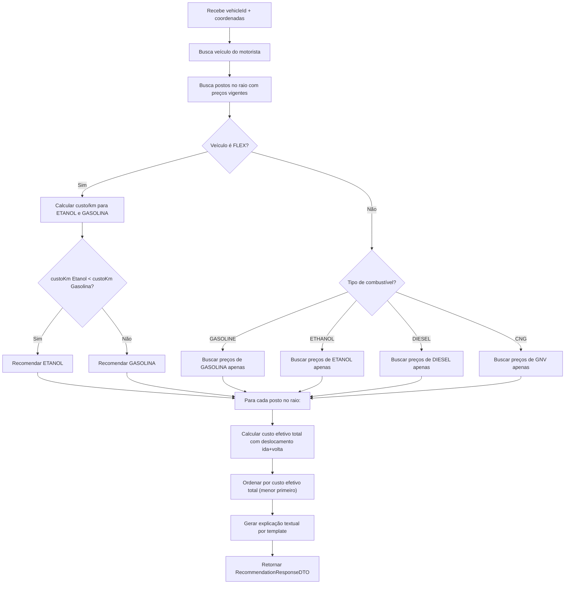

# Fase 7 — Motor de Recomendação de Combustível

## Objetivo

Implementar o motor de recomendação algorítmico de combustível que calcula a paridade etanol vs gasolina, custo por quilômetro personalizado e custo efetivo de deslocamento, ordenando os melhores postos para o motorista.

> **Decisão:** Este módulo utiliza **algoritmo puro** (fórmulas de paridade e custo/km) — **sem** integração com modelos de IA. As explicações são geradas por templates textuais com base nos resultados dos cálculos.

**Branch:** `feature/recomendacoes`
**Dependências:** Fase 3 (Veículos) + Fase 5 (Preços de Combustíveis)

---

## Endpoint

| Método | Rota | Objetivo | Acesso | Status HTTP |
|--------|------|----------|--------|-------------|
| `GET`  | `/recommendations/fuel` | Recomendação de melhor custo-benefício | `ROLE_MOTORISTA` | `200 OK` |

### Parâmetros

| Parâmetro | Tipo | Obrigatório | Descrição |
|-----------|------|-------------|-----------|
| `vehicleId` | UUID | Sim | ID do veículo cadastrado pelo motorista |
| `latitude` | double | Sim | Latitude atual do motorista |
| `longitude` | double | Sim | Longitude atual do motorista |
| `radiusKm` | double | Não (default: 5) | Raio de busca em quilômetros |

---

## Lógica de Recomendação

### Fluxo de Decisão



### Fórmulas Aplicadas

**1. Paridade Clássica dos 70% (referência genérica):**

$$\text{Índice de Paridade} = \left(\frac{\text{Preço do Etanol}}{\text{Preço da Gasolina}}\right) \times 100\%$$

- Se Índice ≤ 70%: Etanol mais vantajoso
- Se Índice > 70%: Gasolina mais vantajosa

**2. Paridade Real Personalizada (veículo FLEX):**

$$\text{Custo/KM}_{\text{Etanol}} = \frac{\text{Preço Etanol}}{\text{Consumo com Etanol (km/L)}}$$

$$\text{Custo/KM}_{\text{Gasolina}} = \frac{\text{Preço Gasolina}}{\text{Consumo com Gasolina (km/L)}}$$

- Se Custo/KM_Etanol < Custo/KM_Gasolina → **Recomenda Etanol**
- Caso contrário → **Recomenda Gasolina**

**3. Custo Efetivo Total (inclui deslocamento):**

$$\text{Custo Efetivo} = \text{Custo Tanque Cheio} + \left(2 \times \text{Distância (km)} \times \text{Custo/KM}\right)$$

---

## Tarefas de Implementação

### 7.1 DTOs

```java
// RecommendationResponseDTO
public record RecommendationResponseDTO(
    VehicleSummaryDTO vehicle,
    String recommendedFuel,
    String explanation,
    BigDecimal parityPercentage,
    List<StationRecommendationDTO> topOptions
) {}

// VehicleSummaryDTO
public record VehicleSummaryDTO(
    String nickname,
    String fuelTypeAccepted
) {}

// StationRecommendationDTO
public record StationRecommendationDTO(
    UUID stationId,
    String stationName,
    String brand,
    String fuelType,
    BigDecimal price,
    Double distanceKm,
    BigDecimal costPerKm,
    BigDecimal estimatedFullTankCost,
    BigDecimal estimatedRoundTripCost
) {}
```

### 7.2 RecommendationService

```java
@Service
@Transactional(readOnly = true)
public class RecommendationService {

    private final VehicleService vehicleService;
    private final StationRepository stationRepository;
    private final FuelPriceRepository fuelPriceRepository;
    private final FuelTypeRepository fuelTypeRepository;

    public RecommendationResponseDTO recommend(
            UUID vehicleId, UUID userId,
            double latitude, double longitude, double radiusKm) {

        // 1. Buscar veículo do motorista
        VehicleResponseDTO vehicle = vehicleService.findByIdAndUser(vehicleId, userId);

        // 2. Buscar postos no raio
        List<Object[]> nearbyStations = stationRepository
                .findStationsWithinRadius(latitude, longitude, radiusKm);

        if (nearbyStations.isEmpty()) {
            throw new ResourceNotFoundException(
                "Nenhum posto encontrado no raio de " + radiusKm + " km.");
        }

        // 3. Determinar recomendação baseada no tipo do veículo
        String fuelTypeAccepted = vehicle.fuelTypeAccepted();

        if ("FLEX".equals(fuelTypeAccepted)) {
            return recommendForFlex(vehicle, nearbyStations);
        } else {
            return recommendForSingleFuel(vehicle, nearbyStations);
        }
    }

    private RecommendationResponseDTO recommendForFlex(
            VehicleResponseDTO vehicle,
            List<Object[]> nearbyStations) {

        List<StationRecommendationDTO> ethanolOptions = new ArrayList<>();
        List<StationRecommendationDTO> gasolineOptions = new ArrayList<>();

        for (Object[] row : nearbyStations) {
            Station station = (Station) row[0];
            double distance = ((Number) row[1]).doubleValue();

            // Buscar preço mais recente de etanol e gasolina
            BigDecimal ethanolPrice = getLatestPrice(station.getId(), "ETHANOL");
            BigDecimal gasolinePrice = getLatestPrice(station.getId(), "GASOLINE_REGULAR");

            if (ethanolPrice != null) {
                BigDecimal costPerKm = ethanolPrice.divide(
                        vehicle.averageConsumptionEthanol(), 4, RoundingMode.HALF_UP);
                BigDecimal fullTankCost = vehicle.tankCapacity().multiply(ethanolPrice);
                BigDecimal roundTripCost = costPerKm.multiply(
                        BigDecimal.valueOf(distance * 2));

                ethanolOptions.add(new StationRecommendationDTO(
                        station.getId(), station.getTradeName(), station.getBrand(),
                        "ETHANOL", ethanolPrice, distance,
                        costPerKm, fullTankCost, roundTripCost));
            }

            if (gasolinePrice != null) {
                BigDecimal costPerKm = gasolinePrice.divide(
                        vehicle.averageConsumptionGasoline(), 4, RoundingMode.HALF_UP);
                BigDecimal fullTankCost = vehicle.tankCapacity().multiply(gasolinePrice);
                BigDecimal roundTripCost = costPerKm.multiply(
                        BigDecimal.valueOf(distance * 2));

                gasolineOptions.add(new StationRecommendationDTO(
                        station.getId(), station.getTradeName(), station.getBrand(),
                        "GASOLINE_REGULAR", gasolinePrice, distance,
                        costPerKm, fullTankCost, roundTripCost));
            }
        }

        // Encontrar a melhor opção de cada
        Optional<StationRecommendationDTO> bestEthanol = ethanolOptions.stream()
                .min(Comparator.comparing(o ->
                        o.estimatedFullTankCost().add(o.estimatedRoundTripCost())));
        Optional<StationRecommendationDTO> bestGasoline = gasolineOptions.stream()
                .min(Comparator.comparing(o ->
                        o.estimatedFullTankCost().add(o.estimatedRoundTripCost())));

        // Decidir recomendação
        String recommended;
        BigDecimal parity = null;
        List<StationRecommendationDTO> topOptions;

        if (bestEthanol.isPresent() && bestGasoline.isPresent()) {
            BigDecimal ethanolCostKm = bestEthanol.get().costPerKm();
            BigDecimal gasolineCostKm = bestGasoline.get().costPerKm();

            if (ethanolCostKm.compareTo(gasolineCostKm) < 0) {
                recommended = "ETHANOL";
                topOptions = ethanolOptions;
            } else {
                recommended = "GASOLINE_REGULAR";
                topOptions = gasolineOptions;
            }

            // Calcular paridade percentual
            parity = bestEthanol.get().price().divide(
                    bestGasoline.get().price(), 4, RoundingMode.HALF_UP)
                    .multiply(BigDecimal.valueOf(100));
        } else if (bestEthanol.isPresent()) {
            recommended = "ETHANOL";
            topOptions = ethanolOptions;
        } else {
            recommended = "GASOLINE_REGULAR";
            topOptions = gasolineOptions;
        }

        // Ordenar por custo efetivo
        topOptions.sort(Comparator.comparing(o ->
                o.estimatedFullTankCost().add(o.estimatedRoundTripCost())));

        String explanation = buildExplanation(
                vehicle, recommended, parity, topOptions.get(0));

        return new RecommendationResponseDTO(
                new VehicleSummaryDTO(vehicle.nickname(), vehicle.fuelTypeAccepted()),
                recommended, explanation,
                parity, topOptions
        );
    }

    /**
     * Gera explicação textual por template
     */
    private String buildExplanation(
            VehicleResponseDTO vehicle, String recommended,
            BigDecimal parity, StationRecommendationDTO best) {

        StringBuilder sb = new StringBuilder();
        sb.append("Com base no consumo informado (");

        if ("FLEX".equals(vehicle.fuelTypeAccepted())) {
            sb.append(vehicle.averageConsumptionEthanol()).append(" km/L no etanol vs ");
            sb.append(vehicle.averageConsumptionGasoline()).append(" km/L na gasolina), ");
        }

        String fuelName = "ETHANOL".equals(recommended) ? "etanol" : "gasolina";
        sb.append("o ").append(fuelName);
        sb.append(" tem custo de R$ ").append(best.costPerKm()).append("/km");
        sb.append(" no ").append(best.stationName());
        sb.append(", garantindo a maior economia.");

        if (parity != null) {
            sb.append(" Paridade etanol/gasolina: ")
              .append(parity.setScale(2, RoundingMode.HALF_UP)).append("%.");
        }

        return sb.toString();
    }

    // Métodos auxiliares: recommendForSingleFuel, getLatestPrice
}
```

### 7.3 RecommendationController

```java
@RestController
@RequestMapping("/recommendations")
@PreAuthorize("hasRole('MOTORISTA')")
public class RecommendationController {

    private final RecommendationService recommendationService;

    @GetMapping("/fuel")
    public ResponseEntity<RecommendationResponseDTO> recommendFuel(
            @RequestParam UUID vehicleId,
            @RequestParam double latitude,
            @RequestParam double longitude,
            @RequestParam(defaultValue = "5") double radiusKm,
            @AuthenticationPrincipal String userId) {

        return ResponseEntity.ok(
                recommendationService.recommend(
                        vehicleId, UUID.fromString(userId),
                        latitude, longitude, radiusKm));
    }
}
```

---

## Exemplo de Resposta

**Request:** `GET /recommendations/fuel?vehicleId=...&latitude=-23.5505&longitude=-46.6333&radiusKm=5`

**Response (200 OK):**

```json
{
  "vehicle": {
    "nickname": "Meu Onix",
    "fuelTypeAccepted": "FLEX"
  },
  "recommendedFuel": "ETHANOL",
  "explanation": "Com base no consumo informado (9.2 km/L no etanol vs 13.5 km/L na gasolina), o etanol tem custo de R$ 0.4228/km no Posto Central, garantindo a maior economia. Paridade etanol/gasolina: 67.18%.",
  "parityPercentage": 67.18,
  "topOptions": [
    {
      "stationId": "c1f7b8a2-...",
      "stationName": "Posto Central",
      "brand": "IPIRANGA",
      "fuelType": "ETHANOL",
      "price": 3.89,
      "distanceKm": 2.45,
      "costPerKm": 0.4228,
      "estimatedFullTankCost": 210.06,
      "estimatedRoundTripCost": 2.07
    }
  ]
}
```

---

## Testes

### Unitários
- `RecommendationServiceTest`:
  - Veículo FLEX com etanol mais vantajoso
  - Veículo FLEX com gasolina mais vantajosa
  - Veículo gasolina puro (sem comparação)
  - Veículo diesel (sem comparação)
  - Nenhum posto no raio → `ResourceNotFoundException`
  - Cálculo de paridade com valores conhecidos
  - Custo efetivo com deslocamento correto

### Integração
- `RecommendationControllerIntegrationTest`:
  - GET retorna 200 com recomendação válida
  - Sem token retorna 401
  - ADMIN acessando retorna 403
  - Veículo de outro usuário retorna 404

### Cenários de Teste (valores conhecidos)

| Cenário | Etanol | Gasolina | Consumo E | Consumo G | Custo/km E | Custo/km G | Recomendação |
|---------|--------|----------|-----------|-----------|------------|------------|--------------|
| 1 | R$ 3.89 | R$ 5.79 | 9.2 km/L | 13.5 km/L | R$ 0.4228 | R$ 0.4289 | ETANOL |
| 2 | R$ 4.50 | R$ 5.79 | 9.2 km/L | 13.5 km/L | R$ 0.4891 | R$ 0.4289 | GASOLINA |
| 3 | R$ 3.50 | R$ 5.00 | 9.0 km/L | 13.0 km/L | R$ 0.3889 | R$ 0.3846 | GASOLINA |

---

## Critérios de Aceitação

- [ ] Recomendação correta para veículo FLEX com dados reais
- [ ] Paridade personalizada usa consumos reais do veículo (não a regra dos 70%)
- [ ] Fallback funciona para veículos de combustível único
- [ ] Custo efetivo inclui deslocamento ida+volta
- [ ] Explicação textual gerada por template é coerente e informativa
- [ ] Ordenação por custo efetivo total (menor primeiro)
- [ ] Nenhum posto no raio retorna erro adequado
- [ ] Testes com valores conhecidos passam

---

## Commit Sugerido

```
feat: implement algorithmic fuel recommendation with parity and cost-per-km
```
