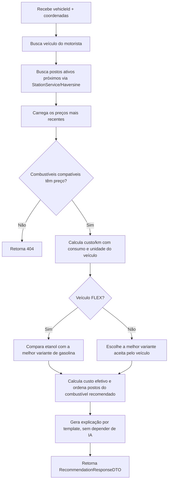

# Fase 7 — Motor de Recomendação de Combustível

## Objetivo

Implementar o motor determinístico de recomendação de combustível que calcula o custo por quilômetro personalizado, compara combustíveis compatíveis e ordena os postos pelo custo efetivo de abastecimento e deslocamento.

> **IA opcional:** Provedor e modelo Spring AI permanecem pendentes de aprovação. A integração deverá usar um adaptador desacoplado, sem tornar a inicialização ou os fluxos essenciais dependentes de IA ou credenciais. O cálculo e a explicação por template são o comportamento funcional sem IA; não fixar provedor, modelo ou credencial antes da aprovação.

**Branch:** `feature/recomendacoes`
**Dependências:** Fase 3 (Veículos) + Fase 4 (Postos/Haversine) + Fase 5 (Preços de Combustíveis)

---

## Endpoint

| Método | Rota | Objetivo | Acesso | Status HTTP |
|--------|------|----------|--------|-------------|
| `GET`  | `/recommendations/fuel` | Recomendação de melhor custo-benefício | `ROLE_DRIVER` | `200 OK` |

### Parâmetros

| Parâmetro | Tipo | Obrigatório | Descrição |
|-----------|------|-------------|-----------|
| `vehicleId` | UUID | Sim | ID do veículo cadastrado pelo motorista |
| `latitude` | double | Sim | Latitude atual do motorista |
| `longitude` | double | Sim | Longitude atual do motorista |
| `radiusKm` | double | Não (default: 5) | Raio de busca em quilômetros |

---

## Lógica de Recomendação

### Fluxo de Decisão


```mermaid
flowchart TD
    A["Recebe vehicleId + coordenadas"] --> B["Busca veículo do motorista"]
    B --> C["Busca postos ativos próximos via StationService/Haversine"]
    C --> D["Carrega os preços mais recentes"]
    D --> E{"Combustíveis compatíveis têm preço?"}
    E -- Não --> X["Retorna 404"]
    E -- Sim --> F["Calcula custo/km com consumo e unidade do veículo"]
    F --> G{"Veículo FLEX?"}
    G -- Sim --> H["Compara etanol com a melhor variante de gasolina"]
    G -- Não --> I["Escolhe a melhor variante aceita pelo veículo"]
    H --> J["Calcula custo efetivo e ordena postos do combustível recomendado"]
    I --> J
    J --> K["Gera explicação por template, sem depender de IA"]
    K --> L["Retorna RecommendationResponseDTO"]
```

### Fórmulas Aplicadas

**1. Custo por quilômetro personalizado:**

$$\text{Custo/KM} = \frac{\text{Preço por unidade (R\$/L ou R\$/m³)}}{\text{Consumo correspondente (km/L ou km/m³)}}$$

Consumo, capacidade e preço devem ter unidades compatíveis. A regra genérica dos
70% é apenas uma referência e **não** decide a recomendação personalizada.

**2. Seleção personalizada:**

Para veículo `FLEX`, calcula-se o custo/km do etanol e de cada variante de
gasolina com os consumos informados pelo motorista. Recomenda-se o combustível
com menor custo/km; em empate, gasolina é escolhida. A paridade retornada é a
razão entre o preço do melhor etanol e o preço da melhor gasolina, multiplicada
por 100. Se só houver preços para um dos dois grupos, recomenda-se o grupo
disponível e a paridade fica `null`.

Para `GASOLINE`, são consideradas `GASOLINE_REGULAR` e `GASOLINE_PREMIUM`;
para `DIESEL`, `DIESEL_S10` e `DIESEL_S500`. Em cada categoria, a recomendação
retorna o código exato da variante de menor custo/km. `ETHANOL` e `CNG` usam
seus códigos correspondentes. A decisão de considerar todas essas variantes
foi confirmada para esta fase.

**3. Custo efetivo total (inclui deslocamento):**

$$\text{Custo Efetivo} = \text{Capacidade (L ou m³)} \times \text{Preço} + \left(2 \times \text{Distância Haversine (km)} \times \text{Custo/KM}\right)$$

`topOptions` contém as opções do código recomendado, ordenadas pelo custo
efetivo crescente; a fase não define um limite de quantidade.

---

## Tarefas de Implementação

### 7.1 DTOs

```java
// RecommendationResponseDTO
public record RecommendationResponseDTO(
    VehicleSummaryDTO vehicle,
    String recommendedFuel,
    String explanation,
    BigDecimal parityPercentage,
    List<StationRecommendationDTO> topOptions
) {}

// VehicleSummaryDTO
public record VehicleSummaryDTO(
    String nickname,
    String fuelTypeAccepted
) {}

// StationRecommendationDTO
public record StationRecommendationDTO(
    UUID stationId,
    String stationName,
    String brand,
    String fuelType,
    BigDecimal price,
    String unitOfMeasure,
    Double distanceKm,
    BigDecimal costPerKm,
    BigDecimal estimatedFullTankCost,
    BigDecimal estimatedRoundTripCost
) {}
```

### 7.2 Service e controller

`RecommendationService` reutiliza `VehicleService.findByIdAndUser` para impor
propriedade do veículo, `StationService.search` para validar coordenadas e
obter postos ativos ordenados por Haversine, e
`FuelPriceRepository.findLatestForStations` para preços vigentes. Não acessa
repositórios de outras fronteiras diretamente para localização ou veículos.

O endpoint exige `ROLE_DRIVER`; o principal autenticado fornece o `userId`.
Parâmetros inválidos são tratados pelos validadores e pelo serviço de busca.
Sem posto próximo ou sem preço vigente compatível, retorna `404`. O valor
`radiusKm` padrão é 5 km. A explicação é gerada localmente por template; IA não
é necessária para inicialização nem para este fluxo.

---

## Exemplo de Resposta

**Request:** `GET /recommendations/fuel?vehicleId=...&latitude=-23.5505&longitude=-46.6333&radiusKm=5`

**Response (200 OK):**

```json
{
  "vehicle": {
    "nickname": "Meu Onix",
    "fuelTypeAccepted": "FLEX"
  },
  "recommendedFuel": "ETHANOL",
  "explanation": "Para o veículo Meu Onix, etanol tem custo de R$ 0.4228/km no posto Posto Central. Paridade etanol/gasolina: 67.18%.",
  "parityPercentage": 67.18,
  "topOptions": [
    {
      "stationId": "c1f7b8a2-...",
      "stationName": "Posto Central",
      "brand": "IPIRANGA",
      "fuelType": "ETHANOL",
      "price": 3.89,
      "unitOfMeasure": "R$/litro",
      "distanceKm": 2.45,
      "costPerKm": 0.4228,
      "estimatedFullTankCost": 210.06,
      "estimatedRoundTripCost": 2.07
    }
  ]
}
```

---

## Testes

### Unitários
- `RecommendationServiceTest`:
  - Veículo FLEX com etanol mais vantajoso
  - Veículo FLEX com gasolina mais vantajosa
  - Veículo gasolina puro (sem comparação)
  - Veículo diesel (sem comparação)
  - Nenhum posto no raio → `ResourceNotFoundException`
  - Cálculo de paridade com valores conhecidos
  - Custo efetivo com deslocamento correto

### Integração
- `RecommendationControllerIntegrationTest`:
  - GET retorna 200 com recomendação válida
  - Sem token retorna 401
  - ADMIN acessando retorna 403
  - Veículo de outro usuário retorna 404

### Cenários de Teste (valores conhecidos)

| Cenário | Etanol | Gasolina | Consumo E | Consumo G | Custo/km E | Custo/km G | Recomendação |
|---------|--------|----------|-----------|-----------|------------|------------|--------------|
| 1 | R$ 3.89 | R$ 5.79 | 9.2 km/L | 13.5 km/L | R$ 0.4228 | R$ 0.4289 | ETANOL |
| 2 | R$ 4.50 | R$ 5.79 | 9.2 km/L | 13.5 km/L | R$ 0.4891 | R$ 0.4289 | GASOLINA |
| 3 | R$ 3.50 | R$ 5.00 | 9.0 km/L | 13.0 km/L | R$ 0.3889 | R$ 0.3846 | GASOLINA |

---

## Critérios de Aceitação

- [x] Recomendação correta para veículo FLEX com dados reais
- [x] Paridade personalizada usa consumos reais do veículo (não a regra dos 70%)
- [x] Fallback funciona para veículos de combustível único
- [x] Custo efetivo inclui deslocamento ida+volta
- [x] Explicação textual gerada por template é coerente e informativa sem configuração de IA
- [x] Provedor/modelo de IA continuam pendentes; a integração não bloqueia o fluxo determinístico
- [x] Variantes de gasolina comum/premium e diesel S10/S500 são consideradas
- [x] Ordenação por custo efetivo total (menor primeiro)
- [x] Nenhum posto no raio ou preço compatível retorna erro adequado
- [x] Testes unitários e de integração com valores conhecidos passam

---

## Commit Sugerido

```
feat: implement algorithmic fuel recommendation with parity and cost-per-km
```
