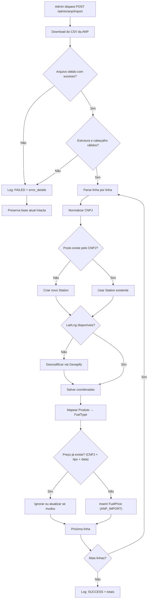

# Fase 8 — Integração com a Base de Dados da ANP

## Objetivo

Implementar o pipeline ETL para ingestão do arquivo CSV semestral de preços de combustíveis publicado pela ANP (Agência Nacional do Petróleo), com validação, limpeza, normalização, geocodificação via Geoapify, idempotência contra duplicatas e auditoria completa.

**Branch:** `feature/integracao-anp`
**Dependência:** Fase 5 (Preços de Combustíveis)

---

## Fonte de Dados

- **Portal:** Dados Abertos da ANP — Série Histórica de Preços de Combustíveis e GLP
- **Arquivo de referência:** 1º Semestre de 2026 (CSV/TSV)
- **Caráter:** Informativo e histórico. Preços decorrem de coletas periódicas da ANP

> **Importante:** O sistema não garante preços em tempo real. Toda exibição de preço deve incluir a **data de coleta** informada pela ANP.

---

## Endpoints (Admin)

| Método | Rota | Objetivo | Acesso | Status HTTP |
|--------|------|----------|--------|-------------|
| `POST` | `/admin/anp/import` | Dispara processo de carga do arquivo semestral | `ROLE_ADMIN` | `202 Accepted` |
| `GET`  | `/admin/anp/imports` | Lista histórico de importações | `ROLE_ADMIN` | `200 OK` |
| `GET`  | `/admin/anp/imports/{id}` | Detalhes de uma importação | `ROLE_ADMIN` | `200 OK` |

---

## Mapeamento de Campos (CSV ANP → Entidades)

| Campo CSV ANP | Entidade | Campo no Sistema |
|---------------|----------|------------------|
| `CNPJ da Revenda` | Station | `cnpj` (identificador único) |
| `Revenda` | Station | `corporate_name`, `trade_name` |
| `Bandeira` | Station | `brand` |
| `Nome da Rua` | Station | `street` |
| `Numero Rua` | Station | `number` |
| `Bairro` | Station | `neighborhood` |
| `Cep` | Station | `postal_code` |
| `Municipio` | Station | `city` |
| `Estado - Sigla` | Station | `state` |
| `Produto` | FuelType | Mapeado para `code` (ver tabela abaixo) |
| `Data da Coleta` | FuelPrice | `collection_date` |
| `Valor de Venda` | FuelPrice | `sale_value` |
| `Unidade de Medida` | FuelType | `unit_of_measure` |

### Mapeamento de Produtos ANP → FuelType Code

| Produto ANP | `fuel_type.code` |
|-------------|------------------|
| GASOLINA COMUM | `GASOLINE_REGULAR` |
| GASOLINA ADITIVADA | `GASOLINE_ADDITIVE` |
| ETANOL | `ETHANOL` |
| DIESEL S10 | `DIESEL_S10` |
| DIESEL S500 | `DIESEL_S500` |
| GNV | `CNG` |

---

## Regras de Negócio

### Idempotência
1. **Chave de deduplicação:** `(station.cnpj, fuel_type.code, collection_date)`
2. Reexecuções da carga **não geram** registros duplicados
3. Se um registro já existe com a mesma chave: **ignora** ou **atualiza** se o valor mudou

### Resiliência e Fallback
1. Se o download falhar → aborta transação, registra `FAILED`
2. Se a estrutura/layout do CSV for inválida → aborta, registra `FAILED`
3. Se o processamento for interrompido → **preserva dados anteriores intactos**
4. O sistema mantém disponíveis os últimos dados válidos previamente carregados

### Normalização de CNPJ
1. Remover caracteres especiais (pontos, barras, hífens)
2. Validar formato: 14 dígitos numéricos
3. Armazenar no formato `XX.XXX.XXX/XXXX-XX` (ou apenas numérico — padronizar)

### Geocodificação (Geoapify)
1. Quando latitude/longitude estiverem ausentes no CSV da ANP
2. Usar a **Geoapify Geocoding API** (plano gratuito) para converter endereço em coordenadas
3. Montar query: `{rua}, {numero}, {bairro}, {cidade}, {estado}, Brasil`
4. Rate limit do plano gratuito: respeitar limites (3000 req/dia)
5. Cachear resultados por CNPJ para evitar chamadas duplicadas

### Auditoria
1. Toda importação registra log na tabela `anp_import_logs`
2. Campos: início, fim, período referência, total lidos, total importados, status, erros
3. Status possíveis: `SUCCESS`, `PARTIAL`, `FAILED`
4. `triggered_by`: UUID do admin que disparou

---

## Fluxo ETL



---

## Tarefas de Implementação

### 8.1 Entidade AnpImportLog

```java
@Entity
@Table(name = "anp_import_logs")
public class AnpImportLog {

    @Id
    @GeneratedValue(strategy = GenerationType.UUID)
    private UUID id;

    @Column(name = "file_name", nullable = false)
    private String fileName;

    @Column(name = "reference_period", nullable = false, length = 20)
    private String referencePeriod;

    @Column(name = "source_url", length = 500)
    private String sourceUrl;

    @Column(name = "import_start", nullable = false)
    private LocalDateTime importStart;

    @Column(name = "import_end")
    private LocalDateTime importEnd;

    @Column(name = "total_records_read")
    private Integer totalRecordsRead = 0;

    @Column(name = "total_records_imported")
    private Integer totalRecordsImported = 0;

    @Column(nullable = false, length = 20)
    @Enumerated(EnumType.STRING)
    private ImportStatus status = ImportStatus.FAILED;

    @Column(name = "error_details", columnDefinition = "TEXT")
    private String errorDetails;

    @Column(name = "triggered_by")
    private UUID triggeredBy;

    // Construtores, getters, setters
}
```

### 8.2 AnpImportService

```java
@Service
public class AnpImportService {

    private final AnpImportLogRepository importLogRepository;
    private final StationRepository stationRepository;
    private final FuelPriceRepository fuelPriceRepository;
    private final FuelTypeRepository fuelTypeRepository;
    private final GeoapifyService geoapifyService;

    @Transactional
    public AnpImportLog executeImport(
            String fileUrl, String referencePeriod, UUID triggeredBy) {

        AnpImportLog log = new AnpImportLog();
        log.setSourceUrl(fileUrl);
        log.setReferencePeriod(referencePeriod);
        log.setImportStart(LocalDateTime.now());
        log.setTriggeredBy(triggeredBy);

        try {
            // 1. Download do arquivo
            String csvContent = downloadFile(fileUrl);
            log.setFileName(extractFileName(fileUrl));

            // 2. Validar estrutura
            validateCsvStructure(csvContent);

            // 3. Parse e processamento
            List<String[]> records = parseCsv(csvContent);
            log.setTotalRecordsRead(records.size());

            int imported = 0;
            for (String[] record : records) {
                if (processRecord(record)) {
                    imported++;
                }
            }

            log.setTotalRecordsImported(imported);
            log.setStatus(ImportStatus.SUCCESS);
            log.setImportEnd(LocalDateTime.now());

        } catch (Exception e) {
            log.setStatus(ImportStatus.FAILED);
            log.setErrorDetails(e.getMessage());
            log.setImportEnd(LocalDateTime.now());
        }

        return importLogRepository.save(log);
    }

    private boolean processRecord(String[] record) {
        // 1. Extrair e normalizar CNPJ
        String cnpj = normalizeCnpj(record[CNPJ_INDEX]);

        // 2. Buscar ou criar Station
        Station station = stationRepository.findByCnpj(cnpj)
                .orElseGet(() -> createStation(record, cnpj));

        // 3. Geocodificar se necessário
        if (station.getLatitude() == null || station.getLongitude() == null) {
            geocodeStation(station);
        }

        // 4. Mapear produto para FuelType
        FuelType fuelType = mapProductToFuelType(record[PRODUCT_INDEX]);
        if (fuelType == null) return false;

        // 5. Extrair preço e data
        BigDecimal price = parsePrice(record[PRICE_INDEX]);
        LocalDate date = parseDate(record[DATE_INDEX]);

        // 6. Verificar duplicata (idempotência)
        Optional<FuelPrice> existing = fuelPriceRepository
                .findByStationIdAndFuelTypeIdAndCollectionDate(
                        station.getId(), fuelType.getId(), date);

        if (existing.isPresent()) {
            // Atualizar apenas se preço mudou
            FuelPrice fp = existing.get();
            if (fp.getSaleValue().compareTo(price) != 0) {
                fp.setSaleValue(price);
                fp.setUpdatedAt(LocalDateTime.now());
                fuelPriceRepository.save(fp);
                return true;
            }
            return false; // Sem alteração
        }

        // 7. Inserir novo preço
        FuelPrice fuelPrice = new FuelPrice();
        fuelPrice.setStation(station);
        fuelPrice.setFuelType(fuelType);
        fuelPrice.setSaleValue(price);
        fuelPrice.setCollectionDate(date);
        fuelPrice.setDataSource(DataSource.ANP_IMPORT);
        fuelPriceRepository.save(fuelPrice);

        return true;
    }

    private String normalizeCnpj(String raw) {
        return raw.replaceAll("[^0-9]", "");
    }

    // Métodos auxiliares: downloadFile, validateCsvStructure, parseCsv,
    //                     createStation, geocodeStation, mapProductToFuelType,
    //                     parsePrice, parseDate
}
```

### 8.3 GeoapifyService

```java
@Service
public class GeoapifyService {

    @Value("${geoapify.api-key}")
    private String apiKey;

    private static final String BASE_URL =
            "https://api.geoapify.com/v1/geocode/search";

    private final RestTemplate restTemplate;

    /**
     * Geocodifica um endereço usando a Geoapify API (plano gratuito)
     * @return [latitude, longitude] ou null se não encontrar
     */
    public double[] geocode(String street, String number,
                            String neighborhood, String city,
                            String state) {

        String address = String.join(", ",
                street != null ? street + " " + number : "",
                neighborhood != null ? neighborhood : "",
                city, state, "Brasil")
                .replaceAll(",\\s*,", ",").trim();

        String url = UriComponentsBuilder.fromHttpUrl(BASE_URL)
                .queryParam("text", address)
                .queryParam("apiKey", apiKey)
                .queryParam("lang", "pt")
                .queryParam("limit", 1)
                .queryParam("filter", "countrycode:br")
                .toUriString();

        try {
            ResponseEntity<JsonNode> response =
                    restTemplate.getForEntity(url, JsonNode.class);

            JsonNode features = response.getBody().get("features");
            if (features != null && features.size() > 0) {
                JsonNode coords = features.get(0)
                        .get("geometry").get("coordinates");
                double lng = coords.get(0).asDouble();
                double lat = coords.get(1).asDouble();
                return new double[]{lat, lng};
            }
        } catch (Exception e) {
            // Log warning, não falhar a importação por geocodificação
        }

        return null;
    }
}
```

### 8.4 Configuração do Geoapify

Adicionar ao `application.yml`:

```yaml
# Geoapify Geocoding (Free Tier)
geoapify:
  api-key: ${GEOAPIFY_API_KEY:sua-chave-aqui}
```

### 8.5 AnpImportController

```java
@RestController
@RequestMapping("/admin/anp")
@PreAuthorize("hasRole('ADMIN')")
public class AnpImportController {

    private final AnpImportService anpImportService;
    private final AnpImportLogRepository importLogRepository;

    @PostMapping("/import")
    public ResponseEntity<AnpImportLogDTO> triggerImport(
            @Valid @RequestBody AnpImportRequestDTO request,
            @AuthenticationPrincipal String userId) {

        AnpImportLog result = anpImportService.executeImport(
                request.sourceUrl(), request.referencePeriod(),
                UUID.fromString(userId));

        return ResponseEntity.accepted().body(toDTO(result));
    }

    @GetMapping("/imports")
    public ResponseEntity<List<AnpImportLogDTO>> listImports() {
        return ResponseEntity.ok(
                importLogRepository.findAllByOrderByImportStartDesc()
                        .stream().map(this::toDTO).toList());
    }

    @GetMapping("/imports/{id}")
    public ResponseEntity<AnpImportLogDTO> getImport(@PathVariable UUID id) {
        AnpImportLog log = importLogRepository.findById(id)
                .orElseThrow(() -> new ResourceNotFoundException(
                        "Log de importação não encontrado."));
        return ResponseEntity.ok(toDTO(log));
    }
}
```

---

## Testes

### Unitários
- `AnpImportServiceTest`:
  - Carga com CSV válido → SUCCESS com totais corretos
  - Carga com CSV inválido (layout errado) → FAILED
  - Reexecução do mesmo arquivo não duplica registros (idempotência)
  - CNPJ normalizado corretamente
  - Mapeamento de produtos ANP → FuelType correto

- `GeoapifyServiceTest`:
  - Geocodificação com endereço válido retorna coordenadas
  - Endereço não encontrado retorna null (não falha)

### Integração
- `AnpImportControllerIntegrationTest`:
  - POST como ADMIN retorna 202
  - POST como MOTORISTA retorna 403
  - GET imports retorna lista de logs

### Dados de Teste
- Criar arquivo CSV com ~100 registros simulando o formato ANP
- Incluir cenários: CNPJ duplicado, produto desconhecido, preço inválido

---

## Critérios de Aceitação

- [ ] Carga idempotente (re-executar não duplica registros)
- [ ] Falha preserva dados anteriores intactos (rollback transacional)
- [ ] Log de auditoria completo (início, fim, totais, status, erros)
- [ ] CNPJ normalizado e validado
- [ ] Mapeamento correto de todos os produtos ANP → FuelType
- [ ] Geocodificação via Geoapify para postos sem coordenadas
- [ ] Apenas ADMIN pode disparar a carga
- [ ] Testes passam

---

## Commit Sugerido

```
feat: implement ANP ETL pipeline with idempotency and Geoapify geocoding
```
