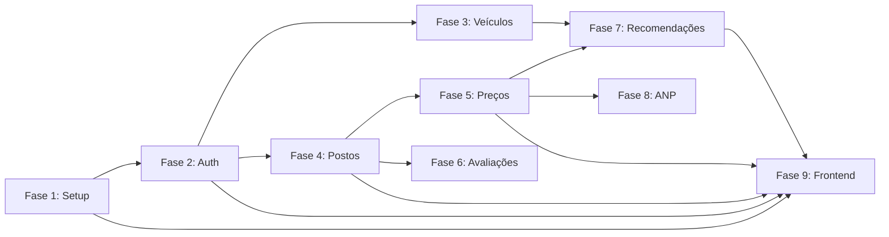
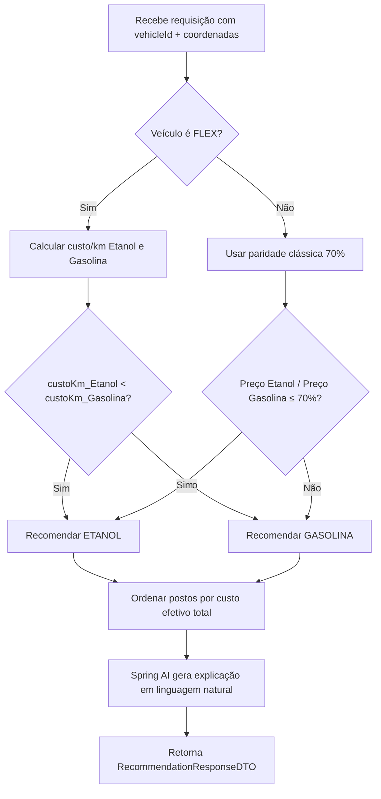
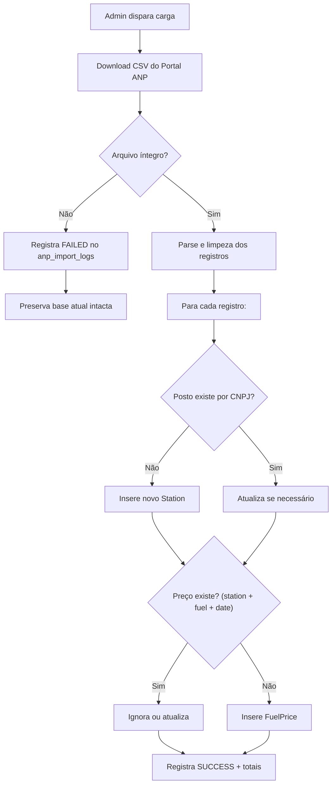

# Plano de Desenvolvimento — FuelFinder

## Descrição do Objetivo

Criar o plano de desenvolvimento detalhado e faseado do aplicativo **FuelFinder** — uma plataforma web responsiva para consulta, localização e comparação de preços de combustíveis no Brasil. O plano traduz as especificações definidas nos arquivos [architecture.md](file:///c:/Users/will_/.gemini/antigravity/scratch/fuelfinder/.ai/architecture.md), [business-rules.md](file:///c:/Users/will_/.gemini/antigravity/scratch/fuelfinder/.ai/business-rules.md), [standards.md](file:///c:/Users/will_/.gemini/antigravity/scratch/fuelfinder/.ai/standards.md) e [tech-stack.md](file:///c:/Users/will_/.gemini/antigravity/scratch/fuelfinder/.ai/tech-stack.md) em uma sequência de **fases incrementais** prontas para implementação.

O plano será materializado em uma pasta `Plano/` no diretório raiz do projeto, contendo documentos detalhados de cada fase.

---

## User Review Required

> [!IMPORTANT]
> **Estrutura da pasta `Plano/`**: O plano será organizado em 8 arquivos Markdown dentro de `Plano/`, cada um cobrindo uma fase do desenvolvimento com suas tarefas, dependências e critérios de aceitação.

> [!IMPORTANT]
> **Escopo MVP**: O plano cobre exclusivamente as funcionalidades do MVP. Funcionalidades Pós-MVP (OCR de totens, PostGIS, ROLE_OPERADOR, histórico de abastecimentos) são mencionadas apenas como referência futura.

---

## Open Questions

> [!IMPORTANT]
> **Java 21 ou 25?** O arquivo `tech-stack.md` menciona "Java 21 LTS *(ou 25)*". Qual versão deseja adotar? O plano assume Java 21 LTS como padrão.

> [!IMPORTANT]
> **Spring AI — Modelo de IA**: O `tech-stack.md` menciona "modelos como Gemini" via `ChatClient`. É necessário definir qual provedor/modelo será utilizado (Gemini, OpenAI, Ollama local) e se haverá API key configurada.

> [!IMPORTANT]
> **Geocodificação de endereços da ANP**: O `business-rules.md` menciona geocodificação de endereço quando lat/long estiver ausente. Qual serviço será usado? (Nominatim/OpenStreetMap gratuito? Google Geocoding API?)

---

## Proposed Changes

A pasta `Plano/` será criada na raiz do projeto com a seguinte estrutura:

```text
Plano/
├── 00-visao-geral.md          # Visão geral, cronograma e dependências entre fases
├── 01-setup-infraestrutura.md # Setup do projeto, banco, migrações, configs
├── 02-autenticacao-usuarios.md # Auth, JWT, RBAC, gestão de contas
├── 03-veiculos.md             # CRUD de veículos e consumo informado
├── 04-postos-geolocalizacao.md # Postos, busca por proximidade, Haversine
├── 05-precos-combustiveis.md  # Preços, tipos de combustível, comparação
├── 06-avaliacoes-moderacao.md # Reviews, nota média, moderação admin
├── 07-recomendacoes-ia.md     # Motor de recomendação, Spring AI, paridade
├── 08-integracao-anp.md       # Pipeline ETL da ANP, idempotência, auditoria
└── 09-frontend-integracao.md  # Interface web, Leaflet, Tailwind, deep links
```

---

### Detalhamento de cada documento

---

### [NEW] `Plano/00-visao-geral.md`

Documento-mestre com:
- Visão geral da arquitetura e decisões técnicas
- Cronograma macro com as 9 fases
- Diagrama de dependências entre fases
- Critérios globais de qualidade
- Convenções de branch/commit (Conventional Commits)



---

### [NEW] `Plano/01-setup-infraestrutura.md`

**Objetivo:** Configurar o projeto Spring Boot, banco de dados, migrações Flyway e toda a infraestrutura base.

**Tarefas:**

| # | Tarefa | Detalhes |
|---|--------|----------|
| 1.1 | Criar projeto Spring Boot 3.4 via Spring Initializr | Dependências: Web, JPA, Security, Validation, Flyway, PostgreSQL Driver, Springdoc OpenAPI |
| 1.2 | Configurar `pom.xml` com JJWT 0.12.6+, Spring AI | Gerenciar versões via Spring BOM |
| 1.3 | Estruturar pacotes conforme `standards.md` | `com.fuelfinder.{config, common, modules.*}` |
| 1.4 | Configurar `application.yml` / `application-dev.yml` | DataSource, JPA, Flyway, CORS, JWT secret/expiration |
| 1.5 | Docker Compose para PostgreSQL 16 | Container local para desenvolvimento |
| 1.6 | Criar migração Flyway `V1__initial_schema.sql` | Todas as 7 tabelas conforme ERD do `architecture.md` |
| 1.7 | Configurar tratamento global de exceções | `GlobalExceptionHandler` com ProblemDetail (RFC 7807) |
| 1.8 | Configurar CORS e WebMvc | Permitir origens do frontend |
| 1.9 | Configurar Swagger/OpenAPI | Endpoint `/swagger-ui.html` funcional |
| 1.10 | Criar `V2__seed_fuel_types.sql` | Dados iniciais dos tipos de combustível (GASOLINE_REGULAR, ETHANOL, DIESEL_S10, etc.) |

**Arquivos principais a criar:**

```text
pom.xml
docker-compose.yml
src/main/resources/application.yml
src/main/resources/application-dev.yml
src/main/resources/db/migration/V1__initial_schema.sql
src/main/resources/db/migration/V2__seed_fuel_types.sql
src/main/java/com/fuelfinder/FuelFinderApplication.java
src/main/java/com/fuelfinder/config/WebConfig.java
src/main/java/com/fuelfinder/config/OpenApiConfig.java
src/main/java/com/fuelfinder/common/exception/GlobalExceptionHandler.java
src/main/java/com/fuelfinder/common/util/HaversineCalculator.java
```

**Migração SQL (esquema):**

```sql
-- V1__initial_schema.sql
CREATE TABLE users (
    id UUID PRIMARY KEY DEFAULT gen_random_uuid(),
    email VARCHAR(255) NOT NULL UNIQUE,
    password_hash VARCHAR(255) NOT NULL,
    full_name VARCHAR(255) NOT NULL,
    role VARCHAR(30) NOT NULL DEFAULT 'ROLE_MOTORISTA',
    status VARCHAR(20) NOT NULL DEFAULT 'ACTIVE',
    created_at TIMESTAMP NOT NULL DEFAULT NOW(),
    updated_at TIMESTAMP NOT NULL DEFAULT NOW()
);

CREATE TABLE vehicles (
    id UUID PRIMARY KEY DEFAULT gen_random_uuid(),
    user_id UUID NOT NULL REFERENCES users(id),
    nickname VARCHAR(50) NOT NULL,
    brand VARCHAR(100) NOT NULL,
    model VARCHAR(100) NOT NULL,
    year_manufacture INTEGER NOT NULL,
    fuel_type_accepted VARCHAR(20) NOT NULL,
    tank_capacity DECIMAL(6,2) NOT NULL,
    avg_consumption_gasoline DECIMAL(5,2),
    avg_consumption_ethanol DECIMAL(5,2),
    created_at TIMESTAMP NOT NULL DEFAULT NOW(),
    updated_at TIMESTAMP NOT NULL DEFAULT NOW()
);

CREATE TABLE stations (
    id UUID PRIMARY KEY DEFAULT gen_random_uuid(),
    cnpj VARCHAR(18) NOT NULL UNIQUE,
    corporate_name VARCHAR(255) NOT NULL,
    trade_name VARCHAR(255),
    brand VARCHAR(100),
    street VARCHAR(255),
    number VARCHAR(20),
    neighborhood VARCHAR(100),
    city VARCHAR(100) NOT NULL,
    state CHAR(2) NOT NULL,
    postal_code VARCHAR(10),
    latitude DECIMAL(10,7) NOT NULL,
    longitude DECIMAL(10,7) NOT NULL,
    average_rating DECIMAL(3,2) DEFAULT 0.00,
    total_reviews INTEGER DEFAULT 0,
    status VARCHAR(20) NOT NULL DEFAULT 'ACTIVE',
    created_at TIMESTAMP NOT NULL DEFAULT NOW(),
    updated_at TIMESTAMP NOT NULL DEFAULT NOW()
);

CREATE TABLE fuel_types (
    id UUID PRIMARY KEY DEFAULT gen_random_uuid(),
    code VARCHAR(50) NOT NULL UNIQUE,
    name VARCHAR(100) NOT NULL,
    unit_of_measure VARCHAR(20) NOT NULL DEFAULT 'R$/litro',
    active BOOLEAN NOT NULL DEFAULT TRUE
);

CREATE TABLE fuel_prices (
    id UUID PRIMARY KEY DEFAULT gen_random_uuid(),
    station_id UUID NOT NULL REFERENCES stations(id),
    fuel_type_id UUID NOT NULL REFERENCES fuel_types(id),
    sale_value DECIMAL(8,3) NOT NULL,
    collection_date DATE NOT NULL,
    data_source VARCHAR(30) NOT NULL DEFAULT 'MANUAL_ADMIN',
    created_at TIMESTAMP NOT NULL DEFAULT NOW(),
    updated_at TIMESTAMP NOT NULL DEFAULT NOW(),
    UNIQUE(station_id, fuel_type_id, collection_date)
);

CREATE TABLE reviews (
    id UUID PRIMARY KEY DEFAULT gen_random_uuid(),
    user_id UUID NOT NULL REFERENCES users(id),
    station_id UUID NOT NULL REFERENCES stations(id),
    rating INTEGER NOT NULL CHECK (rating BETWEEN 1 AND 5),
    comment VARCHAR(500),
    status VARCHAR(20) NOT NULL DEFAULT 'APPROVED',
    created_at TIMESTAMP NOT NULL DEFAULT NOW(),
    updated_at TIMESTAMP NOT NULL DEFAULT NOW(),
    UNIQUE(user_id, station_id)
);

CREATE TABLE anp_import_logs (
    id UUID PRIMARY KEY DEFAULT gen_random_uuid(),
    file_name VARCHAR(255) NOT NULL,
    reference_period VARCHAR(20) NOT NULL,
    source_url VARCHAR(500),
    import_start TIMESTAMP NOT NULL,
    import_end TIMESTAMP,
    total_records_read INTEGER DEFAULT 0,
    total_records_imported INTEGER DEFAULT 0,
    status VARCHAR(20) NOT NULL DEFAULT 'FAILED',
    error_details TEXT,
    triggered_by UUID REFERENCES users(id)
);
```

**Critérios de aceitação:**
- ✅ `mvn clean compile` executa sem erros
- ✅ Aplicação inicia e conecta ao PostgreSQL
- ✅ Flyway aplica as migrações automaticamente
- ✅ Swagger UI acessível em `/swagger-ui.html`
- ✅ `fuel_types` populada com dados de seed

---

### [NEW] `Plano/02-autenticacao-usuarios.md`

**Objetivo:** Implementar autenticação JWT, registro de motoristas, login, refresh token, logout e gestão de perfis RBAC.

**Tarefas:**

| # | Tarefa | Detalhes |
|---|--------|----------|
| 2.1 | Criar entidade `User` (@Entity) | Com campos do ERD, enum `Role` e `AccountStatus` |
| 2.2 | Criar `UserRepository` | Método `findByEmail(String email)` |
| 2.3 | Criar DTOs de Auth | `RegisterRequestDTO`, `LoginRequestDTO`, `AuthResponseDTO`, `UserProfileDTO` |
| 2.4 | Implementar `JwtService` | Geração, validação e extração de claims (JJWT 0.12.6) |
| 2.5 | Implementar `JwtAuthenticationFilter` | `OncePerRequestFilter` que extrai token do header `Authorization: Bearer ...` |
| 2.6 | Configurar `SecurityConfig` | Rotas públicas (`/auth/**`, `/stations GET`), protegidas e RBAC |
| 2.7 | Implementar `AuthService` | Registro (BCrypt hash, custo 10), login (verificação + emissão JWT), refresh |
| 2.8 | Implementar `AuthController` | `POST /auth/register`, `POST /auth/login`, `POST /auth/logout`, `POST /auth/refresh`, `GET /auth/me` |
| 2.9 | Implementar `PATCH /users/me` | Atualização de dados cadastrais do próprio usuário |
| 2.10 | Testes unitários | AuthService, JwtService |
| 2.11 | Testes de integração | AuthController com MockMvc |

**Endpoints implementados:**

| Método | Rota | Acesso | Status |
|--------|------|--------|--------|
| `POST` | `/auth/register` | Público | `201 Created` |
| `POST` | `/auth/login` | Público | `200 OK` |
| `POST` | `/auth/logout` | Autenticado | `204 No Content` |
| `POST` | `/auth/refresh` | Autenticado | `200 OK` |
| `GET`  | `/auth/me` | Autenticado | `200 OK` |
| `PATCH`| `/users/me` | Autenticado | `200 OK` |

**Regras de negócio implementadas:**
- E-mail único (409 Conflict em duplicata)
- Senha ≥ 8 chars, ao menos 1 letra e 1 número
- BCrypt com custo mínimo 10
- JWT com claims: `sub: userId`, `role`, `exp`
- Conta BLOCKED impede login e revoga tokens

**Critérios de aceitação:**
- ✅ Registro cria usuário com `ROLE_MOTORISTA` e `ACTIVE`
- ✅ Login retorna JWT válido
- ✅ Rotas protegidas rejeitam requisição sem token (401)
- ✅ Rotas ADMIN rejeitam motorista (403)
- ✅ E-mail duplicado retorna 409

---

### [NEW] `Plano/03-veiculos.md`

**Objetivo:** CRUD completo de veículos vinculados ao motorista autenticado, com validação de consumo informado.

**Tarefas:**

| # | Tarefa | Detalhes |
|---|--------|----------|
| 3.1 | Criar entidade `Vehicle` | Enum `FuelTypeAccepted`: GASOLINE, ETHANOL, FLEX, DIESEL, CNG |
| 3.2 | Criar `VehicleRepository` | `findByUserId(UUID)`, `findByIdAndUserId(UUID, UUID)` |
| 3.3 | Criar DTOs | `CreateVehicleRequestDTO`, `UpdateVehicleRequestDTO`, `VehicleResponseDTO` |
| 3.4 | Criar `VehicleMapper` | Conversão Entity ↔ DTO |
| 3.5 | Implementar `VehicleService` | CRUD com verificação de ownership (`user_id`) |
| 3.6 | Implementar `VehicleController` | 5 endpoints com `@PreAuthorize("hasRole('MOTORISTA')")` |
| 3.7 | Validações de negócio | Ano: [1950, ano atual+1], consumo: [1.0, 40.0] km/L, FLEX exige ambos consumos |
| 3.8 | Testes | Unitários + integração |

**Endpoints:**

| Método | Rota | Acesso | Status |
|--------|------|--------|--------|
| `POST` | `/vehicles` | MOTORISTA | `201 Created` |
| `GET`  | `/vehicles` | MOTORISTA | `200 OK` |
| `GET`  | `/vehicles/{id}` | MOTORISTA | `200 OK` |
| `PATCH`| `/vehicles/{id}` | MOTORISTA | `200 OK` |
| `DELETE`| `/vehicles/{id}` | MOTORISTA | `204 No Content` |

**Critérios de aceitação:**
- ✅ Motorista só acessa seus próprios veículos
- ✅ Veículo FLEX exige ambos consumos (gasolina e etanol)
- ✅ Validação numérica de consumo [1.0, 40.0]
- ✅ Ano de fabricação entre 1950 e ano corrente + 1

---

### [NEW] `Plano/04-postos-geolocalizacao.md`

**Objetivo:** CRUD de postos, busca por proximidade com Fórmula de Haversine, e visualização geolocalizada.

**Tarefas:**

| # | Tarefa | Detalhes |
|---|--------|----------|
| 4.1 | Criar entidade `Station` | Com todos os campos do ERD |
| 4.2 | Criar `StationRepository` | Custom query com Haversine para busca por raio |
| 4.3 | Implementar `HaversineCalculator` | Classe utilitária em `com.fuelfinder.common.util` |
| 4.4 | Criar DTOs | `StationRequestDTO`, `StationResponseDTO`, `StationSummaryDTO` (com distância) |
| 4.5 | Implementar `StationService` | Busca por raio (latitude, longitude, radiusKm), CRUD admin |
| 4.6 | Implementar `StationController` | GET público, POST/PATCH/DELETE para ADMIN |
| 4.7 | Query JPQL com Haversine | Cálculo no PostgreSQL usando `acos`, `cos`, `sin`, `radians` |
| 4.8 | Testes | Unitários + integração com dados de teste geolocalizados |

**Query de busca por raio (JPQL):**

```java
@Query("""
    SELECT s, (6371 * acos(
        cos(radians(:lat)) * cos(radians(s.latitude)) *
        cos(radians(s.longitude) - radians(:lng)) +
        sin(radians(:lat)) * sin(radians(s.latitude))
    )) AS distance
    FROM Station s
    WHERE s.status = 'ACTIVE'
    HAVING distance <= :radius
    ORDER BY distance ASC
    """)
List<Object[]> findStationsWithinRadius(
    @Param("lat") double lat,
    @Param("lng") double lng,
    @Param("radius") double radiusKm);
```

**Endpoints:**

| Método | Rota | Acesso | Status |
|--------|------|--------|--------|
| `GET`  | `/stations` | Público/Autenticado | `200 OK` |
| `GET`  | `/stations/{id}` | Público/Autenticado | `200 OK` |
| `POST` | `/stations` | ADMIN | `201 Created` |
| `PATCH`| `/stations/{id}` | ADMIN | `200 OK` |
| `DELETE`| `/stations/{id}` | ADMIN | `204 No Content` |

**Critérios de aceitação:**
- ✅ Busca por latitude/longitude/raio retorna postos ordenados por distância
- ✅ CNPJ único por posto (409 em duplicata)
- ✅ DELETE faz inativação lógica (`INACTIVE`), não exclusão física
- ✅ Postos `INACTIVE` não aparecem em buscas públicas

---

### [NEW] `Plano/05-precos-combustiveis.md`

**Objetivo:** Gestão de preços de combustíveis por posto, catálogo de tipos de combustível e endpoint de comparação.

**Tarefas:**

| # | Tarefa | Detalhes |
|---|--------|----------|
| 5.1 | Criar entidade `FuelType` | Enum code: GASOLINE_REGULAR, GASOLINE_ADDITIVE, ETHANOL, DIESEL_S10, DIESEL_S500, CNG |
| 5.2 | Criar entidade `FuelPrice` | Com constraint unique (station_id, fuel_type_id, collection_date) |
| 5.3 | Criar repositórios | `FuelTypeRepository`, `FuelPriceRepository` |
| 5.4 | Criar DTOs | `FuelPriceRequestDTO`, `FuelPriceResponseDTO`, `CompareResultDTO` |
| 5.5 | Implementar `FuelPriceService` | CRUD de preços, comparação ordenada por preço/distância |
| 5.6 | Implementar `FuelPriceController` | Endpoints de preço e comparação |
| 5.7 | Fórmulas de domínio | Custo tanque cheio, custo por km, autonomia estimada |
| 5.8 | Testes | Cálculos com valores conhecidos |

**Endpoints:**

| Método | Rota | Acesso | Status |
|--------|------|--------|--------|
| `GET`  | `/stations/{id}/fuel-prices` | Público/Autenticado | `200 OK` |
| `POST` | `/stations/{id}/fuel-prices` | ADMIN | `201 Created` |
| `PATCH`| `/stations/{id}/fuel-prices/{priceId}` | ADMIN | `200 OK` |
| `GET`  | `/fuel-prices/compare` | Público/Autenticado | `200 OK` |

**Fórmulas implementadas:**
- Custo Tanque Cheio = `tankCapacity × pricePerLiter`
- Autonomia Estimada = `tankCapacity × avgConsumption`
- Custo por KM = `pricePerLiter / avgConsumption`
- Custo Efetivo Total = `custoAbastecimento + (2 × distância × custoPorKm)`

**Critérios de aceitação:**
- ✅ Data de coleta ANP exibida em todo preço
- ✅ Comparação ordena por preço e/ou distância
- ✅ Preço com `data_source` (ANP_IMPORT ou MANUAL_ADMIN)

---

### [NEW] `Plano/06-avaliacoes-moderacao.md`

**Objetivo:** Sistema de avaliações com nota (1-5 estrelas) e comentário, nota média agregada e moderação administrativa.

**Tarefas:**

| # | Tarefa | Detalhes |
|---|--------|----------|
| 6.1 | Criar entidade `Review` | Com constraint unique (user_id, station_id) |
| 6.2 | Criar `ReviewRepository` | `findByStationIdAndStatus`, `findByUserIdAndStationId` |
| 6.3 | Criar DTOs | `CreateReviewRequestDTO`, `ReviewResponseDTO` |
| 6.4 | Implementar `ReviewService` | Criar/editar review, recalcular nota média do posto |
| 6.5 | Implementar `ReviewController` | CRUD com RBAC (motorista cria, admin modera) |
| 6.6 | Lógica de nota média | Atualizar `station.average_rating` e `station.total_reviews` |
| 6.7 | Testes | Unitários (recálculo) + integração |

**Endpoints:**

| Método | Rota | Acesso | Status |
|--------|------|--------|--------|
| `GET`  | `/stations/{id}/reviews` | Público/Autenticado | `200 OK` |
| `POST` | `/stations/{id}/reviews` | MOTORISTA | `201 Created` |
| `PATCH`| `/reviews/{id}` | MOTORISTA (própria) | `200 OK` |
| `DELETE`| `/reviews/{id}` | MOTORISTA (própria) / ADMIN | `204 No Content` |

**Regras:**
- 1 avaliação ativa por motorista por posto (upsert)
- Nota: inteiro 1-5
- Comentário: opcional, máx 500 chars
- Nota média = soma das notas APPROVED / total APPROVED
- Admin pode aprovar/rejeitar/excluir

**Critérios de aceitação:**
- ✅ Nova avaliação do mesmo motorista para o mesmo posto atualiza a existente
- ✅ Nota média do posto recalculada em cada operação
- ✅ Apenas avaliações APPROVED contam na média
- ✅ Admin pode moderar (aprovar/rejeitar)

---

### [NEW] `Plano/07-recomendacoes-ia.md`

**Objetivo:** Motor de recomendação inteligente de combustível com paridade personalizada e explicação via Spring AI.

**Tarefas:**

| # | Tarefa | Detalhes |
|---|--------|----------|
| 7.1 | Implementar `RecommendationService` | Lógica de paridade e custo por km |
| 7.2 | Integrar Spring AI `ChatClient` | Geração de explicações em linguagem natural |
| 7.3 | Implementar `RecommendationController` | `GET /recommendations/fuel` |
| 7.4 | Criar DTOs | `RecommendationResponseDTO` com topOptions |
| 7.5 | Lógica de paridade clássica (70%) | Quando o motorista não tem veículo FLEX cadastrado |
| 7.6 | Lógica de paridade personalizada | Custo/km etanol vs gasolina com consumos reais do veículo |
| 7.7 | Custo efetivo com deslocamento | Incluir ida e volta ao posto no cálculo |
| 7.8 | Testes | Cenários com veículo FLEX, gasolina puro, diesel |

**Endpoint:**

| Método | Rota | Acesso | Status |
|--------|------|--------|--------|
| `GET`  | `/recommendations/fuel?vehicleId=...&latitude=...&longitude=...&radiusKm=...` | MOTORISTA | `200 OK` |

**Lógica de decisão:**



**Critérios de aceitação:**
- ✅ Recomendação correta para veículo FLEX com dados reais
- ✅ Fallback para paridade 70% quando sem dados de consumo
- ✅ Custo efetivo inclui deslocamento ida+volta
- ✅ Explicação gerada via Spring AI é coerente

---

### [NEW] `Plano/08-integracao-anp.md`

**Objetivo:** Pipeline ETL para ingestão do arquivo semestral CSV da ANP com resiliência, idempotência e auditoria.

**Tarefas:**

| # | Tarefa | Detalhes |
|---|--------|----------|
| 8.1 | Criar entidade `AnpImportLog` | Auditoria completa de cada importação |
| 8.2 | Criar `AnpImportLogRepository` | Consultas de histórico de importações |
| 8.3 | Implementar `AnpImportService` | Download CSV, validação, parsing, limpeza, carga em lote |
| 8.4 | Mapeamento de campos ANP | CSV → entidades Station + FuelPrice |
| 8.5 | Normalização de CNPJ | Remover caracteres especiais, validar formato |
| 8.6 | Idempotência | Chave de deduplicação: `(station_cnpj, fuel_type_code, collection_date)` |
| 8.7 | Resiliência e rollback | Falha aborta transação, preserva dados anteriores |
| 8.8 | Controller Admin | Endpoint para disparar carga manualmente |
| 8.9 | Testes | Com arquivo CSV de teste, cenários de falha |

**Fluxo ETL:**



**Mapeamento de campos:**

| Campo CSV ANP | Campo no Sistema |
|---------------|------------------|
| `CNPJ da Revenda` | `station.cnpj` |
| `Revenda` | `station.corporate_name` |
| `Bandeira` | `station.brand` |
| `Nome da Rua`, `Numero Rua`, `Bairro`, `Cep` | Endereço do posto |
| `Municipio` | `station.city` |
| `Estado - Sigla` | `station.state` |
| `Produto` | → Mapeado para `fuel_type.code` |
| `Data da Coleta` | `fuel_price.collection_date` |
| `Valor de Venda` | `fuel_price.sale_value` |
| `Unidade de Medida` | `fuel_type.unit_of_measure` |

**Critérios de aceitação:**
- ✅ Carga idempotente (re-executar não duplica registros)
- ✅ Falha preserva dados anteriores intactos
- ✅ Log de auditoria completo (início, fim, totais, status)
- ✅ CNPJ normalizado e validado

---

### [NEW] `Plano/09-frontend-integracao.md`

**Objetivo:** Interface web responsiva com mapa Leaflet, consumo da API REST, autenticação JWT no cliente e deep links de navegação.

**Tarefas:**

| # | Tarefa | Detalhes |
|---|--------|----------|
| 9.1 | Estruturar projeto frontend | HTML5 semântico + Tailwind CSS 3.4+ + Vanilla JS ES2023 |
| 9.2 | Página de Login / Registro | Forms com validação, armazenar JWT no localStorage |
| 9.3 | Header com navegação | Navbar responsiva, identificação do usuário logado |
| 9.4 | Mapa principal com Leaflet 1.9.4 | Renderizar marcadores dos postos nos resultados |
| 9.5 | Geolocation API | Solicitar permissão GPS, fallback para busca textual |
| 9.6 | Lista de postos ordenada | Nome, bandeira, distância, preços, nota média |
| 9.7 | Detalhes do posto | Preços por combustível, avaliações, botão "Rotas" |
| 9.8 | Botão "Rotas" | Deep links para Google Maps e Waze com coordenadas |
| 9.9 | Tela de veículos | CRUD de veículos do motorista |
| 9.10 | Tela de recomendação | Resultado personalizado com explicação da IA |
| 9.11 | Painel Admin | Gestão de postos, preços, moderação, carga ANP |
| 9.12 | Interceptor Fetch com JWT | Adicionar `Authorization: Bearer ...` em todas as requests |
| 9.13 | Responsividade | Mobile-first com Tailwind |
| 9.14 | Acessibilidade | HTML semântico (`<main>`, `<nav>`, `<article>`), `aria-label`, contraste |

**Deep links de navegação:**

```javascript
// Google Maps
const googleMapsUrl = `https://www.google.com/maps/dir/?api=1&destination=${lat},${lng}`;

// Waze
const wazeUrl = `https://waze.com/ul?ll=${lat},${lng}&navigate=yes`;
```

**Estrutura de arquivos frontend:**

```text
src/main/resources/static/
├── index.html              # Página principal com mapa
├── login.html              # Login e registro
├── vehicles.html           # Gestão de veículos
├── station-detail.html     # Detalhes do posto
├── recommendations.html    # Tela de recomendação
├── admin/                  # Painel administrativo
│   ├── stations.html
│   ├── prices.html
│   ├── reviews.html
│   └── anp-import.html
├── css/
│   └── styles.css          # Customizações sobre Tailwind
├── js/
│   ├── api.js              # Client HTTP com interceptor JWT
│   ├── auth.js             # Login, registro, logout
│   ├── map.js              # Inicialização e controle do Leaflet
│   ├── stations.js         # Busca e listagem de postos
│   ├── vehicles.js         # CRUD de veículos
│   ├── reviews.js          # Avaliações
│   ├── recommendations.js  # Recomendações
│   └── admin.js            # Funções administrativas
└── img/
    └── markers/            # Ícones de marcadores do mapa
```

**Critérios de aceitação:**
- ✅ Mapa Leaflet com tiles OpenStreetMap renderiza corretamente
- ✅ Marcadores no mapa correspondem aos postos da API
- ✅ GPS solicita permissão e faz fallback para busca textual
- ✅ Botão "Rotas" abre Google Maps ou Waze corretamente
- ✅ Interface responsiva em mobile e desktop
- ✅ Tags semânticas e `aria-label` em elementos interativos

---

## Verificação Final (Verification Plan)

### Automated Tests

```bash
# Testes unitários e de integração
mvn clean test

# Verificar compilação
mvn clean compile

# Verificar que a aplicação inicia
mvn spring-boot:run
```

### Manual Verification

1. **Auth Flow:** Registrar → Login → Acessar rota protegida → Logout
2. **Vehicle CRUD:** Criar veículo FLEX → Verificar ambos consumos → Editar → Deletar
3. **Station Search:** Buscar por GPS → Verificar marcadores no mapa → Clicar "Rotas"
4. **Price Comparison:** Comparar postos por preço → Verificar ordenação
5. **Review Flow:** Avaliar posto → Verificar nota média atualizada → Admin modera
6. **Recommendation:** Selecionar veículo FLEX → Obter recomendação → Verificar paridade
7. **ANP Import:** Importar arquivo CSV de teste → Verificar idempotência re-executando
8. **Responsive:** Testar em viewport mobile (375px) e desktop (1440px)
9. **Swagger:** Verificar todos os endpoints documentados em `/swagger-ui.html`

---

## Resumo de Branches (Conventional Commits)

| Fase | Branch | Exemplo de Commit |
|------|--------|-------------------|
| 1 | `feature/setup-infraestrutura` | `chore: setup spring boot project with flyway and postgresql` |
| 2 | `feature/autenticacao-jwt` | `feat: implement JWT auth with registration and login` |
| 3 | `feature/veiculos` | `feat: add vehicle CRUD with consumption validation` |
| 4 | `feature/postos-geolocalizacao` | `feat: implement station search with Haversine distance` |
| 5 | `feature/precos-combustiveis` | `feat: add fuel prices and comparison endpoint` |
| 6 | `feature/avaliacoes` | `feat: implement reviews with rating aggregation` |
| 7 | `feature/recomendacoes-ia` | `feat: add fuel recommendation engine with Spring AI` |
| 8 | `feature/integracao-anp` | `feat: implement ANP ETL pipeline with idempotency` |
| 9 | `feature/frontend-leaflet` | `feat: build responsive frontend with Leaflet map` |
