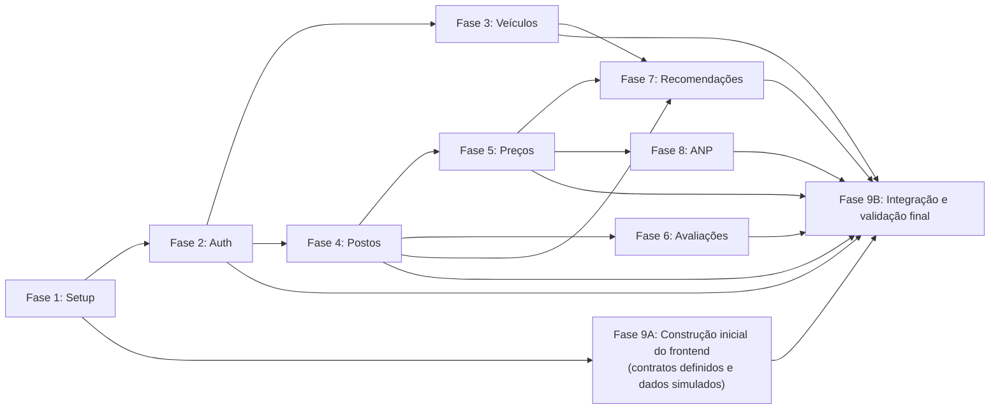
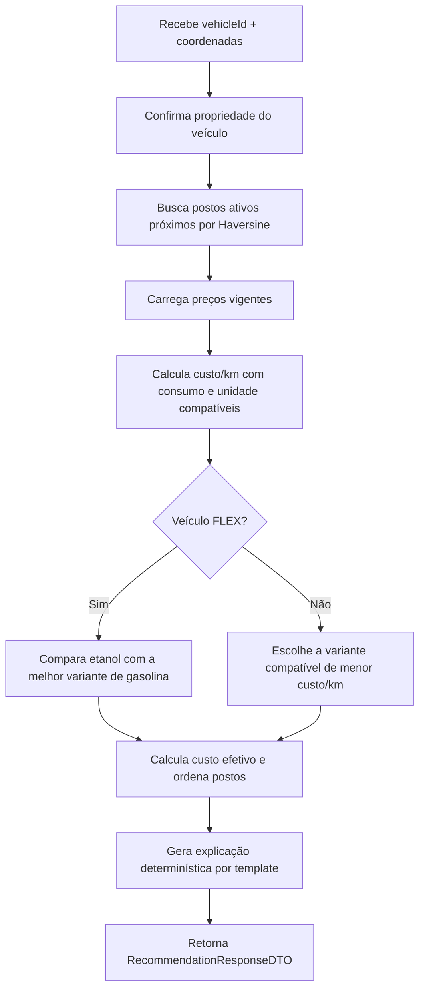
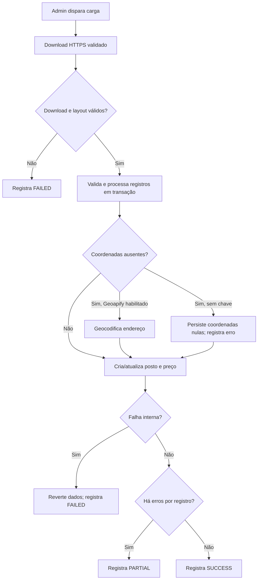

# Plano de Desenvolvimento — FuelFinder

## Descrição do Objetivo

Coordenar o plano de desenvolvimento detalhado e faseado do aplicativo **FuelFinder** — uma plataforma web responsiva para consulta, localização e comparação de preços de combustíveis no Brasil. Este documento mestre traduz as decisões registradas nos documentos de arquitetura, regras de negócio, padrões e stack tecnológica em fases incrementais e aponta o estado entregue e as pendências de cada área.

Os documentos detalhados das fases estão em `Plano/`. As orientações visuais do frontend e o estado da decisão sobre a biblioteca CSS estão em [`09-frontend-integracao.md`](./09-frontend-integracao.md); a referência LUNO Bootstrap está na pasta [`../Layout/`](../Layout/README.md), na raiz do repositório.

---

## User Review Required

> [!IMPORTANT]
> **Estrutura da pasta `Plano/`**: O plano de implementação compreende 10 documentos Markdown: um documento de visão geral e nove documentos, um para cada fase, com tarefas, dependências e critérios de aceitação. Este arquivo (`plano-desenvolvimento-fuelfinder.md`) é o documento mestre que descreve e coordena esses entregáveis.

> [!IMPORTANT]
> **Escopo MVP**: O plano cobre exclusivamente as funcionalidades do MVP. Funcionalidades Pós-MVP (OCR de totens, PostGIS, `ROLE_STATION_OPERATOR`, histórico de abastecimentos) são mencionadas apenas como referência futura.

---

## Pendências

> [!IMPORTANT]
> **IA — provedor e modelo Spring AI:** a escolha será feita futuramente. Manter a integração desacoplada e opcional; ela não pode impedir a inicialização da aplicação nem os fluxos essenciais do MVP.

> [!IMPORTANT]
> **Geoapify — chave para chamadas reais:** `GEOAPIFY_API_KEY` será necessária somente para testar chamadas reais ao serviço. Lê-la exclusivamente do ambiente; nunca incluir a chave no código ou em arquivos versionados. Documentar como habilitar a integração. Sem a variável, a aplicação e os demais fluxos devem continuar funcionando.

> [!IMPORTANT]
> **Frontend — decisão tomada:** o usuário aprovou a substituição do Tailwind por Bootstrap 5. O frontend está migrando para Bootstrap 5.2.3 via CDN, mantendo Vanilla JS, Leaflet e os fluxos existentes. A migração não está concluída até a validação funcional, visual e responsiva descrita na Fase 9.

## Pré-requisitos do Ambiente Local — Fase 1

Os itens abaixo são requisitos para executar e validar os comandos da fase 1, não decisões pendentes:

- JDK 21 LTS instalado e ativo.
- Maven 3.9 ou superior instalado.
- Docker e Docker Compose instalados e disponíveis para iniciar o PostgreSQL local.

Confirmar o ambiente com `java --version`, `mvn --version`, `docker --version` e `docker compose version`.

---

## Plano por Fases

Os documentos do plano já estão materializados em `Plano/`. O índice abaixo
mostra os entregáveis por fase; o estado atual, critérios pendentes e referências
específicas do frontend são mantidos em cada documento e em especial na Fase 9.

```text
Plano/
├── 00-visao-geral.md          # Visão geral, cronograma e dependências entre fases
├── 01-setup-infraestrutura.md # Setup do projeto, banco, migrações, configs
├── 02-autenticacao-usuarios.md # Auth, JWT, RBAC, gestão de contas
├── 03-veiculos.md             # CRUD de veículos e consumo informado
├── 04-postos-geolocalizacao.md # Postos, busca por proximidade, Haversine
├── 05-precos-combustiveis.md  # Preços, tipos de combustível, comparação
├── 06-avaliacoes-moderacao.md # Reviews, nota média, moderação admin
├── 07-recomendacoes.md        # Motor de recomendação, Spring AI, paridade
├── 08-integracao-anp.md       # Pipeline ETL da ANP, idempotência, auditoria
└── 09-frontend-integracao.md  # Interface web, Leaflet, referência LUNO/Bootstrap, deep links
```

---

### Detalhamento de cada documento

---

### `Plano/00-visao-geral.md`

Documento-mestre com:
- Visão geral da arquitetura e decisões técnicas
- Cronograma macro com as 9 fases
- Diagrama de dependências entre fases
- Critérios globais de qualidade
- Convenções de branch/commit (Conventional Commits)


```mermaid
flowchart LR
    F1["Fase 1: Setup"] --> F2["Fase 2: Auth"]
    F2 --> F3["Fase 3: Veículos"]
    F2 --> F4["Fase 4: Postos"]
    F4 --> F5["Fase 5: Preços"]
    F4 --> F6["Fase 6: Avaliações"]
    F3 --> F7["Fase 7: Recomendações"]
    F4 --> F7
    F5 --> F7
    F5 --> F8["Fase 8: ANP"]
    F1 --> F9A["Fase 9A: Construção inicial do frontend<br/>(contratos definidos e dados simulados)"]
    F9A --> F9B["Fase 9B: Integração e validação final"]
    F2 --> F9B
    F3 --> F9B
    F4 --> F9B
    F5 --> F9B
    F6 --> F9B
    F7 --> F9B
    F8 --> F9B
```

**Execução da Fase 9:** A construção inicial de telas e componentes pode começar em paralelo após a Fase 1, usando os contratos de API documentados e dados simulados. A integração com a API real e a validação final do frontend dependem da conclusão das Fases 2 a 8, incluindo os endpoints de avaliações (Fase 6) e os dados/importação ANP (Fase 8).

**Andamento da Fase 9 — migração visual:** em andamento na branch `feature/Danilo`. Bootstrap 5.2.3 foi adotado para substituir Tailwind; as páginas de busca/mapa, autenticação, veículos, recomendação, detalhe do posto e administração foram adaptadas ao grid e componentes Bootstrap. `mvn -q -f app\pom.xml test`, validação sintática dos módulos JavaScript e `git diff --check` passaram. Smoke visual em servidor estático confirmou ausência de overflow horizontal no mapa nas larguras testadas de 360 a 1440px e abertura do menu móvel; integração real de sessão/API e revisão visual de todos os estados continuam pendentes. A referência `Layout/` permanece somente para leitura.

---

### `Plano/01-setup-infraestrutura.md`

**Objetivo:** Configurar o projeto Spring Boot, banco de dados, migrações Flyway e toda a infraestrutura base.

**Tarefas:**

| # | Tarefa | Detalhes |
|---|--------|----------|
| 1.1 | Criar projeto Spring Boot 3.4 via Spring Initializr | Dependências: Web, JPA, Security, Validation, Flyway, PostgreSQL Driver, Springdoc OpenAPI |
| 1.2 | Configurar `pom.xml` com Java 21 e JJWT 0.12.6+ | Spring AI não é dependência obrigatória do MVP; adicionar um adaptador opcional somente após aprovação do provedor e modelo |
| 1.3 | Estruturar pacotes conforme `standards.md` | `com.fuelfinder.config`, `com.fuelfinder.common` e módulos em `com.fuelfinder.modules` (`auth`, `user`, `vehicle`, `station`, `fuel`, `price`, `review`, `recommendation`, `anp`) |
| 1.4 | Configurar `application.yml` / `application-dev.yml` | DataSource, JPA, Flyway, CORS, JWT secret/expiration |
| 1.5 | Docker Compose para PostgreSQL 16 | Container local para desenvolvimento |
| 1.6 | Criar migração Flyway `V1__initial_schema.sql` | Todas as 7 tabelas conforme ERD do `architecture.md` |
| 1.7 | Configurar tratamento global de exceções | `GlobalExceptionHandler` com ProblemDetail (RFC 7807) |
| 1.8 | Configurar CORS e WebMvc | Permitir origens do frontend |
| 1.9 | Configurar Swagger/OpenAPI | Endpoint `/swagger-ui.html` funcional |
| 1.10 | Criar `V2__seed_fuel_types.sql` | Dados iniciais dos tipos de combustível (GASOLINE_REGULAR, ETHANOL, DIESEL_S10, etc.) |

**Arquivos principais a criar:**

```text
pom.xml
docker-compose.yml
src/main/resources/application.yml
src/main/resources/application-dev.yml
src/main/resources/db/migration/V1__initial_schema.sql
src/main/resources/db/migration/V2__seed_fuel_types.sql
src/main/java/com/fuelfinder/FuelFinderApplication.java
src/main/java/com/fuelfinder/config/WebConfig.java
src/main/java/com/fuelfinder/config/OpenApiConfig.java
src/main/java/com/fuelfinder/common/exception/GlobalExceptionHandler.java
src/main/java/com/fuelfinder/common/util/HaversineCalculator.java
```

**Migração SQL (esquema):**

```sql
-- V1__initial_schema.sql
CREATE TABLE users (
    id UUID PRIMARY KEY DEFAULT gen_random_uuid(),
    email VARCHAR(255) NOT NULL UNIQUE,
    password_hash VARCHAR(255) NOT NULL,
    full_name VARCHAR(255) NOT NULL,
    role VARCHAR(30) NOT NULL DEFAULT 'ROLE_DRIVER',
    status VARCHAR(20) NOT NULL DEFAULT 'ACTIVE',
    created_at TIMESTAMP NOT NULL DEFAULT NOW(),
    updated_at TIMESTAMP NOT NULL DEFAULT NOW()
);

CREATE TABLE vehicles (
    id UUID PRIMARY KEY DEFAULT gen_random_uuid(),
    user_id UUID NOT NULL REFERENCES users(id),
    nickname VARCHAR(50) NOT NULL,
    brand VARCHAR(100) NOT NULL,
    model VARCHAR(100) NOT NULL,
    year_manufacture INTEGER NOT NULL,
    fuel_type_accepted VARCHAR(20) NOT NULL,
    tank_capacity DECIMAL(6,2) NOT NULL,
    avg_consumption_gasoline DECIMAL(5,2),
    avg_consumption_ethanol DECIMAL(5,2),
    created_at TIMESTAMP NOT NULL DEFAULT NOW(),
    updated_at TIMESTAMP NOT NULL DEFAULT NOW()
);

CREATE TABLE stations (
    id UUID PRIMARY KEY DEFAULT gen_random_uuid(),
    cnpj VARCHAR(18) NOT NULL UNIQUE,
    corporate_name VARCHAR(255) NOT NULL,
    trade_name VARCHAR(255),
    brand VARCHAR(100),
    street VARCHAR(255),
    number VARCHAR(20),
    neighborhood VARCHAR(100),
    city VARCHAR(100) NOT NULL,
    state CHAR(2) NOT NULL,
    postal_code VARCHAR(10),
    latitude DECIMAL(10,7),
    longitude DECIMAL(10,7),
    average_rating DECIMAL(3,2) DEFAULT 0.00,
    total_reviews INTEGER DEFAULT 0,
    status VARCHAR(20) NOT NULL DEFAULT 'ACTIVE',
    created_at TIMESTAMP NOT NULL DEFAULT NOW(),
    updated_at TIMESTAMP NOT NULL DEFAULT NOW()
);

CREATE TABLE fuel_types (
    id UUID PRIMARY KEY DEFAULT gen_random_uuid(),
    code VARCHAR(50) NOT NULL UNIQUE,
    name VARCHAR(100) NOT NULL,
    unit_of_measure VARCHAR(20) NOT NULL DEFAULT 'R$/litro',
    active BOOLEAN NOT NULL DEFAULT TRUE
);

CREATE TABLE fuel_prices (
    id UUID PRIMARY KEY DEFAULT gen_random_uuid(),
    station_id UUID NOT NULL REFERENCES stations(id),
    fuel_type_id UUID NOT NULL REFERENCES fuel_types(id),
    sale_value DECIMAL(8,3) NOT NULL,
    collection_date DATE NOT NULL,
    data_source VARCHAR(30) NOT NULL DEFAULT 'MANUAL_ADMIN',
    created_at TIMESTAMP NOT NULL DEFAULT NOW(),
    updated_at TIMESTAMP NOT NULL DEFAULT NOW(),
    UNIQUE(station_id, fuel_type_id, collection_date)
);

CREATE TABLE reviews (
    id UUID PRIMARY KEY DEFAULT gen_random_uuid(),
    user_id UUID NOT NULL REFERENCES users(id),
    station_id UUID NOT NULL REFERENCES stations(id),
    rating INTEGER NOT NULL CHECK (rating BETWEEN 1 AND 5),
    comment VARCHAR(500),
    status VARCHAR(20) NOT NULL DEFAULT 'APPROVED',
    created_at TIMESTAMP NOT NULL DEFAULT NOW(),
    updated_at TIMESTAMP NOT NULL DEFAULT NOW(),
    UNIQUE(user_id, station_id)
);

CREATE TABLE anp_import_logs (
    id UUID PRIMARY KEY DEFAULT gen_random_uuid(),
    file_name VARCHAR(255) NOT NULL,
    reference_year SMALLINT NOT NULL CHECK (reference_year BETWEEN 1000 AND 9999),
    reference_semester SMALLINT NOT NULL CHECK (reference_semester IN (1, 2)),
    source_url VARCHAR(500),
    import_start TIMESTAMP NOT NULL,
    import_end TIMESTAMP,
    total_records_read INTEGER DEFAULT 0,
    total_records_imported INTEGER DEFAULT 0,
    total_records_ignored INTEGER DEFAULT 0,
    total_records_failed INTEGER DEFAULT 0,
    status VARCHAR(20) NOT NULL DEFAULT 'FAILED',
    error_details TEXT,
    triggered_by UUID REFERENCES users(id)
);
```

O trecho representa o modelo-alvo documentado. O banco atual usa `reference_period`;
a alteração requer uma migração futura que converta os valores existentes antes
de remover/substituir a coluna antiga. Não editar migrações Flyway já aplicadas.

O SQL acima representa somente o ponto de partida da migração V1. A migração
V4 passa a armazenar capacidade e consumo com valor e unidade (`*_value`,
`*_unit`), inclui consumos de diesel e CNG e valida a compatibilidade entre
combustível e unidade. Veículos CNG usam m³ e km/m³; os demais usam litros e km/L.
Capacidades CNG legadas são convertidas de litros para m³ por divisão por 1.000,
mantendo cinco casas decimais para preservar os valores antigos. Consumos CNG
legados são preservados numericamente e classificados como km/m³.

**Critérios de aceitação:**
- ✅ `mvn clean compile` executa sem erros
- ✅ Aplicação inicia e conecta ao PostgreSQL
- ✅ Flyway aplica as migrações automaticamente
- ✅ Swagger UI acessível em `/swagger-ui.html`
- ✅ `fuel_types` populada com dados de seed

---

### `Plano/02-autenticacao-usuarios.md`

**Objetivo:** Implementar autenticação JWT, registro de motoristas, login, refresh token, logout e gestão de perfis RBAC.

**Tarefas:**

| # | Tarefa | Detalhes |
|---|--------|----------|
| 2.1 | Criar entidade `User` (@Entity) | Com campos do ERD, enum `Role` e `AccountStatus` |
| 2.2 | Criar `UserRepository` | Método `findByEmail(String email)` |
| 2.3 | Criar DTOs de Auth | `RegisterRequestDTO`, `LoginRequestDTO`, `AuthResponseDTO`, `UserProfileDTO`; o refresh token chega pelo cookie HttpOnly, sem DTO/body próprio |
| 2.4 | Implementar `JwtService` | Geração e validação de access JWT de curta duração com claims `sub`, `role`, `sid` e `exp` (JJWT 0.12.6); duração configurável |
| 2.5 | Implementar `JwtAuthenticationFilter` | `OncePerRequestFilter` que extrai token do header `Authorization: Bearer ...` |
| 2.6 | Criar persistência de sessões | Entidades `AuthSession` e `RefreshToken`, repositórios e migração Flyway; armazenar hashes de tokens e manter tokens consumidos para detectar reutilização |
| 2.7 | Implementar rotação de refresh token | Emitir tokens opacos, persistir somente hashes, invalidar token anterior em cada renovação e revogar a sessão em caso de reutilização |
| 2.8 | Integrar validação de sessão ao `JwtAuthenticationFilter` | Em cada rota protegida, validar sessão ativa e status `ACTIVE` do usuário após validar o JWT |
| 2.9 | Configurar `SecurityConfig` | Rotas públicas (`/auth/register`, `/auth/login`, `/auth/refresh`), dados de domínio protegidos, RBAC e validação de origem/CSRF para endpoints que usam cookies |
| 2.10 | Implementar `AuthService` | Registro, login, refresh rotativo, logout da sessão atual e revogação de todas as sessões do usuário |
| 2.11 | Implementar `AuthController` | `POST /auth/register`, `POST /auth/login`, `POST /auth/logout`, `POST /auth/refresh`, `POST /auth/sessions/revoke-all`, `GET /auth/me` |
| 2.12 | Implementar `PATCH /users/me` | Atualização de dados cadastrais do próprio usuário |
| 2.13 | Implementar bloqueio imediato de conta | Bloquear login e refresh, revogar todas as sessões e negar acesso protegido por verificação de status |
| 2.14 | Testes unitários | AuthService, JwtService e RefreshTokenService: expiração de access/refresh, rotação, reutilização, logout, revogação global e conta bloqueada |
| 2.15 | Testes de integração | AuthController e filtros de segurança com MockMvc, incluindo rejeição de access JWT expirado ou sessão revogada |

**Endpoints implementados:**

| Método | Rota | Acesso | Status |
|--------|------|--------|--------|
| `POST` | `/auth/register` | Público | `201 Created` |
| `POST` | `/auth/login` | Público | `200 OK` |
| `POST` | `/auth/logout` | Autenticado; revoga a sessão atual | `204 No Content` |
| `POST` | `/auth/sessions/revoke-all` | Autenticado; revoga todas as sessões do usuário | `204 No Content` |
| `POST` | `/auth/refresh` | Público; exige refresh token válido e rotaciona-o | `200 OK` |
| `GET`  | `/auth/me` | Autenticado | `200 OK` |
| `PATCH`| `/users/me` | Autenticado | `200 OK` |

**Regras de negócio implementadas:**
- E-mail único (409 Conflict em duplicata)
- Senha com mínimo de 8 caracteres, uma maiúscula, uma minúscula, um número e um caractere especial; hash BCrypt com custo mínimo 12
- Access JWT de curta duração configurável com claims `sub: userId`, `role`, `sid: sessionId`, `exp`
- Refresh token opaco de uso único; somente seu hash é persistido no servidor
- Reutilização de refresh token rotacionado revoga a sessão associada
- Logout revoga a sessão atual; endpoint de revogação global revoga todas as sessões do usuário
- Rotas protegidas validam sessão ativa e conta `ACTIVE`; conta BLOCKED não pode autenticar ou renovar tokens e perde acesso imediatamente

**Critérios de aceitação:**
- ✅ Registro cria usuário com `ROLE_DRIVER` e `ACTIVE`
- ✅ Login retorna access JWT de curta duração e refresh token
- ✅ Access JWT e refresh token expirados são rejeitados; refresh válido é rotacionado e não pode ser reutilizado
- ✅ Logout invalida a sessão e seus tokens; revogação global invalida todas as sessões do usuário
- ✅ Conta BLOCKED não pode renovar tokens e perde imediatamente acesso às rotas protegidas
- ✅ Rotas protegidas rejeitam requisição sem token (401)
- ✅ Rotas ADMIN rejeitam motorista (403)
- ✅ E-mail duplicado retorna 409

---

### `Plano/03-veiculos.md`

**Objetivo:** CRUD completo de veículos vinculados ao motorista autenticado, com validação de consumo informado.

**Tarefas:**

| # | Tarefa | Detalhes |
|---|--------|----------|
| 3.1 | Criar entidade `Vehicle` | Enum `FuelTypeAccepted`: GASOLINE, ETHANOL, FLEX, DIESEL, CNG |
| 3.2 | Criar `VehicleRepository` | `findByUserId(UUID)`, `findByIdAndUserId(UUID, UUID)` |
| 3.3 | Criar DTOs | `CreateVehicleRequestDTO`, `UpdateVehicleRequestDTO`, `VehicleResponseDTO` |
| 3.4 | Criar `VehicleMapper` | Conversão Entity ↔ DTO |
| 3.5 | Implementar `VehicleService` | CRUD com verificação de ownership (`user_id`) |
| 3.6 | Implementar `VehicleController` | 5 endpoints com `@PreAuthorize("hasRole('DRIVER')")` |
| 3.7 | Validações de negócio | Ano: [1950, ano atual+1], consumo: [1.0, 40.0] km/L, FLEX exige ambos consumos |
| 3.8 | Testes | Unitários + integração |

**Endpoints:**

| Método | Rota | Acesso | Status |
|--------|------|--------|--------|
| `POST` | `/vehicles` | `ROLE_DRIVER` | `201 Created` |
| `GET`  | `/vehicles` | `ROLE_DRIVER` | `200 OK` |
| `GET`  | `/vehicles/{id}` | `ROLE_DRIVER` | `200 OK` |
| `PATCH`| `/vehicles/{id}` | `ROLE_DRIVER` | `200 OK` |
| `DELETE`| `/vehicles/{id}` | `ROLE_DRIVER` | `204 No Content` |

**Critérios de aceitação:**
- ✅ Motorista só acessa seus próprios veículos
- ✅ Veículo FLEX exige ambos consumos (gasolina e etanol)
- ✅ Validação numérica de consumo [1.0, 40.0]
- ✅ Ano de fabricação entre 1950 e ano corrente + 1

---

### `Plano/04-postos-geolocalizacao.md`

**Objetivo:** CRUD de postos, busca por proximidade com Fórmula de Haversine, e visualização geolocalizada.

**Tarefas:**

| # | Tarefa | Detalhes |
|---|--------|----------|
| 4.1 | Criar entidade `Station` | Com todos os campos do ERD |
| 4.2 | Criar `StationRepository` | Consultas por janela geográfica e status para reduzir candidatos |
| 4.3 | Implementar `HaversineCalculator` | Classe utilitária em `com.fuelfinder.common.util` |
| 4.4 | Criar DTOs | `StationRequestDTO`, `StationResponseDTO`, `StationSummaryDTO` (com distância) |
| 4.5 | Implementar `StationService` | Busca por raio (latitude, longitude, radiusKm), CRUD admin |
| 4.6 | Implementar `StationController` | GET público, POST/PATCH/DELETE para ADMIN |
| 4.7 | Busca geográfica no MVP | Calcular a distância exata com Haversine na aplicação Java e ordenar por distância |
| 4.8 | Testes | Unitários + integração com dados de teste geolocalizados |

**Busca por raio no MVP:** `StationRepository` limita candidatos por status e
janela de latitude/longitude, considerando antimeridiano e polos.
`StationService` calcula a distância exata com `HaversineCalculator`, filtra
pelo raio e ordena os postos em memória. PostGIS não é requisito desta fase.

**Endpoints:**

| Método | Rota | Acesso | Status |
|--------|------|--------|--------|
| `GET`  | `/stations` | `ROLE_DRIVER` / `ROLE_ADMIN` | `200 OK` |
| `GET`  | `/stations/{id}` | `ROLE_DRIVER` / `ROLE_ADMIN` | `200 OK` |
| `POST` | `/stations` | ADMIN | `201 Created` |
| `PATCH`| `/stations/{id}` | ADMIN | `200 OK` |
| `DELETE`| `/stations/{id}` | ADMIN | `204 No Content` |

**Critérios de aceitação:**
- ✅ Busca por latitude/longitude/raio retorna postos ordenados por distância
- ✅ CNPJ único por posto (409 em duplicata)
- ✅ DELETE faz inativação lógica (`INACTIVE`), não exclusão física
- ✅ Postos `INACTIVE` não aparecem em buscas de usuários autenticados

---

### `Plano/05-precos-combustiveis.md`

**Objetivo:** Gestão de preços de combustíveis por posto, catálogo de tipos de combustível e endpoint de comparação.

**Tarefas:**

| # | Tarefa | Detalhes |
|---|--------|----------|
| 5.1 | Criar entidade `FuelType` | Enum code: GASOLINE_REGULAR, GASOLINE_PREMIUM, ETHANOL, DIESEL_S10, DIESEL_S500, CNG |
| 5.2 | Criar entidade `FuelPrice` | Com constraint unique (station_id, fuel_type_id, collection_date) |
| 5.3 | Criar repositórios | `FuelTypeRepository`, `FuelPriceRepository` |
| 5.4 | Criar DTOs | `FuelPriceRequestDTO`, `FuelPriceResponseDTO`, `CompareResultDTO` |
| 5.5 | Implementar `FuelPriceService` | CRUD de preços, comparação ordenada por preço/distância |
| 5.6 | Implementar `FuelPriceController` | Endpoints de preço e comparação |
| 5.7 | Fórmulas de domínio | Custo tanque cheio, custo por km, autonomia estimada |
| 5.8 | Testes | Cálculos com valores conhecidos |

**Endpoints:**

| Método | Rota | Acesso | Status |
|--------|------|--------|--------|
| `GET`  | `/stations/{id}/fuel-prices` | `ROLE_DRIVER` / `ROLE_ADMIN` | `200 OK` |
| `POST` | `/stations/{id}/fuel-prices` | ADMIN | `201 Created` |
| `PATCH`| `/stations/{id}/fuel-prices/{priceId}` | ADMIN | `200 OK` |
| `GET`  | `/fuel-prices/compare` | `ROLE_DRIVER` / `ROLE_ADMIN` | `200 OK` |

**Fórmulas implementadas:**
- Custo Tanque Cheio = `tankCapacity × pricePerLiter`
- Autonomia Estimada = `tankCapacity × avgConsumption`
- Custo por KM = `pricePerLiter / avgConsumption`
- Custo Efetivo Total = `custoAbastecimento + (2 × distância × custoPorKm)`

**Critérios de aceitação:**
- ✅ Data de coleta ANP exibida em todo preço
- ✅ Comparação ordena por preço e/ou distância
- ✅ Preço com `data_source` (ANP_IMPORT ou MANUAL_ADMIN)

---

### `Plano/06-avaliacoes-moderacao.md`

**Objetivo:** Sistema de avaliações com nota (1-5 estrelas) e comentário, nota média agregada e moderação administrativa.

**Tarefas:**

| # | Tarefa | Detalhes |
|---|--------|----------|
| 6.1 | Criar entidade `Review` | Com constraint unique (user_id, station_id) |
| 6.2 | Criar `ReviewRepository` | `findByStationIdAndStatus`, `findByUserIdAndStationId` |
| 6.3 | Criar DTOs | `CreateReviewRequestDTO`, `ReviewResponseDTO` |
| 6.4 | Implementar `ReviewService` | Criar/editar review, recalcular nota média do posto |
| 6.5 | Implementar `ReviewController` | CRUD com RBAC (motorista cria, admin modera) |
| 6.6 | Lógica de nota média | Atualizar `station.average_rating` e `station.total_reviews` |
| 6.7 | Testes | Unitários (recálculo) + integração |

**Endpoints:**

| Método | Rota | Acesso | Status |
|--------|------|--------|--------|
| `GET`  | `/stations/{id}/reviews` | `ROLE_DRIVER` / `ROLE_ADMIN` | `200 OK` |
| `POST` | `/stations/{id}/reviews` | `ROLE_DRIVER` | `201 Created` |
| `PATCH`| `/reviews/{id}` | `ROLE_DRIVER` (própria) | `200 OK` |
| `PATCH`| `/reviews/{id}/moderation` | `ROLE_ADMIN` | `200 OK` |
| `DELETE`| `/reviews/{id}` | `ROLE_DRIVER` (própria) / `ROLE_ADMIN` | `204 No Content` |

**Regras:**
- 1 avaliação por motorista por posto (upsert), preservando o status de moderação existente
- Nota: inteiro 1-5
- Comentário: opcional, máx 500 chars
- Nota média = soma das notas APPROVED / total APPROVED
- Novas avaliações iniciam `APPROVED`; Admin pode aprovar/rejeitar/excluir

**Critérios de aceitação:**
- [x] Nova avaliação do mesmo motorista para o mesmo posto atualiza a existente
- [x] Nota média do posto recalculada em cada operação
- [x] Apenas avaliações APPROVED contam na média
- [x] Admin pode moderar (aprovar/rejeitar)

---

### `Plano/07-recomendacoes.md`

**Objetivo:** Motor determinístico de recomendação de combustível com paridade personalizada; explicações por IA são uma integração opcional e desacoplada, sujeita à aprovação do provedor/modelo.

**Tarefas:**

| # | Tarefa | Detalhes |
|---|--------|----------|
| 7.1 | Implementar `RecommendationService` | Reutiliza veículo do condutor, postos ativos por Haversine e preços vigentes |
| 7.2 | Criar DTOs | Resposta inclui combustível recomendado, explicação, paridade quando aplicável e opções com unidade |
| 7.3 | Implementar `RecommendationController` | `GET /recommendations/fuel`, restrito a `ROLE_DRIVER` |
| 7.4 | Selecionar combustível pelo custo/km | FLEX compara etanol e variantes de gasolina; GASOLINE e DIESEL comparam suas variantes; ETHANOL e CNG usam tipo único |
| 7.5 | Calcular custo efetivo com deslocamento | Tanque completo mais ida e volta; ordenar opções do combustível recomendado |
| 7.6 | Criar testes unitários e de integração | FLEX, combustíveis únicos, variantes, unidades CNG, autorização, propriedade e erros |

**Endpoint:**

| Método | Rota | Acesso | Status |
|--------|------|--------|--------|
| `GET`  | `/recommendations/fuel?vehicleId=...&latitude=...&longitude=...&radiusKm=...` | `ROLE_DRIVER` | `200 OK` |

**Lógica de decisão:**


```mermaid
flowchart TD
    A["Recebe vehicleId + coordenadas"] --> B["Confirma propriedade do veículo"]
    B --> C["Busca postos ativos próximos por Haversine"]
    C --> D["Carrega preços vigentes"]
    D --> E["Calcula custo/km com consumo e unidade compatíveis"]
    E --> F{"Veículo FLEX?"}
    F -- Sim --> G["Compara etanol com a melhor variante de gasolina"]
    F -- Não --> H["Escolhe a variante compatível de menor custo/km"]
    G --> I["Calcula custo efetivo e ordena postos"]
    H --> I
    I --> J["Gera explicação determinística por template"]
    J --> K["Retorna RecommendationResponseDTO"]
```

**Critérios de aceitação:**
- ✅ Recomendação correta para veículo FLEX com dados reais
- ✅ Veículos de combustível único recebem recomendação entre os preços compatíveis
- ✅ Preços, consumo e capacidade respeitam as unidades de líquidos e CNG
- ✅ Custo efetivo inclui deslocamento ida+volta
- ✅ Opções do código recomendado são ordenadas por custo efetivo crescente
- ✅ Fluxo e explicação determinística funcionam sem IA configurada
- ✅ A integração de IA permanece opcional e pendente de aprovação do provedor/modelo

---

### `Plano/08-integracao-anp.md`

**Objetivo:** Pipeline ETL para ingestão segura dos arquivos semestrais da ANP (CSV/TSV direto ou ZIP contendo CSV), com resiliência, idempotência e auditoria.

**Tarefas:**

| # | Tarefa | Detalhes |
|---|--------|----------|
| 8.1 | Auditoria | `AnpImportLog`, repositório, DTOs e estados `SUCCESS`, `PARTIAL`, `FAILED` |
| 8.2 | Download seguro | Hosts HTTPS oficiais permitidos, sem redirects, timeouts e limites configuráveis para download/descompactação |
| 8.3 | Parsing CSV/TSV e ZIP | Validar ZIP e CSV interno; identificar delimitador pelo cabeçalho/consistência, tratar BOM/charset, cabeçalhos e linhas inválidas |
| 8.4 | Números ANP | Reconhecer formatos numéricos reais, incluindo vírgula decimal, sem confundir com o delimitador `;` |
| 8.5 | Período | Entrada e auditoria com campos separados `referenceYear` (quatro algarismos) e `referenceSemester` (`1` ou `2`); migração preserva dados existentes |
| 8.6 | Cadastro controlado de postos | Resolver por CNPJ normalizado; criar apenas com identificador e campos obrigatórios válidos; não duplicar nem persistir preço sem posto resolvido |
| 8.7 | Idempotência | Chave efetiva `(station_id, fuel_type_id, collection_date)`; atualizar apenas preço alterado |
| 8.8 | Geocodificação opcional | Geoapify via `GEOAPIFY_API_KEY`; importar sem coordenadas quando ausente |
| 8.9 | Auditoria e resumo | Exibir registros lidos, importados, ignorados e falhos; razões úteis por linha; fechar previamente as definições dos contadores |
| 8.10 | Controller Admin | Atualizar contrato `POST /admin/anp/import`, histórico e formulário administrativo para o período separado |
| 8.11 | Testes | CSV/TSV e ZIP, delimitadores/formatos numéricos, cabeçalhos, registros inválidos, posto existente/novo, falha de cadastro, idempotência e RBAC |

**Fluxo ETL:**


```mermaid
flowchart TD
    A["Admin dispara carga"] --> B["Download HTTPS validado"]
    B --> C{"Download e layout válidos?"}
    C -- Não --> D["Registra FAILED"]
    C -- Sim --> E["Valida e processa registros em transação"]
    E --> F{"Coordenadas ausentes?"}
    F -- Não --> G["Cria/atualiza posto e preço"]
    F -- Sim, Geoapify habilitado --> H["Geocodifica endereço"]
    F -- Sim, sem chave --> I["Persiste coordenadas nulas; registra erro"]
    H --> G
    I --> G
    G --> J{"Falha interna?"}
    J -- Sim --> K["Reverte dados; registra FAILED"]
    J -- Não --> L{"Há erros por registro?"}
    L -- Sim --> M["Registra PARTIAL"]
    L -- Não --> N["Registra SUCCESS"]
```

**Critérios já atendidos pela entrega inicial:**
- [x] Carga idempotente; preço alterado atualiza o registro existente
- [x] Falha interna reverte os dados da carga e preserva dados anteriores
- [x] Log completo com URL segura, período, usuário, totais, status e erros
- [x] CNPJ, catálogo de produtos, datas, preços e unidades validados
- [x] Geocodificação Geoapify opcional; ausência da chave permite funcionamento
- [x] Endpoints protegidos por `ROLE_ADMIN`
- [x] Testes unitários e de integração passam, incluindo cobertura de 100% das linhas

**Critérios adicionais planejados, ainda não implementados:**
- [ ] ZIP contendo CSV validado com limites de segurança; múltiplos CSVs tratados sem seleção silenciosa
- [ ] Parser identifica delimitador e separador decimal com amostras oficiais ANP
- [ ] Posto criado de forma controlada quando não existe, sem preço associado a registro inválido
- [ ] Resumo consistente de linhas lidas, importadas, ignoradas e falhas com mensagens úteis
- [ ] Período submetido e persistido como ano e semestre separados, com migração progressiva

Ver detalhes do contrato, comportamento e validação em
[`08-integracao-anp.md`](./08-integracao-anp.md).

---

### `Plano/09-frontend-integracao.md`

**Objetivo:** Interface web responsiva com mapa Leaflet, consumo da API REST, autenticação JWT no cliente, deep links de navegação e direção visual orientada pelo LUNO/Bootstrap 5. A decisão de substituir Tailwind por Bootstrap 5.2.3 via CDN foi aprovada; migração visual em andamento, sem carregar ambos os frameworks em conjunto.

**Tarefas:**

| # | Tarefa | Detalhes |
|---|--------|----------|
| 9.1 | Estruturar projeto frontend | Preservar HTML5 + Vanilla JS ES modules e Leaflet; substituir Tailwind por Bootstrap 5.2.3 via CDN e CSS próprio |
| 9.2 | Página de Login / Registro | Access token só em memória; refresh token em cookie HttpOnly |
| 9.3 | Header com navegação | Navbar responsiva e identificação do usuário logado |
| 9.4 | Mapa principal com Leaflet 1.9.4 | Marcadores e preços buscados sob demanda da API |
| 9.5 | Geolocation API | Permissão GPS e fallback para busca textual |
| 9.6 | Lista de postos | Nome, bandeira, distância e nota; preços no popup e detalhes |
| 9.7 | Detalhes do posto | Preços/data de coleta, avaliações e botões de rota |
| 9.8 | Botão "Rotas" | Deep links seguros para Google Maps e Waze |
| 9.9 | Tela de veículos | CRUD integrado; capacidade/consumo com unidades de domínio |
| 9.10 | Tela de recomendação | Resultado determinístico, explicação, paridade e opções |
| 9.11 | Painel Admin | Gestão de postos, preços, fila de moderação e carga ANP |
| 9.12 | Interceptor Fetch com JWT | Adicionar `Authorization: Bearer ...` em todas as requests |
| 9.13 | Responsividade | Grid Bootstrap e breakpoints nativos mais pontos customizados LUNO; mobile-first sem overflow e com mapa/lista adaptáveis |
| 9.14 | Acessibilidade | HTML semântico, foco visível, labels e regiões `aria-live` |
| 9.15 | Sessão segura no frontend | Manter access token só em memória; usar cookie de refresh `HttpOnly`, `SameSite` e `Secure` em produção, com rotação, logout que revoga sessão/limpa cookie e proteção CSRF; enviar credenciais via Fetch somente aos endpoints que usam o cookie; nunca registrar tokens em logs ou URLs |
| 9.16 | Home pública e entrada autenticada | Raiz apresenta produto/benefícios e login; mapa e áreas internas exigem sessão na UI; destino interno seguro é preservado após login |
| 9.17 | Autorização de conteúdo | Proteger telas internas e APIs de dados no servidor; somente login/cadastro e endpoints mínimos de autenticação permanecem públicos |
| 9.18 | Navegação responsiva | Adaptar navegação para cabeçalho e menu recolhível próximo de 1200px; fechar por controle, navegação e Escape, com foco e seção atual acessíveis |
| 9.19 | Referência visual e respiro | Adaptar paleta, tipografia, espaçamento e componentes documentados em [`09-frontend-integracao.md`](./09-frontend-integracao.md) a partir de [`../Layout/`](../Layout/README.md); não copiar assets sem verificar licença |
| 9.20 | Mapa com posição atual | Após login e consentimento, centralizar mapa e carregar postos próximos automaticamente; apresentar carregamento e fallback manual |
| 9.21 | Estados de tela | Planejar estados de carregamento, vazio, sucesso e erro nas operações relevantes |

**Critérios já atendidos pela entrega inicial:**
- ✅ Leaflet/OSM, GPS, busca textual, lista e marcadores integrados
- ✅ Detalhes mostram preços e data de coleta; rotas abrem Maps ou Waze
- ✅ Autenticação, veículos, avaliações e recomendações integram a API real
- ✅ Admin inclui postos, preços, moderação por status e importação ANP
- ✅ JWT não persiste em storage; cookie é enviado só nos endpoints próprios
- ✅ **Estado da entrega inicial:** assets estáticos públicos e autorização por endpoint; algumas leituras de domínio também estão públicas. Restringir telas e APIs internas está planejado abaixo.
- ✅ Interface responsiva, semântica, teclado acessível e feedback `aria-live`
- ✅ Testes de integração verificam acesso público a assets e RBAC da moderação

**Critérios adicionais planejados, ainda não implementados:**
- [x] Home pública é a página inicial padrão; botão Entrar abre login e o login não duplica essa ação no cabeçalho
- [x] Busca/mapa movido para `map.html`, com sessão requerida no controle do frontend; login/registro retorna ao mapa por padrão
- [x] Navegação e conteúdo reagem a mudanças de sessão; links e ações são condicionados à autenticação e papel
- [ ] Validar integração da home e navegação com sessão/API real e confirmar autorização server-side das páginas internas
- [ ] Retorno após login funciona apenas para destino interno autorizado, sem open redirect
- [ ] APIs de leitura de postos, preços e avaliações exigem `ROLE_DRIVER` ou `ROLE_ADMIN`
- [ ] Navegação responsiva no cabeçalho, com comportamento desktop/mobile e acessibilidade verificados
- [ ] Mapa solicita permissão ao entrar; após autorização centra na posição e carrega postos automaticamente
- [ ] Recusa/erro/indisponibilidade de GPS permite localização manual e não bloqueia o restante do sistema
- [ ] Espaçamento consistente, áreas de toque adequadas e estados loading/empty/success/error validados
- [ ] Concluir a migração e validar todas as telas FuelFinder com o sistema visual LUNO/Bootstrap, sem copiar conteúdo demonstrativo e com toda a interface em pt-BR
- [ ] Validar a versão Bootstrap 5.2.3 carregada e avaliar integridade/reprodutibilidade da dependência CDN para o modo de entrega do projeto
- [ ] Validar os estados de autenticação, formulários, administração e respostas da API em ambiente integrado; o smoke test estático não fornece endpoints reais
- [ ] Validar licenças antes de reutilizar assets/fontes do template e preferir CSS próprio enxuto aos bundles e plugins não usados

Estado atual, diretrizes de referência e instruções de validação em
[`09-frontend-integracao.md`](./09-frontend-integracao.md).

---

## Verificação Final (Verification Plan)

### Automated Tests

```bash
# Testes unitários e de integração
mvn clean test

# Verificar compilação
mvn clean compile

# Verificar que a aplicação inicia
mvn spring-boot:run
```

Antes de iniciar localmente, configure `JWT_SECRET` com pelo menos 32 bytes; consulte [01-setup-infraestrutura.md](./01-setup-infraestrutura.md) para o comando PowerShell que gera um segredo temporário sem gravá-lo no repositório.

### Manual Verification

1. **Auth Flow:** Registrar → Login → Acessar rota protegida → Logout
2. **Vehicle CRUD:** Criar veículo FLEX → Verificar ambos consumos → Editar → Deletar
3. **Station Search:** Buscar por GPS → Verificar marcadores no mapa → Clicar "Rotas"
4. **Price Comparison:** Comparar postos por preço → Verificar ordenação
5. **Review Flow:** Avaliar posto → Verificar nota média atualizada → Admin modera
6. **Recommendation:** Selecionar veículo FLEX → Obter recomendação → Verificar paridade
7. **ANP Import:** Importar CSV e ZIP contendo CSV de teste → Validar delimitadores e vírgula decimal, criar/localizar posto e confirmar contadores; reexecutar para verificar idempotência
8. **Responsive:** Testar nos breakpoints documentados em `09-frontend-integracao.md`, incluindo 360/375px, 567/576px, 640px, 768px, 992/1024px, 1200/1280px e 1400/1440px
9. **Swagger:** Verificar todos os endpoints documentados em `/swagger-ui.html`

---

## Resumo de Branches (Conventional Commits)

| Fase | Branch | Exemplo de Commit |
|------|--------|-------------------|
| 1 | `feature/setup-infraestrutura` | `chore: setup spring boot project with flyway and postgresql` |
| 2 | `feature/autenticacao-jwt` | `feat: implement JWT auth with registration and login` |
| 3 | `feature/veiculos` | `feat: add vehicle CRUD with consumption validation` |
| 4 | `feature/postos-geolocalizacao` | `feat: implement station search with Haversine distance` |
| 5 | `feature/precos-combustiveis` | `feat: add fuel prices and comparison endpoint` |
| 6 | `feature/avaliacoes` | `feat: implement reviews with rating aggregation` |
| 7 | `feature/recomendacoes` | `feat: add deterministic fuel recommendation engine` |
| 8 | `feature/integracao-anp` | `feat: implement ANP ETL pipeline with idempotency` |
| 9 | `feature/frontend-leaflet` | `feat: build responsive frontend with Leaflet map` |
