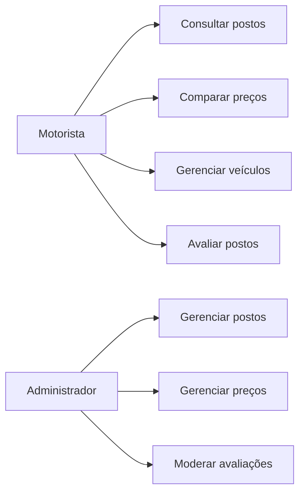
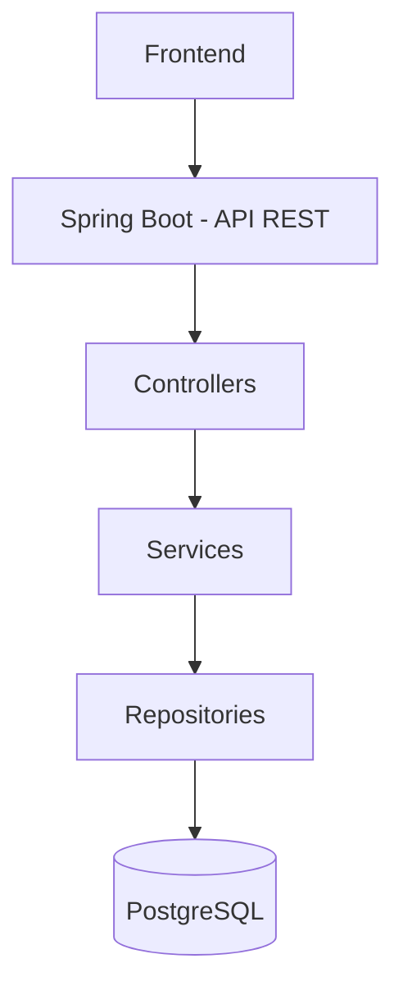
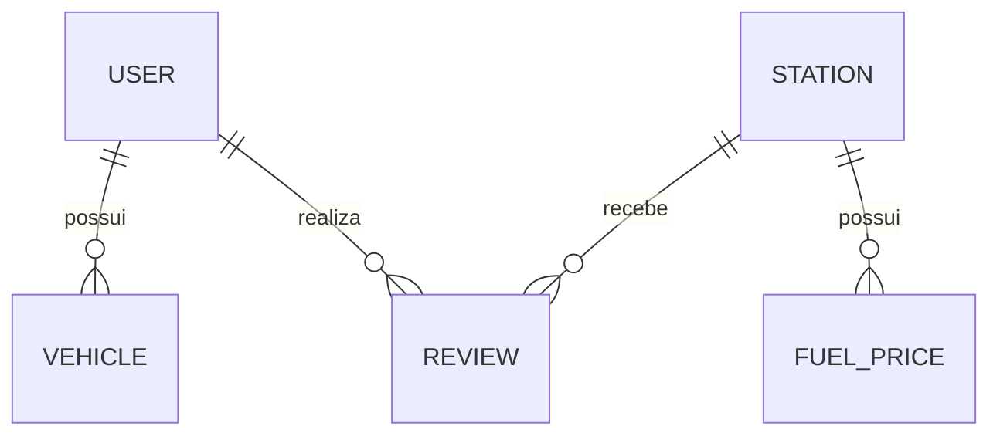
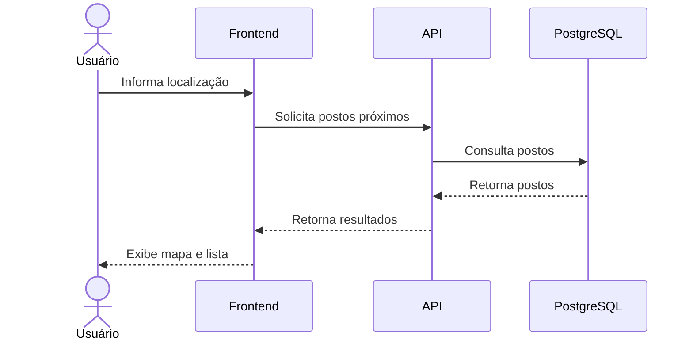

# Prompt — Geração do contexto arquitetural e técnico do projeto

Você está trabalhando na fase de **concepção e planejamento** do projeto **FuelFinder**, uma plataforma web responsiva para consulta, localização e comparação de preços de combustíveis.

O projeto ainda **não possui código-fonte implementado**.

Nesta etapa, sua responsabilidade é transformar as informações, requisitos, decisões e diretrizes fornecidas para o projeto em uma estrutura de contexto técnico e de negócio que será utilizada posteriormente por uma IA durante a implementação.

Crie na raiz do projeto:

```text
.ai/
├── standards.md
├── architecture.md
├── tech-stack.md
└── business-rules.md
```

Esses arquivos serão a **fonte de contexto do projeto** para futuras tarefas de desenvolvimento.

---

# PRINCÍPIO FUNDAMENTAL

O projeto está em fase de concepção.

Portanto:

* NÃO analise código-fonte inexistente;
* NÃO invente requisitos;
* NÃO invente regras de negócio;
* NÃO invente decisões arquiteturais;
* NÃO invente versões de tecnologias;
* NÃO trate funcionalidades futuras como funcionalidades do MVP;
* NÃO altere decisões que já foram definidas;
* identifique explicitamente decisões que ainda estão em aberto.

Quando uma informação não estiver definida, utilize:

```text
DECISÃO EM ABERTO
```

ou:

```text
NÃO DEFINIDO NA ESPECIFICAÇÃO
```

conforme o caso.

---

# 1. ENTENDIMENTO DO PROJETO

Antes de criar os arquivos `.md`, organize mentalmente as informações disponíveis e identifique:

* Problema que o projeto resolve;
* Objetivo da plataforma;
* Público-alvo;
* Funcionalidades principais;
* Escopo do MVP;
* Funcionalidades futuras;
* Tipos de usuários;
* Permissões;
* Entidades;
* Relacionamentos;
* Regras de negócio;
* Arquitetura;
* APIs;
* Tecnologias;
* Fluxos principais.

Não é necessário criar um arquivo adicional para essa análise.

As informações deverão ser distribuídas nos quatro arquivos `.md`.

---

# 2. FUNCIONALIDADES PRINCIPAIS

Documente as funcionalidades principais do sistema.

Separe claramente:

## MVP

Funcionalidades que fazem parte da primeira versão.

## Pós-MVP

Funcionalidades previstas para evolução futura.

Para cada funcionalidade, descreva:

* Objetivo;
* Usuário envolvido;
* Regras relevantes;
* Dados utilizados;
* Dependências;
* Endpoints relacionados, quando aplicável.

Não transforme uma possibilidade futura em requisito obrigatório.

---

# 3. TIPOS DE USUÁRIOS E PERMISSÕES

Documente os perfis de usuário e suas permissões.

Para o MVP, considere os perfis definidos na especificação:

### Motorista

Responsável pelas funcionalidades de consulta e utilização da plataforma.

### Administrador

Responsável pelo gerenciamento dos dados e moderação da plataforma.

Caso outros perfis apareçam como possibilidades futuras, marque-os como:

```text
PÓS-MVP / EM AVALIAÇÃO
```

Crie também uma representação visual das permissões quando isso melhorar a compreensão.

Utilize Mermaid quando apropriado.

Exemplo:



Adapte o diagrama às informações reais do projeto.

---

# 4. ARQUITETURA

O arquivo `.ai/architecture.md` deverá ser o documento mais completo da estrutura.

Documente a arquitetura planejada do sistema.

A arquitetura inicial definida é:

```text
Frontend
    ↓
Backend / API REST
    ↓
Banco de dados
```

O backend deverá seguir uma arquitetura de **monólito modular**, mantendo separação lógica dos domínios sem introduzir microsserviços no MVP.

Documente as camadas:

* Controller;
* Service;
* Repository;
* Entity;
* DTO;
* Security;
* Exception Handling.

Explique claramente a responsabilidade de cada camada.

---

# 5. DIAGRAMA DE ARQUITETURA

O `architecture.md` DEVE possuir um diagrama Mermaid representando a arquitetura geral.

Utilize:



Adapte o diagrama para representar corretamente a arquitetura definida no projeto.

Inclua também componentes transversais quando fizer sentido, como:

* Security;
* JWT;
* Exception Handling.

---

# 6. DOMÍNIOS / MÓDULOS

Identifique e documente os principais módulos do sistema.

Exemplos:

```text
Autenticação
Usuários
Veículos
Postos
Combustíveis
Preços
Avaliações
Recomendações
Administração
```

Para cada módulo informe:

* Responsabilidade;
* Principais entidades;
* Principais regras;
* Principais endpoints;
* Dependências com outros módulos.

---

# 7. ENTIDADES E RELACIONAMENTOS

Identifique as entidades principais do domínio.

Considere as entidades definidas na especificação, sem criar entidades fictícias.

Para cada entidade documente:

* Nome;
* Responsabilidade;
* Principais atributos;
* Relacionamentos;
* Regras relevantes.

O `architecture.md` ou `business-rules.md` deverá conter um **diagrama ER em Mermaid**, quando houver informação suficiente.

Utilize:



Adicione somente relacionamentos suportados pela especificação.

---

# 8. ENDPOINTS DA API

Documente os principais endpoints REST planejados.

Organize por domínio:

```text
/auth
/users
/vehicles
/stations
/fuel-prices
/reviews
/recommendations
```

Para cada endpoint informe:

* Método HTTP;
* Rota;
* Objetivo;
* Usuário/perfil autorizado;
* Parâmetros principais;
* Corpo da requisição, quando aplicável;
* Resposta esperada;
* Regras de negócio relacionadas.

Utilize tabelas Markdown.

Exemplo:

| Método | Endpoint      | Descrição         | Acesso                                 |
| ------ | ------------- | ----------------- | -------------------------------------- |
| POST   | `/auth/login` | Autentica usuário | Público                                |
| GET    | `/stations`   | Consulta postos   | Autenticado/Público conforme definição |
| POST   | `/vehicles`   | Cadastra veículo  | Motorista                              |

Não invente endpoints que não estejam definidos ou sejam necessários para uma decisão ainda não tomada.

Quando sugerir um endpoint adicional, identifique claramente:

```text
SUGESTÃO — NÃO DEFINIDO NA ESPECIFICAÇÃO
```

---

# 9. TECNOLOGIAS

Crie o `.ai/tech-stack.md`.

Separe as tecnologias em:

## Definidas

Tecnologias explicitamente determinadas no projeto.

## Sugeridas

Tecnologias que podem complementar a solução, quando necessário.

## Em aberto

Tecnologias cuja escolha ainda não foi definida.

As sugestões podem ser genéricas quando a especificação ainda não exigir uma tecnologia específica.

Exemplo:

```text
Banco de dados: banco relacional
Framework backend: framework web baseado em Java
Autenticação: mecanismo baseado em JWT
Mapas: biblioteca de mapas web
```

Entretanto, quando a especificação já tiver definido uma tecnologia, preserve essa decisão.

Por exemplo:

```text
Backend: Spring Boot
Banco: PostgreSQL
Mapa: Leaflet 1.9.4
Tiles: OpenStreetMap
```

Não substitua tecnologias definidas por alternativas.

---

# 10. FLUXOS PRINCIPAIS

Identifique os principais fluxos do sistema.

Documente pelo menos:

1. Cadastro e autenticação;
2. Controle de acesso;
3. Cadastro de veículo;
4. Consulta de postos;
5. Comparação de preços;
6. Consulta por localização;
7. Recomendações;
8. Avaliação de posto;
9. Administração;
10. Outros fluxos definidos na especificação.

Sempre que possível, represente os fluxos utilizando Mermaid.

Exemplo:



Utilize `sequenceDiagram` quando o fluxo envolver comunicação entre componentes.

Utilize `flowchart` quando o objetivo for representar decisões ou processos.

Utilize `erDiagram` para entidades e relacionamentos.

Utilize `architecture-beta` somente se for suportado pela ferramenta utilizada para renderizar os arquivos; caso contrário, prefira `flowchart`.

---

# 11. PADRÃO DOS DIAGRAMAS

Os diagramas Mermaid devem ser:

* simples;
* legíveis;
* consistentes;
* semanticamente corretos;
* compatíveis com Markdown;
* preferencialmente pequenos o suficiente para serem compreendidos rapidamente.

Não crie diagramas apenas por criar.

Use diagramas quando eles facilitarem a compreensão.

Priorize:

```text
architecture.md
    ├── Diagrama geral da arquitetura
    ├── Diagrama dos módulos
    ├── Diagrama de entidades
    ├── Fluxos principais
    └── Integrações externas

business-rules.md
    ├── Fluxos de negócio
    ├── Estados, quando aplicável
    └── Regras de decisão

standards.md
    └── Diagramas somente se realmente necessários

tech-stack.md
    └── Diagrama somente se agregar valor
```

---

# 12. `standards.md`

Documente os padrões que deverão ser seguidos durante a implementação.

Inclua:

* Convenções de nomenclatura;
* Organização de pacotes;
* Organização de módulos;
* Organização de classes;
* Controllers;
* Services;
* Repositories;
* DTOs;
* Entities;
* Exceptions;
* APIs REST;
* Validações;
* Segurança;
* Tratamento de erros;
* Testes;
* Documentação.

Como o código ainda não existe, descreva esses padrões como **convenções planejadas**.

---

# 13. `business-rules.md`

Documente as regras de negócio conhecidas.

Organize por domínio:

* Usuários;
* Autenticação;
* RBAC;
* Veículos;
* Combustíveis;
* Postos;
* Preços;
* Comparação;
* Avaliações;
* Recomendações;
* Localização;
* Administração.

Inclua fórmulas quando existirem.

Por exemplo:

```text
Consumo médio (km/L) =
(quilometragem atual - quilometragem anterior)
/
litros abastecidos
```

Sempre diferencie:

```text
REGRA DEFINIDA
```

de:

```text
REGRA / COMPORTAMENTO A DEFINIR
```

---

# 14. DECISÕES ARQUITETURAIS

Registre decisões importantes utilizando ADRs.

Formato:

```markdown
## ADR-001 — Monólito modular no MVP

### Status
Aceito

### Contexto
...

### Decisão
...

### Consequências
...
```

Não crie ADRs para decisões que não estejam fundamentadas na especificação.

Decisões ainda não tomadas devem aparecer como:

```markdown
## Decisão em aberto

### Questão
...

### Contexto
...

### Opções a avaliar
...
```

---

# 15. CONSISTÊNCIA ENTRE OS ARQUIVOS

Após gerar os quatro documentos, faça uma revisão de consistência.

Verifique especialmente:

* Se as entidades aparecem de maneira consistente;
* Se os endpoints correspondem aos módulos;
* Se os perfis possuem permissões coerentes;
* Se as regras de negócio são compatíveis com a arquitetura;
* Se a stack tecnológica é compatível com a arquitetura;
* Se os diagramas correspondem ao texto;
* Se o MVP não contém funcionalidades marcadas como pós-MVP;
* Se não existem tecnologias ou regras inventadas.

---

# 16. RESULTADO FINAL

O resultado deverá ser:

```text
.ai/
├── standards.md
├── architecture.md
├── tech-stack.md
└── business-rules.md
```

Os arquivos devem ser escritos em Markdown.

Os diagramas devem utilizar blocos:

````markdown
```mermaid
...
````

```

O `architecture.md` deve ser especialmente completo e conter diagramas suficientes para permitir que uma pessoa ou IA compreenda rapidamente:

1. Arquitetura geral;
2. Camadas;
3. Módulos;
4. Entidades;
5. Relacionamentos;
6. Comunicação entre frontend e backend;
7. Principais fluxos;
8. Integrações externas.

Ao final, apresente um resumo contendo:

- Arquivos criados;
- Principais decisões consolidadas;
- Decisões em aberto;
- Funcionalidades do MVP;
- Funcionalidades pós-MVP;
- Possíveis inconsistências encontradas nas especificações.

**Não implemente código do sistema nesta etapa.**

O objetivo é criar o **contexto técnico, arquitetural e de negócio que servirá de base para a implementação futura do FuelFinder.**

### Uma melhoria importante

Eu acrescentaria uma regra no prompt: **“não corrigir silenciosamente inconsistências da especificação”**.

Isso é especialmente importante no material que vocês estão construindo. Por exemplo, existe uma diferença entre alguns trechos que tratam o histórico de abastecimentos como **pós-MVP** e outro trecho posterior que descreve o **registro de abastecimento e cálculo de consumo** como fluxo do sistema.

Em vez de a IA escolher sozinha qual interpretação é correta, o ideal é ela escrever algo como:

> **⚠️ Decisão em aberto:** a especificação apresenta o histórico de abastecimentos como evolução pós-MVP, mas também descreve seu fluxo e cálculo de consumo. Confirmar se o registro de abastecimentos fará parte do MVP.

Isso transforma o `.ai/` em algo muito mais útil: **não apenas uma documentação bonita, mas uma memória estruturada das decisões do projeto**, inclusive das coisas que vocês ainda precisam decidir.
```
